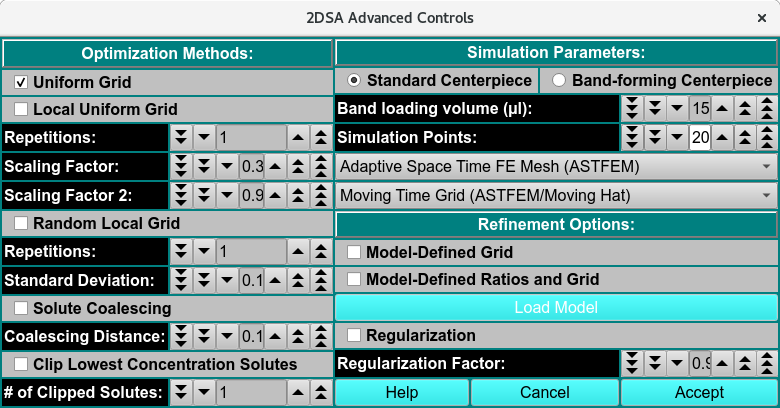

==============================
2DSA Advanced Analysis Control
==============================

.. toctree:: 
  :maxdepth: 3

.. contents:: Index
  :local: 

This dialog provides for definition of an analysis run with parameters not normally of interest to the typical user including use of band-forming centerpieces for Band sedimentation experiments. 
The advanced analysis choices presented in this dialog fall into three categories. 

.. rst-class::
    :align: center

    **2DSA Advanced Controls**

Functions:
==========

**Optimization Methods:** Parameters in this section allow for methods beyond the default Uniform Grid method.

.. list-table::
  :widths: 20 50
  :header-rows: 0
  
  * - **Uniform Grid**
    - Use a uniform grid of the simulation parameter pairs.  
  * - **Solute Coalescing**
    - Select to merge solutes together. 
  * - **Coalescing Distance:**
    - Specify the distance between solutes to merge.  
  * - **Clip Lowest Concentration Solutes**
    - Select to clip low concentration solutes. 
  * - **# of Clipping Solutes:**
    - Specify the number of solutes to clip. 

**Simulation Parameters:** Parameters here allow for changes in the base Lamm equation simulation computation method.

.. list-table::
  :widths: 20 50
  :header-rows: 0

  * -  **Standard Centerpiece**
    - Check to specify a standard, non-band-forming standard 2-channel centerpiece
  * - **Band-forming Centerpiece**
    - Check to specify a band-forming centerpiece if running a band forming sedimentation velocity experiment.
  * - **Band-loading volume (µL):**
    - Specify the volume added to the reservoir in the band-forming centerpiece in microliters (µL). 
  * - **Band-loading Volume:**
    - Specify a band-loading volume value.
  * - **Simulation Points:**
    - Specify the number of discretized radial positions used when numerically integrating the Lamm equation. For typical analyses, 200 simulation points provide sufficient resolution. Increasing this value improves the precision of the simulation but also increases computational time. 
  * - **(mesh type)**
    - Select from one of several mesh types, including Adaptive Space Time (ASTFEM), Claverie, Moving Hat, user File, or Adaptive Space Volume (ASVFEM).
  * - **(grid type):**
    - Select the grid type to use in the simulation: MOVING, FIXED. 

**Refinement Options:** These parameters duplicate some found in the standard analysis control dialog; and add the Regularization options

.. list-table::
  :widths: 20 50
  :header-rows: 0

  * - **Model-Defined Grid**
    -
  * - **Model-Defined Ratios and Grid**
    -
  * - **Load Model**
    - Load the model if Model-Defined grid or Model-Defined Ratios and Grid are selected. 
  * - **Regularization**
    - 
  * - **Regularization Factor:**
    - 