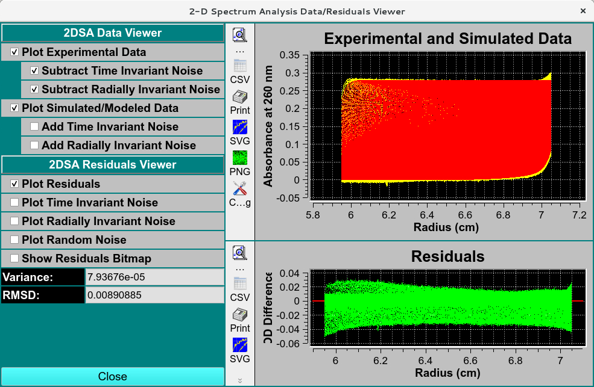

==============================================
2-Dimensional Spectrum Analysis Process (2DSA)
==============================================

.. toctree:: 
  :maxdepth: 3

.. contents:: Index
  :local: 

The parameters of this dialog define and control an analysis run to find the set of solutes that best fits experimental data.

Each refinement iteration proceeds over a defined grid of s and f/f0 values. That grid is divided into subgrids as defined by a number of grid refinements in each direction. The base fit analysis pass thus defined may be repeated a specified number of times, with the second and subsequent refinement iterations adding calculated solutes from the previous iteration to subgrid solutes in each subgrid analysis.

A full set of analysis iterations may be repeated for either a range of meniscus points or a number of monte carlo iterations.

.. rst-class::
    :align: center

    **2-Dimensional Spectrum Analysis Controls**

Fitting Analysis Process:
=========================

*  **Step 1:** *Define the Grid and Grid points:* With *Fitting Controls*, define the overall solute grid by giving the lower and upper limits of s and f/f0; and the the number of grid points for s and f/f0. The default 64 grid points work well for typical Sedimentatation velocity datasets. that total grid into subgrids using Grid Refinements.
*  **Step 2:** *Set Refinement Iterations:* Secondly, set a value for Maximum Iterations of refinement passes.
*  **Step 3:** *Set any Meniscus/Monti Carlo:* Thirdly, if desired, set parameters defining a Meniscus scan or set of Monte Carlo iterations.
*  **Step 4:** *Set Threads:* Next, after control values are set, define a number of threads that is appropriate to the complexity of the run and the number of processors or cores available on your machine, 8-16 threads work best for a typical single-wavelength datasets.
*  **Step 5:** *Start the Fit:* Begin the fit analysis by clicking "Start Fit".
*  **Step 6:** *Display and Save Results:* After simulation, a variety of options are available for displaying simulation results, residuals, and distributions. Report text files and graphics plot files can also be generated.

2DSA Analysis Control Functions:
=================================

**Fitting Controls**

.. list-table::
  :widths: 20 50
  :header-rows: 0
  
  * - **Lower Limit (s x 1e-13):**
    - Set a lower limit of sedimentation coefficient values to scan. 
  * - **Upper Limit (s):**
    - Set an upper limit of sedimentation coefficient values to scan. 
  * - **Number Grid Points (s)**
    - Set the total grid count of sedimentation coefficient points.
  * - **Lower Limit (f/f0):**
    - Set a lower limit of frictional ratio values to scan.
  * - **Upper Limit (f/f0):**
    - Set an upper limit of frictional ratio values to scan.
  * - **Number Grid Points (f/f0)**
    - Set the total grid count of frictional ratio points.
  * - **Thread Count:**
    - Specify by counter the number of threads to use for computations. This value is the total number of worker threads used at one time. The master thread generally has little work to do during computations, so the value may be set to your machine's total processors or cores, 8-16 threads work best for a typical single-wavelength datasets. 
  * - **Fit Time-Invariant Noise**
    - Check this box if you want to calculate time-invariant noise.
  * - **Fit Radially-Invariant Noise**
    - Check this box if you want to calculate radially-invariant noise. 
  * - **Automatically Plot**
    - Check this box if you want plot dialogs to automatically open at the completion of all calculations.
  * - **Vary Vbar with Constant f/f0**  
    - Check this box if you want to vary vbar while holding f/f0 constant. With this box checked, the control window replaces the lower and upper limits of f/f0 with controls for the upper and lower limits of vbar. 
  * - **Start Fit**
    - Click to begin the fit analysis.
  * - **Stop Fit**
    - If something seems wrong with the progress of analysis or if you realize you have parameterized incorrectly, click this button to abort the fit run.
  * - **Plot Results**
    - Open 3-D and :ref:`residual-plot-dialog` to display final results.
  * - **Save Results:** 
    - Save final model(s) and any noises generated. Also output report and plot image files.
  * - **Estimated Memory:**
    - Text showing a memory use estimate based on chosen parameters.
  * - **Completed Iteration:**
    - Display of the last completed refinement iteration number.
  * - **Old Variance:**
    - The variance value for the previous iteration.
  * - **New Variance:**
    - The variance value for the last completed iteration.
  * - **Improvement:**
    - The difference between the variance value from the last iteration and the one preceeding it. 
  * - **Status:**
    - A progress bar showing activity progress within each iteration pass.

**Optimization Methods**

.. list-table::
  :widths: 20 50
  :header-rows: 0

  * - **Uniform Grid**
    - Check this box if Uniform Grid is your preferred optimization method. This is currently the only choice.
  * - **Grid Refinements:** 
    - The number of refinements (subgrid divisions) in each dimension (s and f/f0). The square of this number is the number of subgrids. The Number Grid Points given for each dimension, divided by Grid Refinements, is the approximate number of subgrid points in that dimension. 
  * - **Custom Grid**
    - Check this box to load a custom grid as the preffered optimization method. A `Load Distribution dialog    <../common_dialogs.html#load-distribution-model>`_ to load the costum grid generated by the `Custrom Grid Editor (CG) <../custum_grid.html>`_. 
  * - **Float Meniscus:**
    - Check this box if you wish to wrap the refinement iterations in outer iterations of meniscus scans. Note that this option means that Monte Carlo (below) may not be chosen.
  * - **Float Bottom:**
    - Check this box to fit the Bottom position. 
  * - **Fit Range (cm):**
    - Select the total meniscus/bottom or both value ranges, centered around the original edited data's value, for which to perform iterations.
  * - **Grid Points:**
    - Select the total number of meniscus/bottom points (iterations) to sample.
  * - **Monte Carlo Iterations:**
    - Check this box if you wish to wrap the refinement iterations in an outer set of monte carlo iterations. The second and subsequent iterations use as "experiment" data input the previous iteration's simulated data with gaussian determined random variations. Note that as mentioned above, this choice and Meniscus are mutually exclusive. Monte Carlo iterations do not allow noise calculations.
  * - **Monte Carlo Iterations:**
    - Select a number of Monte Carlo iterations to perform. A separate model is produced from each each iteration. 
  * - **Advanced Analysis Controls**
    - Click on this button to open the `2DSA Advanced Controls <2dsa_adv.html>`_ dialog with control parameters not of interest to the typical user.
  * - **Use Iterative Method:**
    - Check this box if you want to refine analysis fits with multiple refinement iterations.
  * - **Maximum Iterations:**
    - Select the maximum number of refinement iterations. This number may not be reached if subsequent iterations achieve the same set of computed solutes or if their variances differ by a very small amount.
  * - **Plot Norm Grid:**
    - Click to visualize the :ref:`normalized grid plot <norm_grid_plot>` of the 2DSA s–f/f0 grid.
  * - **Norm Tolerance:**
    - Select the normalization tolerance of the grid. 
  * - **Status Information:**
    - The text box here is continually updated with summaries of analysis activity and iteration results.

.. _norm_grid_plot:

.. rst-class::
    :align: center

    **Normalized Grid Plot of User-specified grid**
    

Fit Controls for Varying Vbar 2DSA:
====================================    

This variation of the 2DSA Analysis Control presents controls for varying vbar while holding frictional ratio constant.

.. rst-class::
    :align: center

    **2DSA Fit Controls with Varying VBar**

Functions Specific to Varying Vbar
-------------------------------------

.. list-table::
  :widths: 20 50
  :header-rows: 0

  * - **Lower Limit (vbar):**
    - Set a lower limit of vbar values to scan. The default is a little below the current experiment vbar value.
  * - **Upper Limit (vbar):**
    - Set an upper limit of vbar values to scan. The default is a little above the current experiment vbar value.
  * - **Number Grid Points (vbar):**
    - Set the total grid count of vbar points.
  * - **Constant f/f0:**
    - Specify by counter the constant frictional ratio to use while varying the vbar values.

.. _residual-plot-dialog:

Residual Plot Dialog
======================

.. rst-class::
    :align: center

    **2-D Spectrum Analysis Data / Residuals Viewer**

Detailed information on the results of a 2DS analysis is available at `Simulated Finite Element Model Viewer <../fe_match/index.html>`_

Related
====================

`2-Dimensional Spectrum Analysis <index.html>`_

`Finite Element (FE) Model Viewer <../fe_match/index.html>`_

`Parametrically Constrained Spectrum Analysis (PCSA) <../pcsa/index.html>`_