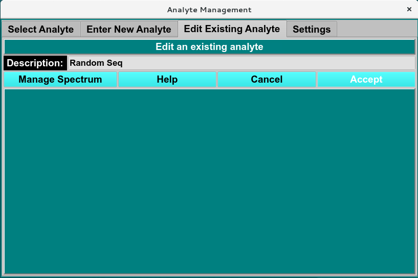
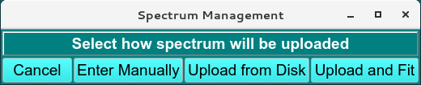
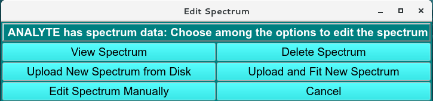
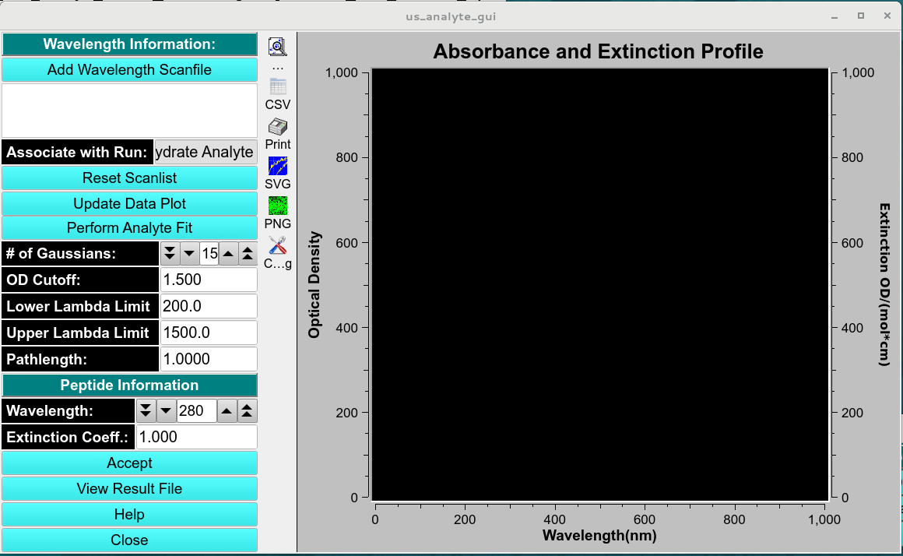

=======================================
Edit Existing Analyte Tab
=======================================

.. toctree:: 
  :maxdepth: 3

.. contents:: Index
  :local: 

**Panel Tab Options:**

* `Select Analyte <analyte_select.html>`_ - A panel whose primary purpose is to select an analyte to return to the caller.
* `Enter New Analyte <analyte_new.html>`_ - A panel whose primary purpose is to enter a brand new analyte, defined by specifying sequence for protein and nucleic components or manually enter the molecular weight (Da), Vbar and other required parameters of proteins, RNA, DNA, Carbohydrate/other analytes. 
* :ref:`Edit Existing Analyte <analyte_edit>` - A panel whose primary purpose is to add spectral characteristics of an already existing analyte.
* `Analyte Settings <analyte_settings.html>`_ - A panel whose primary purpose is to set Database-or-Disk input, the investigator; or to synchronize the local analyte components file from the database.

Edit Existing Analyte Panel
=============================

.. _analyte_edit: 

This panel allows the user to modify non-hydrodynamic characteristics. 

.. rst-class:: 
    :align: center

    **Edit Existing Analyte Window**

Edit Analyte Spectrum 
======================

The **Manage Spectrum** menu window allows the user to upload from local disk, upload and fit the spectrum using **Analyte Spectrum Fitter** window to determine the extinction coefficient at a wavelength range or add manually absorbance at specific wavelength. 

.. rst-class:: 
    :align: center

    **Edit Existing Spectrum Menu**

Once an analyte has an associated spectrum, the **Manage Spectrum** menu window updates to include view Spectrum  and delete spectrum buttons. 

.. rst-class:: 
    :align: center

    **Analyte Spectrum Fitter**

.. rst-class:: 
    :align: center

    **Analyte Spectrum Fitter**

.. image:: ../_static/images/analyte_spectrum.png
    :align: center

.. rst-class:: 
    :align: center

    **Analyte Spectrum**

