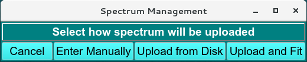
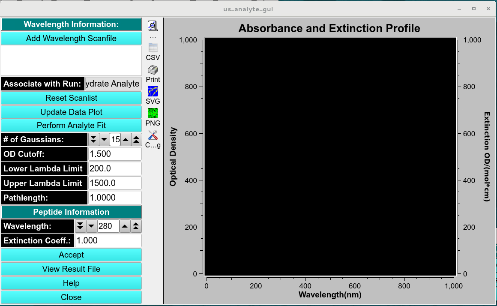

=======================================
Enter New Analyte Tab
=======================================

.. toctree:: 
  :maxdepth: 3

.. contents:: Index
  :local: 

**Panel Tab Options:**

* `Select Analyte <analyte_select.html>`_ - A panel whose primary purpose is to select an analyte to return to the caller.
* :ref:`Enter New Analyte <analyte_new>` - A panel whose primary purpose is to enter a brand new analyte, defined by specifying sequence for protein and nucleic components or manually enter the molecular weight (Da), Vbar and other required parameters of proteins, RNA, DNA, Carbohydrate/other analytes. 
* `Edit Existing Analyte <analyte_edit.html>`_ - A panel whose primary purpose is to add spectral characteristics of an already existing analyte.
* `Analyte Settings <analyte_settings.html>`_ - A panel whose primary purpose is to set Database-or-Disk input, the investigator; or to synchronize the local analyte components file from the database.

Enter New Analyte Panel
=======================

.. _analyte_new: 

Using this panel, the user can create a new analyte in the current database or in the local disk. A new analyte can be entered by clicking the :ref:`Enter Sequence <analyte_sequence>` and pasting the sequence.  The MW, Vbar and E280 (for Proteins) will be automatically updated once the sequence is saved. 

.. rst-class:: 
    :align: center

    **Add Analyte Window - Protein View**

|

.. rst-class:: 
    :align: center    

    **Add Analyte Window - DNA/RNA View**

|

.. rst-class:: 
    :align: center

    **Add Analyte Window - Carbohydrate/Other View**

|

.. _analyte_sequence:

.. rst-class:: 
    :align: center

    **Add Analyte Sequence Window**

Add Analyte Spectrum 
=====================

The panel can also add a spectrum of the analyte by clicking and opening the :ref:`Manage Spectrum menu <analyte_spec>` and manually entering the extinction coefficient at a specified wavelength (**Enter Manually**), by loading a csv file from local disk (**Upload from disk**), or by loading a dilution spectrum series and fitting to determine the extinction coefficient in the :ref:`Analyte Spectrum Fitter <analyte_spec_fitter>` module. 

.. _analyte_spec: 

.. rst-class:: 
    :align: center

    **Select Analyte Window - Protein View**

|

.. _analyte_spec_fitter: 

.. rst-class:: 
    :align: center
    
    **Select Analyte Window - Protein View**
