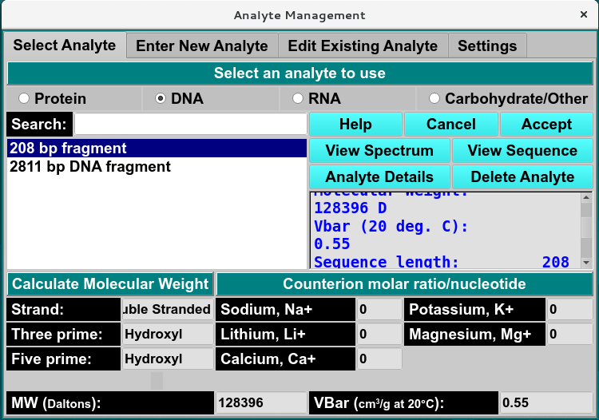
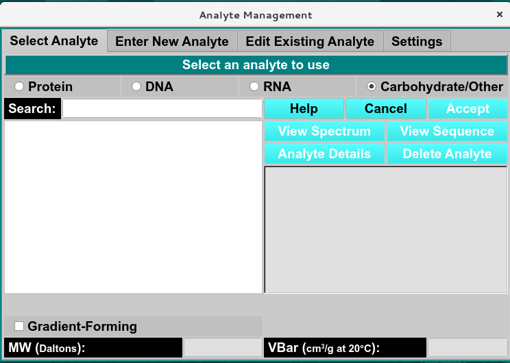
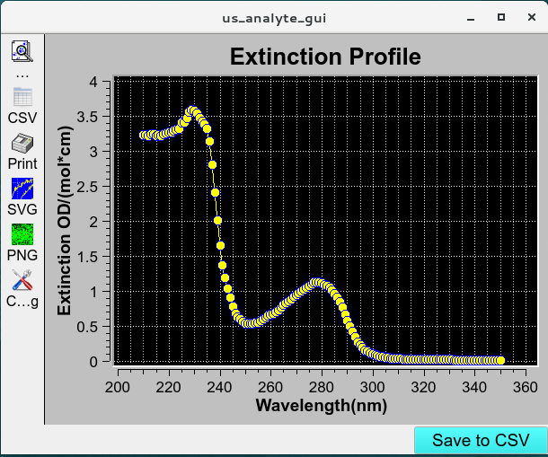
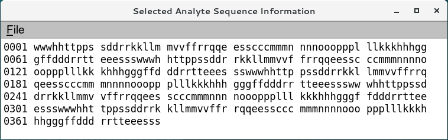
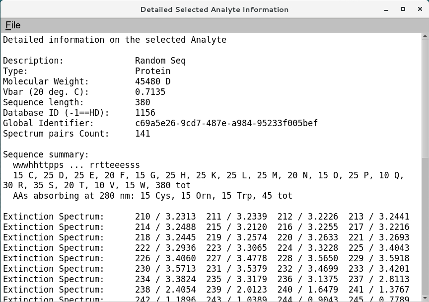

=======================================
Select Analyte Tab
=======================================

.. toctree:: 
  :maxdepth: 3

.. contents:: Index
  :local: 

**Panel Tab Options:**

* :ref:`Select Analyte <select_analyte>` - A panel whose primary purpose is to select an analyte to return to the caller.
* `Enter New Analyte <analyte_new.html>`_ - A panel whose primary purpose is to enter a brand new analyte, defined by specifying sequence for protein and nucleic components or manually enter the molecular weight (Da), Vbar and other required parameters of proteins, RNA, DNA, Carbohydrate/other analytes. 
* `Edit Existing Analyte <analyte_edit.html>`_ - A panel whose primary purpose is to add spectral characteristics of an already existing analyte.
* `Analyte Settings <analyte_settings.html>`_ - A panel whose primary purpose is to set Database-or-Disk input, the investigator; or to synchronize the local analyte components file from the database.

Select Analyte Panel
=======================

.. _select_analyte: 

The Select Analyte tab provides an interface for managing analytes saved in the selected database pr local disk. Users can select from existing analytes by clicking on the analyte and clicking **Accept** and returning it to the caller for analytes in the protein, DNA, RNA, and carbohydrates/other lists. This panel can also be used to view the analyte details such as molecular weight, partial specific volume (Vbar), and, for proteins, the extinction coefficient at 280 nm.

This tab also allows users to view spectral data or analyte properties and to delete analytes that are **not used** in any model.

.. note:: 
    Analytes associated with models can not be deleted.

.. image:: ../_static/images/analyte_selectp.png 
    :align: center

.. rst-class:: 
    :align: center

    **Select Analyte Window - Protein View**

.. rst-class:: 
    :align: center

    **Select Analyte Window - Nucliec acids View**

.. rst-class:: 
    :align: center

    **Select Analyte Window - Carbohydrates/Other View**

Functions:
----------

**Protein**

.. list-table::
    :widths: 20 50

    * - **(analyte list, left-side)** 
      - The items listed on the left side are all the descriptions (names) of analytes available or the descriptions as limited by the **Search** text. A single click on a list item selects a analytes.
    * - **(analyte details, right-side)**
      - The view on the right side is the details of the currently selected analyte. 
    * - **Search:**
      - Enter a partial description to search for a specific analyte. Clear the text to expand to the full list.
    * - **MW (Dalton):**
      - The molecular weight in Dalton of the currently selected analyte.
    * - **Vbar (cm³/g at 20°C):**
      - The Vbar of the currently selected analyte.
    * - **Residue Count:**
      - The protein residue count of the currently selected analyte.
    * - **E280 (OD/(mol*cm)):**
      - The extinction coefficient of the currently selected analyte at 280 nm in optical density/(mole*cm).
    * - **Help**
      - Show this documentation.
    * - **Cancel**
      - Close the analyte dialog and return to the caller with no change in analyte selection.
    * - **Accept**
      - Close the analyte dialog and return to the caller with the current analyte selection.
    * - **View Spectrum**
      - Open a :ref:`Manage Spectrum <analyte_spectrum>` dialog to show the Wavelength/Extinction profile associated with the currently selected analyte.
    * - **View Sequence**
      - Open a :ref:`Manage Sequence <analyte_sequence>` dialog to show the available sequence profile associated with the currently selected analyte.
    * - **Analyte Details**
      - Open a :ref:`Analyte Information <analyte_details>` dialog to show the detailed information about the currently selected analyte.
    * - **Delete Analyte**
      - Permanently delete the currently selected analyte. A confirmation dialog will appear to allow you to cancel the delete request or to proceed with it. Upon confirmation, the removal will proceed regardless of any further action ("Cancel" or "Accept").

|

**DNA/RNA**

.. list-table::
    :widths: 20 50

    * - **Strand**
      - Show the Complementary or Double stranded.
    * - **Three prime**
      - Show the three prime Hydroxyl or phosphate ends.
    * - **Five prime**
      - Show the five prime Hydroxyl or phosphate ends.
    * - **Counterion molar ratio/nucleotide**
      - Show the Counterion molar ratio of Sodium (Na+), Lithium (Li+), Calcium (Ca+), Potassium (K+), or Magnesium (Mg+) 

|

**Carbohydrate/Other**

.. list-table::
    :widths: 20 50

    * - **Gradient-Forming**
      - Select analyte as Gradient-Forming.

|

.. _analyte_spectrum:

.. rst-class:: 
    :align: center

    **View Analyte Spectrum**

.. _analyte_sequence:

.. rst-class:: 
    :align: center

    **View Analyte Sequence file**

.. _analyte_details:

.. rst-class:: 
    :align: center

    **View Analyte Detailed Information**