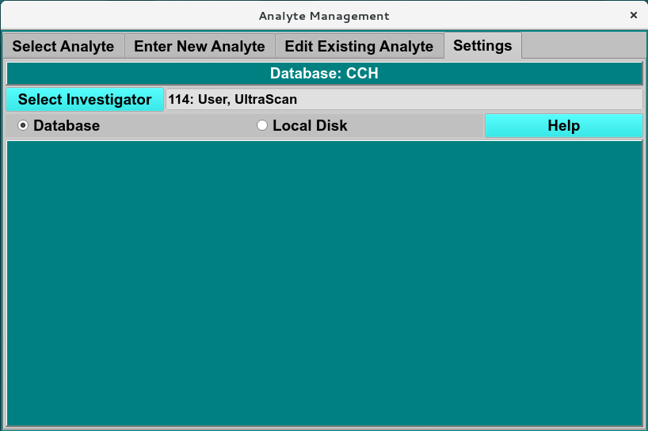

=======================================
Analyte Settings Tab
=======================================

.. toctree:: 
  :maxdepth: 3

.. contents:: Index
  :local: 

**Panel Tab Options:**

* `Select Analyte <analyte_select.html>`_ - A panel whose primary purpose is to select an analyte to return to the caller.
* `Enter New Analyte <analyte_new.html>`_ - A panel whose primary purpose is to enter a brand new analyte, defined by specifying sequence for protein and nucliec components or manually enter the molecular weight (Da), Vbar and other required parameters of proteins, RNA, DNA, Carbohydrate/other analytes. 
* `Edit Existing Analyte <analyte_edit.html>`_ - A panel whose primary purpose is to add spectral characteristics of an already existing analyte.
* :ref:`Analyte Settings <analyte_settings>` - A panel whose primary purpose is to set Database-or-Disk input, the investigator; or to synchronize the local analyte components file from the database.

Analyte Settings Panel
=======================
The Analyte Settings panel allows user to select the investigator, and set the data input from Database or local disk. 

.. _analyte_settings: 

.. rst-class:: 
    :align: center

    **Analyte Specrum**

