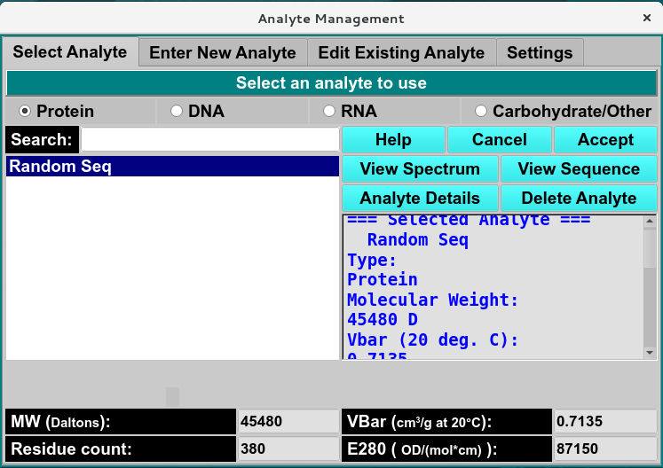

===========================
Manage Analyte Information
===========================

.. toctree::
   :maxdepth: 1
   :caption: Table of Content:

   analyte_select
   analyte_new
   analyte_edit
   analyte_settings

**Select Analyte:** A panel whose primary purpose is to select a analyte to return to the caller.

**Enter New Analyte:** A panel whose primary purpose is to enter a brand new analyte, defined mostly by entering the sequence of proteins and nucleic acids and each one's concentration. 

**Edit Existing Analyte:** A panel whose primary purpose is to change non-hydrodynamic characteristics of an already existing analyte. 

**Settings:** A panel whose primary purpose is to set Database-or-Disk input, the investigator; or to synchronize the local analyte components file from the database. 
