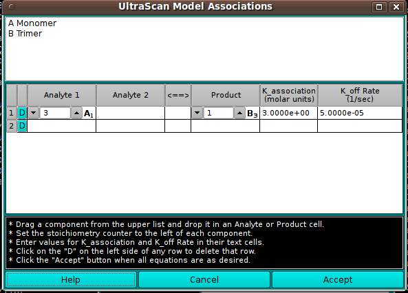

========================================
Model Associations
========================================

.. toctree:: 
  :maxdepth: 3

.. contents:: Index
  :local: 

In this dialog, you can define reversible associations of model components. Associations are constructed in terms of chemical equations with one or two analytes on one side and a product on the other.

Each association row is built by dragging a model component in the upper list to an Analyte or Product cell. As each analyte is dropped, its code letter (A, B, C, ...) appears in the cell with a subscript that represents the oligomer number of the molecule. At least one Analyte and one Product cell must be thus populated. The implied chemical equation must be balanced by setting the stoichiometry counter in each cell such that stoichiometry times oligomer value(s) on the left equals the product of stoichiometry and oligomer on the right. K_association and K_off Rate values should be entered for each row.

Once all association rows have been validly built, click the Accept button to set the reversible association parameters for the model. If a row is wrong and cannot be easily corrected, click the "D" button on the left side of the row to delete that row so that it can be rebuilt.

.. rst-class:: 
    :align: center

    **Create Associations**

Functions:
===========

.. list-table::
  :widths: 20 50
  :header-rows: 0

  * - **(analyte list)**
    - The upper list of model components is populated from the model passed by the calling object. Members of this list can be dragged to the table below to construct association equations.
  * - **(chemical equation associations table)**
    - A table with one or more rows is constructed to represent the reversible associations present in the model.
  * - **D**
    - These buttons in the first table column allow you to delete the associated row.
  * - **Analyte 1**
    - Each row for an association must have this column populated by dragging and dropping a list component.
  * - **Analyte 2**
    - Each row for an association may optionally have this column populated by dragging and dropping a list component.
  * - **Product**
    - Each row for an association must have this column populated by dragging and dropping a list component. Like the Analyte cell(s), a component will be represented by its code letter and a subscript showing its oligomer number. The stoichiometry counter should be set so stoichiometry-times-oligomer balances on the sides of the equation.
  * - **K_association**
    - Enter the K_association value in molar units for each association row.
  * - **K_off Rate**
    - Enter the K_off Rate value in reciprocal seconds for each association row.
  * - **Help**
    - Show this documentation.
  * - **Cancel**
    - Close the dialog and do not return association specifications to the caller.
  * - **Accept**
    - Close the dialog and return association specifications to the caller.
  

.. note:: 
    If you click on the **Accept** button and any equation does not balance, a dialog informing you of the imbalance will pop up. You then have the opportunity to correct the equation and **Accept** again or to click on the **Cancel** button.