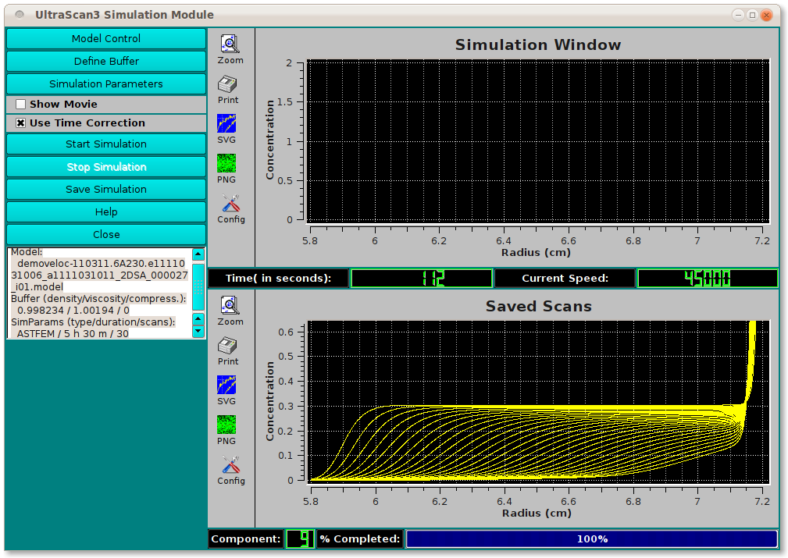

==========================================
Simulation Module
==========================================

.. toctree:: 
  :maxdepth: 3

.. contents:: Index
  :local: 

This module is used to simulate an experiment using Finite Element (ASTFEM) or Finite Volume (ASTFVM) methods. A model is loaded from the database or from local disk. Simulation parameters are specified. A simulation is then calculated and displayed. The simulation may be saved as a synthetic version of raw experimental data. 
If model and simulation parameters indicate ideal conditions, the default method is Adaptive Space Time Finite Element Method (ASTFEM). For non-ideal cases - such as concentration dependence, co-sedimenting, or compressibility, the default is Adaptive Space Time Finite Volume Method (ASTFVM). 

Process: 
==========

1. **Model Control:** First, load a model on which the simulation will be based. 
2. **Simulation Parameters:** Secondly, open a dialog to specify parameters governing the simulation. 
3. **Define Buffer:** Optionally (and rarely), you may wish to specify buffer conditions. This may be necessary if your intention is to simulate and save an artificial version of a specific experimental data set. Normally, the buffer conditions are those of water at 20 degrees Centigrade. 
4. **Start Simulation:** Initiate calculation of the specified simulation. 
5. **Display and/or Save Results:** After simulation, a variety of options are available for displaying simulation results and for optionally saving them to disk. 

.. rst-class::
    :align: center

    **Simulation Main Window**

Functions:
===========

.. list-table::
  :widths: 20 50
  :header-rows: 0

  * - **Model Control** 
    - Load a model from database or local disk using a `Model Editor <model_editor.html>`_ dialog. 
  * - **Define Buffer** 
    - Normally not used, this button allows you to specify buffer conditions through a `Buffer Management <buffer/index.html>`_ dialog. 
  * - **Simulation Parameters** 
    - The majority of the parameters that govern the output simulation grid, duration, method, and so on are given in the result of clicking this button: a `Simulation Parameters <simparams.html>`_ dialog. 
  * - **Select Rotor**
    - Load a rotor and its calibration data by opening the `Rotor Management <rotor.html>`_ dialog.
  * - **Show Movie**
    - Have intermediate scan curves displayed in the upper right plot window during simulation calculations by checking this box. This function allows the user to select a run time which allows the analyte sediments fully. 
  * - **Use Time Correction** 
    - Specify with a check here that you want time corrections to be used in the course of simulation calculations. 
  * - **Start Simulation** 
    - Click this button to begin simulation calculations. 
  * - **Stop Simulation** 
    - If the simulation seems to be taking an inordinate amount of time and you suspect incorrect setting of parameters as the cause, you may click here to stop calculations so that you can review and modify parameters. 
  * - **Save Simulation**
    - Clicking this button leads to a standard output directory dialog in which you may specify a ./results folder on local disk into which to save a simulated raw experiment data set. This data set may be desirable for testing purposes, in which case it will need further editing through `Edit <us_edit.html>`_. 
  * - **Help** 
    - Display this documentation. 
  * - **Close**
    - Exit this dialog. 
  * - **(status summary)** 
    - A text box displays a brief summary of model, buffer, and simulation parameters chosen thus far. 
  * - **(Simulation Window)** 
    - This plot window shows intermediate scan curves as they are generated, when "Show Movie" has been checked. 
  * - **(Saved Scans)** 
    - This plot window displays the final result of simulation calculations. 
  * - **(progress counters and bars)** 
    - Several counters and bars illustrate ongoing progress during simulation calculation. 