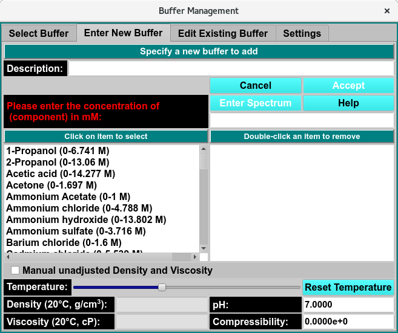
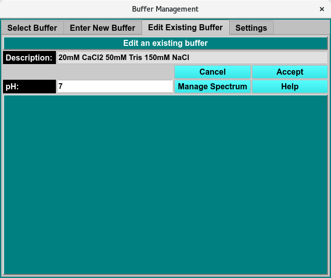
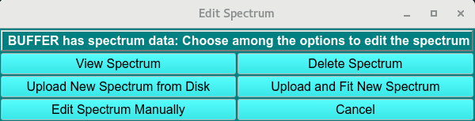
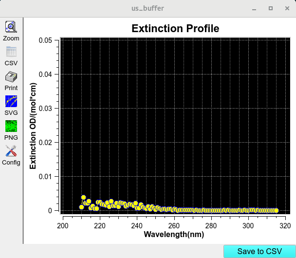
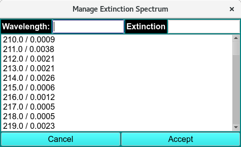
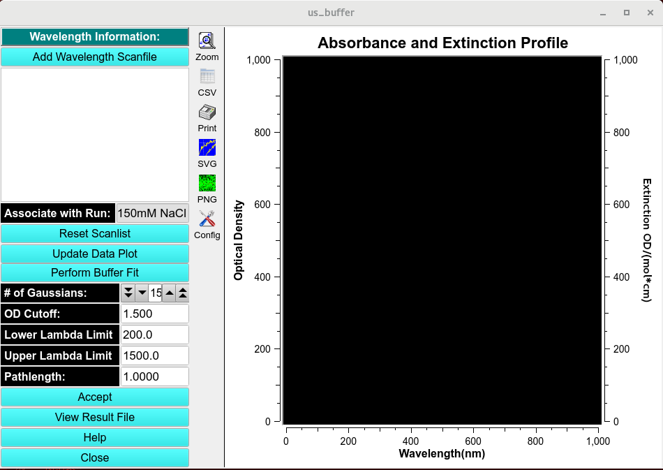
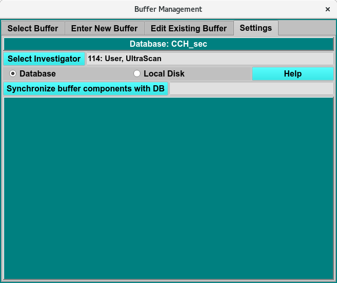

=========================
Manage Buffer Information
=========================

.. toctree:: 
  :maxdepth: 3

.. contents:: Index
  :local: 

**Panel Tab Options:**

* :ref:`Select Buffer <select_buffer>` - A panel whose primary purpose is to select a buffer to return to the caller.
* :ref:`Enter New Buffer <add_buffer>` - A panel whose primary purpose is to enter a brand new buffer, defined mostly by specifying components and each one's concentration.
* :ref:`Edit Existing Buffer <edit_buffer>` - A panel whose primary purpose is to change non-hydrodynamic characteristics of an already existing buffer.
* :ref:`Settings <settings_buffer>` - A panel whose primary purpose is to set Database-or-Disk input, the investigator; or to synchronize the local buffer components file from the database.

This window allows the user to manage buffer information by creating new buffer compositions, editing existing entries, and synchronizing buffer data between your local system and the user database.

Select Buffer Panel:
====================

.. _select_buffer:

Using this panel, you can select a buffer in the current database or on the local disk. Most commonly, you select a buffer in the provided list and click the Accept button to return it to the caller.

As with all panels, a set of tabs allows you to navigate to other panels in order to perform specialized subtasks relating to buffer management. Links to and summaries of the panels are given in the final section of this page.

.. image:: _static/images/buffer_select.png
    :align: center

.. rst-class:: 
    :align: center

    **Select Buffer Window**

Select Buffer Functions:
------------------------

.. list-table::
    :widths: 20 50
    
    * - **(buffer list, left-side)** 
      - The items listed on the left side are all the descriptions (names) of buffers available or the descriptions as limited by the **Search** text. A single click on a list item selects a buffer.
    * - **(component list, right-side)**
      - The items listed on the right side are the components of the currently selected buffer, along with each one's concentration. This list is solely for information purposes.
    * - **Search:**
      - Enter a partial description to search for a specific buffer or set of buffers. Clear the text to expand to the full list.
    * - **Density**
      - The density of the currently selected buffer.
    * - **Viscosity**
      - The viscosity of the currently selected buffer.
    * - **pH**
      - The pH of the currently selected buffer.
    * - **Compressibility**
      - The compressibility of the currently selected buffer.
    * - **Cancel**
      - Close the buffer dialog and return to the caller with no change in buffer selection.
    * - **Accept**
      - Close the buffer dialog and return to the caller with the current buffer selection.
    * - **View Spectrum**
      - Open a :ref:`Manage Spectrum <view_spectrum>` dialog showing the Wavelength/Extinction profile associated with the currently selected buffer.
    * - **Delete Buffer**
      - Permanently delete the currently selected buffer. A confirmation dialog will appear to allow you to cancel the delete request or to proceed with it. Upon confirmation, the removal will proceed regardless of any further action ("Cancel" or "Accept").
    * - **Buffer Details**
      - Open a :ref:`Buffer Information <buffer_details>` dialog showing detailed information about the currently selected buffer.
    * - **Help**
      - Show this documentation.
    * - **Temperature:**
      - Temperature range slider, select the temperature using the slider and the Density and Viscosity will update. 
    * - **Reset Temperature:**
      - Reset the Temperature range slider to 20°C, select the temperature using the slider and the Density and Viscosity will update. 

Select Buffer Steps:
-----------------------

As mentioned above, the most common use of this panel is to select a buffer in the provided list and click on the Accept button to return the selected buffer to the caller, such as a Solution Management dialog.

The panel allows actions beyond simple buffer selection, including getting buffer information, deleting a buffer, or choosing the buffer for which non-hydrodynamic modifications are to be made. In summary, the most common actions for this panel are as follows.

* Select a buffer and Accept it for a caller.
* Select a buffer and modify its non-hydrodynamic characteristics by selecting the Edit Existing Buffer panel.
* Select a buffer to obtain information about it, including the details shown with the :ref:`Buffer Details <buffer_details>` button.
* Select a buffer in order to remove it permanently from the database or local disk, with the Delete Buffer button.

.. _buffer_details:

.. image:: _static/images/buffer_info.png
    :align: center

.. rst-class:: 
    :align: center

    **Buffer Information**

Enter New Buffer Panel:
========================

.. _add_buffer:

Using this panel, you can create a new buffer in the current database or on the local disk. Most commonly, you select a set of buffer components in the provided list. As each is selected, you enter its concentration. After providing a description for the new buffer, you can click on the Accept button to upload the buffer to the DB or to local disk and to return to the Select Buffer panel.

As with all panels, a set of tabs allows you to navigate to other panels in order to perform specialized subtasks relating to buffer management. Links to and summaries of the panels are given in the final section of this page.

.. rst-class:: 
    :align: center

    **Enter New Buffer Panel**

Enter New Buffer Functions:
-------------------------------

.. list-table::
    :widths: 20 50
    
    * - **Description Enter**
      - A new and unique description for a buffer to create.
    * - **(all components list, left-side)**
      - The items listed on the left are descriptions of all available buffer components. Click on one to select it as a component to add to the new buffer. Then enter its concentration in the box above.
    * - **(buffer components list, right-side)**
      - The items listed on the right side are the components added so far to the buffer. An item may be removed by double-clicking on it.
    * - **Manual unadjusted Density and Viscosity**
      - Check this box to allow entry of Density and Viscosity values that override any values computed for the sum of buffer components or that define the values for a buffer with no components, such as water only.
    * - **Density Density value set by components choice.** 
      - It is also editable here (if "Manual..." is checked).
    * - **Viscosity Viscosity value set by components choice.** 
      - It is also editable here (if "Manual..." is checked).
    * - **pH** 
      - pH value for the new buffer. It may be modified here.
    * - **Compressibility**
      - The compressibility of the new buffer. It may be modified here.
    * - **Cancel**
      - Close the panel and return to the :ref:`Select Buffer <select_buffer>` panel with no new buffer created.
    * - **Accept**
      - Close the panel and return to the :ref:`Select Buffer <select_buffer>` panel with the new buffer selected.
    * - **Enter Spectrum**
      - This button brings up a :ref:`Manage Spectrum dialog <manage_buffer_spectrum>` to set a Wavelength/Extinction profile.

.. note::
    Please enter the concentration of (component) in (unit): Enter a concentration for the currently selected component. Choose a value within the component range, then hit the keyboard Return key to add the component.

Enter New Buffer Steps:
-------------------------------

The purpose of this panel is to define a new buffer. A unique description must be given. Density and viscosity must be defined by adding components or by manually entering them. Other buffer values are optional.

Once the new buffer has been sufficiently defined, the **Accept** button becomes enabled. Clicking on it causes the buffer to be added to the DB or the local disk and causes a return to the :ref:`Select Buffer <select_buffer>` panel with the new buffer selected. 

Edit Exisiting Buffer Panel:
============================

.. _edit_buffer:

Using this panel, you can change non-hydrodynamic characteristics of a buffer previously selected in the Select Buffer panel.

Once any desired modifications have been made, clicking on the Accept button will return you to the Select Buffer panel with a modified buffer.

As with all panels, a set of tabs allows you to navigate to other panels in order to perform specialized subtasks relating to buffer management. Links to and summaries of the panels are given in the final section of this page.

.. rst-class:: 
    :align: center

    **Edit Exisiting Buffer Panel**

Edit Exisiting Buffer Functions:
--------------------------------

.. list-table::
    :widths: 20 50
    
    * - **Description**
      - The description of the currently selected buffer for which modification are to be made.
    * - **Cancel**
      - Click this button to abandon any changes and return to the Select Buffer panel with the original unchanged buffer.
    * - **Accept**
      - Click this button to save any changes and return to the Select Buffer panel with a buffer as modified in this panel.
    * - **pH:** 
      - Manually change pH to be associated with the current buffer.
    * - **Manage Spectrum** 
      - This button brings up a :ref:`Manage Spectrum dialog <manage_spectrum>` to enter a Wavelength / Extinction profile for the buffer.
    * - **Help**
      - Show this documentation.

Edit Exisiting Buffer Steps:
----------------------------

.. caution::
    No other parameters than those indicated in this panel may be modified for an existing buffer. This is because existing buffers may be already associated with solutions and runs. Changing hydrodynamic characteristics already associated with models will invalidate those models.
    
    To create a buffer with most characteristics similar to an existing one, the users should note those characteristics; then name and enter a new buffer in the :ref:`Enter New Buffer panel <edit_buffer>`, with selected parameters changed.

Using the Buffer settings panel users can upload new spectum CSV files, and view or edit  the spectrum. 

.. list-table::
    :widths: 20 50

    * - **Upload New Spectrum from Disk**
      - to upload a new a spectrum CSV file from a local file, select this button and a file manager dialog will appear to select the buffer spectrum data.
    * - **View Spectrum**
      - Click the View Spectrum button to open the :ref:`View Spectrum Window <view_spectrum>`. Save to CSV file of the profile to *ultrascan/report/*.
    * - **Edit Spectrum Manually**
      - Click the Edit Spectrum manually button to open the :ref:`Managa Extinction Spectrum <edit_spectrum>` Window. 
    * - **Delete Spectrum**
      - Click to delete an existing spectrum. 
    * - **Upload and fit new Spectrum**
      - Upload and :ref:`fit Spectrum data <fit_spectrum>`. 
    * - **Cancel**
      - Cancel all changes and exit window. 

.. _manage_buffer_spectrum:

.. rst-class:: 
    :align: center

    **Edit Exisiting Buffer Setting**

- Opens an existing Extinxtion profile 
- Upload a new spectrum in CSV format. 

.. _view_spectrum:

.. rst-class:: 
    :align: center

    **View Spectrum Window**
    

.. _edit_spectrum:

.. _manage_spectrum:

.. rst-class:: 
    :align: center

    **Edit Spectrum Data Window**

.. _fit_spectrum:

.. rst-class:: 
    :align: center

    **Upload and fit new Spectrum**

.. note:: 
    This window allows the user to fit the spectrum using the Spectral Fitter module (link when page made)

Settings Panel:
===============

.. _settings_buffer:

Using this window, you can manage settings that affect all other buffer panels. The essential environment for buffer management that you can change here involves the following.

* The investigator for database access.
* The choice of Database or Local Disk for input/output.
* A local buffer components file synchronized with the master list in the database.

As with all panels, a set of tabs allows you to navigate to other panels in order to perform specialized subtasks relating to buffer management. Links to and summaries of the panels are given in the final section of this page.

.. rst-class:: 
    :align: center

    **Settings Panel**

Settings Functions:
-------------------

.. list-table::
    :widths: 20 50

    * - **Select Investigator**
      - This button brings up a window that allows selecting the current investigator for limiting buffer descriptions.
    * - **Database**
      - Check to select read or write of the buffer definitions to or from the database.
    * - **Local Disk**
      - Check to select read or write of the buffer definition to or from a local disk file.
    * - **Synchronize buffer components with DB**
      - Click to obtain a local file listing of all buffer components downloaded from the database. This action is rarely needed, most commonly for new users who have no buffer components file whatsoever.
    * - **(status box)**
      - Status of any action, such as synchronizing buffer components.
    * - **Help**
      - Show this documentation. 

