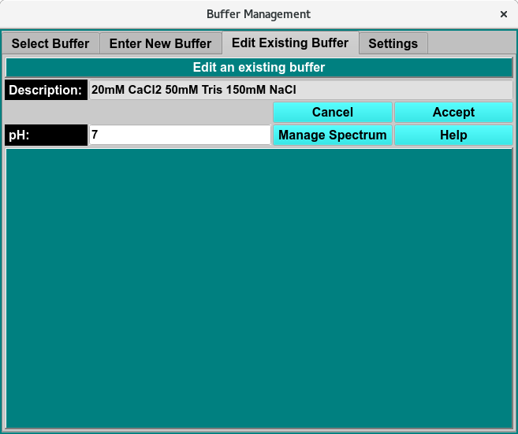
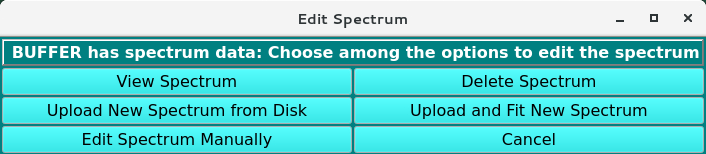

=======================================
Edit Existing Buffer Tab
=======================================

.. toctree:: 
  :maxdepth: 3

.. contents:: Index
  :local: 

**Panel Tab Options:**

* `Select Buffer <buffer_select.html>`_ - A panel whose primary purpose is to select a buffer to return to the caller.
* `Enter New Buffer <buffer_new.html>`_ - A panel whose primary purpose is to enter a brand new buffer, defined mostly by specifying components and each one's concentration.
* :ref:`Edit Existing Buffer <edit_buffer>` - A panel whose primary purpose is to change non-hydrodynamic characteristics of an already existing buffer.
* `Settings <buffer_settings.html>`_ - A panel whose primary purpose is to set Database-or-Disk input, the investigator; or to synchronize the local buffer components file from the database.

Edit Buffer Panel
=======================

.. _edit_buffer: 

Using this panel, you can change non-hydrodynamic characteristics of a buffer previously selected in the Select Buffer panel.

Once any desired modifications have been made, clicking on the Accept button will return you to the Select Buffer panel with a modified buffer.

As with all panels, a set of tabs allows you to navigate to other panels in order to perform specialized subtasks relating to buffer management. Links to and summaries of the panels are given in the final section of this page.

.. rst-class:: 
    :align: center

    **Edit Buffer Window**

Functions:
--------------

.. list-table::
    :widths: 20 50

    * - **Description**
      - The description of the currently selected buffer for which modification are to be made.
    * - **Cancel** 
      - Click this button to abandon any changes and return to the `Select Buffer <buffer_select.html>`_ panel with the original unchanged buffer.
    * - **Accept**
      - Click this button to save any changes and return to the `Select Buffer <buffer_select.html>`_ panel with a buffer as modified in this panel.
    * - **pH:**
      - Manually change pH to be associated with the current buffer.
    * - **Manage Spectrum**
      - This button brings up a :ref:`Manage Spectrum <edit_spectrum>` dialog to set a Wavelength / Extinction profile for the buffer.
    * - **Help**
      - Show this documentation.

.. note::
    
    **Important Note**
    No other parameters than those indicated in this panel may be modified for an existing buffer. This is because existing buffers may be already associated with solutions and runs. Changing hydrodynamic characteristics already associated with models will invalidate those models.

    To create a buffer with most characteristics similar to an existing one, the users should note those characteristics; then name and enter a new buffer in the Enter New Buffer panel, with selected parameters changed.

Edit Buffer Spectrum 
======================

.. _edit_spectrum:

.. rst-class:: 
    :align: center

    **Edit Buffer - Manage Spectrum Menu**

**View Spectrum** 