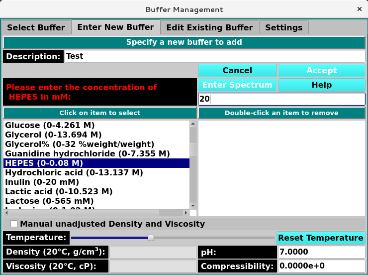

=======================================
Enter New Buffer Tab
=======================================

.. toctree:: 
  :maxdepth: 3

.. contents:: Index
  :local: 

**Panel Tab Options:**

* `Select Buffer <buffer_select.html>`_ - A panel whose primary purpose is to select a buffer to return to the caller.
* :ref:`Enter New Buffer <enter-new-buffer>` - A panel whose primary purpose is to enter a brand new buffer, defined mostly by specifying components and each one's concentration.
* `Edit Existing Buffer <buffer_edit.html>`_ - A panel whose primary purpose is to change non-hydrodynamic characteristics of an already existing buffer.
* `Settings <buffer_settings.html>`_ - A panel whose primary purpose is to set Database-or-Disk input, the investigator; or to synchronize the local buffer components file from the database.

Enter New Buffer Panel
=======================

.. _enter-new-buffer: 

Using this panel, you can create a new buffer in the current database or on the local disk. Most commonly, you select a set of buffer components in the provided list. As each is selected, you enter its concentration. After providing a description for the new buffer, you can click on the Accept button to upload the buffer to the DB or to local disk and to return to the Select Buffer panel.

As with all panels, a set of tabs allows you to navigate to other panels in order to perform specialized subtasks relating to buffer management. Links to and summaries of the panels are given in the final section of this page.

.. rst-class:: 
    :align: center

    **Enter New Buffer Panel**

Functions:
-----------

.. list-table::
    :widths: 20 50
    
    * - **Description Enter**
      - A new and unique description for a buffer to create.
    * - **(all components list, left-side)**
      - The items listed on the left are descriptions of all available buffer components. Click on one to select it as a component to add to the new buffer. Then enter its concentration in the box above.
    * - **(buffer components list, right-side)**
      - The items listed on the right side are the components added so far to the buffer. An item may be removed by double-clicking on it.
    * - **Manual unadjusted Density and Viscosity**
      - Check this box to allow entry of Density and Viscosity values that override any values computed for the sum of buffer components or that define the values for a buffer with no components, such as water only.
    * - **Density value set by components choice.** 
      - It is also editable here (if "Manual..." is checked).
    * - **Viscosity value set by components choice.** 
      - It is also editable here (if "Manual..." is checked).
    * - **pH** 
      - pH value for the new buffer. It may be modified here.
    * - **Compressibility**
      - The compressibility of the new buffer. It may be modified here.
    * - **Cancel**
      - Close the panel and return to the `Select Buffer <buffer_select.html>_` panel with no new buffer created.
    * - **Accept**
      - Close the panel and return to the `Select Buffer <buffer_select.html>_` panel with the new buffer selected.
    * - **Enter Spectrum**
      - This button brings up a :ref:`Manage Spectrum dialog <manage_buffer_spectrum>` to set a Wavelength/Extinction profile.

.. note::
    Please enter the concentration of (component) in (unit): Enter a concentration for the currently selected component. Choose a value within the component range, then hit the keyboard Return key to add the component.

Add New Buffer Steps
=====================

Once the new buffer has been sufficiently defined, the **Accept** button becomes enabled. Clicking on it causes the buffer to be added to the DB or the local disk and causes a return to the :ref:`Select Buffer <select_buffer>` panel with the new buffer selected. 

Add Buffer Spectrum 
=====================

A Spectrum of the buffer can be added to each buffer using the **Enter Spectrum** Button. 

- Manually add single wavelength data by clicking :ref:`Enter Manually <manual_spectrum>`
- Upload a new spectrum in CSV, TXT, DAT, or DSP format by clicking **Upload from Disk** and selecting a file from the file manager. 
- Open the Spectrum Fitter 

.. _manage_buffer_spectrum:

.. rst-class:: 
    :align: center

    **Edit Exisiting Buffer Setting**

.. _manual_spectrum: