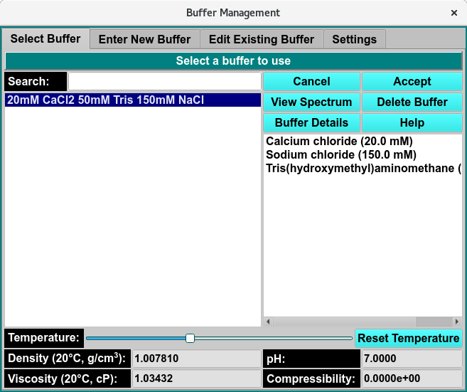
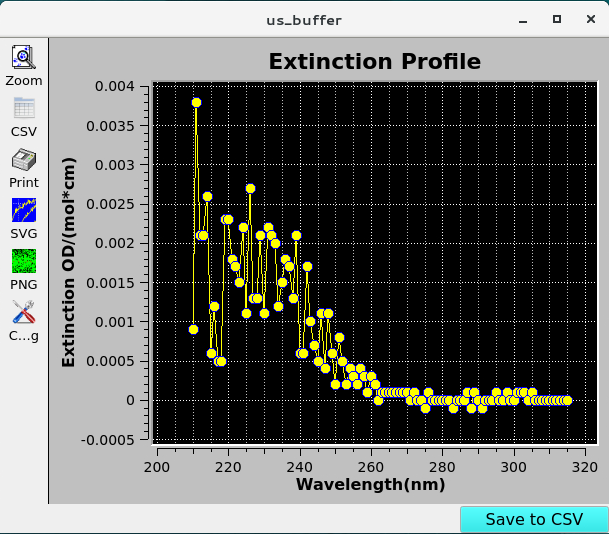
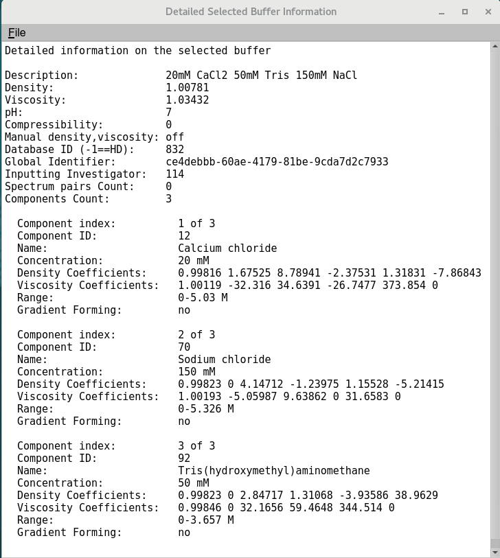

=========================
Select Buffer Tab
=========================

.. toctree:: 
  :maxdepth: 3

.. contents:: Index
  :local: 

**Panel Tab Options:**

* :ref:`Select Buffer <select_buffer>` - A panel whose primary purpose is to select a buffer to return to the caller.
* `Enter New Buffer <buffer_new.html>`_ - A panel whose primary purpose is to enter a brand new buffer, defined mostly by specifying components and each one's concentration.
* `Edit Existing Buffer <buffer_edit.html>`_ - A panel whose primary purpose is to change non-hydrodynamic characteristics of an already existing buffer.
* `Settings <buffer_settings.html>`_ - A panel whose primary purpose is to set Database-or-Disk input, the investigator; or to synchronize the local buffer components file from the database.

Select Buffer Panel
====================

.. _select_buffer:

Using this panel, you can select a buffer in the current database or on the local disk. Most commonly, you select a buffer in the provided list and click the Accept button to return it to the caller.

As with all panels, a set of tabs allows you to navigate to other panels in order to perform specialized subtasks relating to buffer management. Links to and summaries of the panels are given in the final section of this page.

.. rst-class:: 
    :align: center

    **Select Buffer Window**

Functions:
----------

.. list-table::
    :widths: 20 50
    
    * - **(buffer list, left-side)** 
      - The items listed on the left side are all the descriptions (names) of buffers available or the descriptions as limited by the **Search** text. A single click on a list item selects a buffer.
    * - **(component list, right-side)**
      - The items listed on the right side are the components of the currently selected buffer, along with each one's concentration. This list is solely for information purposes.
    * - **Search:**
      - Enter a partial description to search for a specific buffer or set of buffers. Clear the text to expand to the full list.
    * - **Density**
      - The density of the currently selected buffer.
    * - **Viscosity**
      - The viscosity of the currently selected buffer.
    * - **pH**
      - The pH of the currently selected buffer.
    * - **Compressibility**
      - The compressibility of the currently selected buffer.
    * - **Cancel**
      - Close the buffer dialog and return to the caller with no change in buffer selection.
    * - **Accept**
      - Close the buffer dialog and return to the caller with the current buffer selection.
    * - **View Spectrum**
      - Open a :ref:`Manage Spectrum <buffer_spectrum>` dialog showing the Wavelength/Extinction profile associated with the currently selected buffer.
    * - **Delete Buffer**
      - Permanently delete the currently selected buffer. A confirmation dialog will appear to allow you to cancel the delete request or to proceed with it. Upon confirmation, the removal will proceed regardless of any further action ("Cancel" or "Accept").
    * - **Buffer Details**
      - Open a :ref:`Buffer Information <buffer_details>` dialog showing detailed information about the currently selected buffer.
    * - **Help**
      - Show this documentation.
    * - **Temperature:**
      - Temperature range slider, select the temperature using the slider and the Density and Viscosity will update. 
    * - **Reset Temperature:**
      - Reset the Temperature range slider to 20°C, select the temperature using the slider and the Density and Viscosity will update. 

Select Buffer Steps:
-----------------------

As mentioned above, the most common use of this panel is to select a buffer in the provided list and click on the Accept button to return the selected buffer to the caller, such as a Solution Management dialog.

The panel allows actions beyond simple buffer selection, including getting buffer information, deleting a buffer, or choosing the buffer for which non-hydrodynamic modifications are to be made. In summary, the most common actions for this panel are as follows.

* Select a buffer and **Accept** it for a caller.
* Select a buffer and **modify** its non-hydrodynamic characteristics by selecting the Edit Existing Buffer panel.
* Select a buffer to **obtain information** about it, including the details shown with the :ref:`Buffer Details <buffer_details>` button.
* Select a buffer in order to **remove it** permanently from the database or local disk, with the Delete Buffer button.

|

.. _buffer_spectrum:

.. rst-class:: 
    :align: center

    **View Buffer Spectrum**

    
.. note::
  Buffer spectra can be added **Managae Spectrum** button found in either the `New Buffer <analyte_new.html#add-analyte-spectrum>`_ tab or the `Edit Analyte <buffer_edit.html#edit-buffer-spectrum>`_ tab.
    
.. _buffer_details:

.. rst-class:: 
    :align: center

    **Buffer Information**

