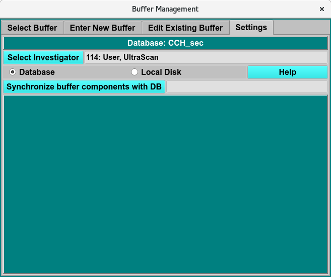

=======================================
Buffer Settings Tab
=======================================

.. toctree:: 
  :maxdepth: 3

.. contents:: Index
  :local: 

**Panel Tab Options:**

* `Select Buffer <select_buffer.html>`_ - A panel whose primary purpose is to select a buffer to return to the caller.
* `Enter New Buffer <buffer_new.html>`_ - A panel whose primary purpose is to enter a brand new buffer, defined mostly by specifying components and each one's concentration.
* `Edit Existing Buffer <buffer_edit.html>`_ - A panel whose primary purpose is to change non-hydrodynamic characteristics of an already existing buffer.
* :ref:`Settings <settings-tab>` - A panel whose primary purpose is to set Database-or-Disk input, the investigator; or to synchronize the local buffer components file from the database.

Settings Panel
=======================

.. _settings-tab:

Using this window, you can manage settings that affect all other buffer panels. The essential environment for buffer management that you can change here involves the following.

   - The investigator for database access.
   - The choice of Database or Local Disk for input/output.
   - A local buffer components file synchronized with the master list in the database.

As with all panels, a set of tabs allows you to navigate to other panels in order to perform specialized subtasks relating to buffer management. Links to and summaries of the panels are given in the final section of this page.

.. rst-class:: 
    :align: center

    **Buffer Settings Window**

Functions:
--------------

.. list-table::
    :widths: 20 50

    * - **Select Investigator**
      - This button brings up a window that allows selecting the current investigator for limiting buffer descriptions.
    * - **Database**
      - Check to select read or write of the buffer definitions to or from the database.
    * - **Local Disk**
      - Check to select read or write of the buffer definition to or from a local disk file.
    * - **Synchronize buffer components with DB**
      - Click to obtain a local file listing of all buffer components downloaded from the database. This action is rarely needed, most commonly for new users who have no buffer components file whatsoever.
    * - **(status box)**
      - Status of any action, such as synchronizing buffer components.
    * - **Help**
      - Show this documentation.

