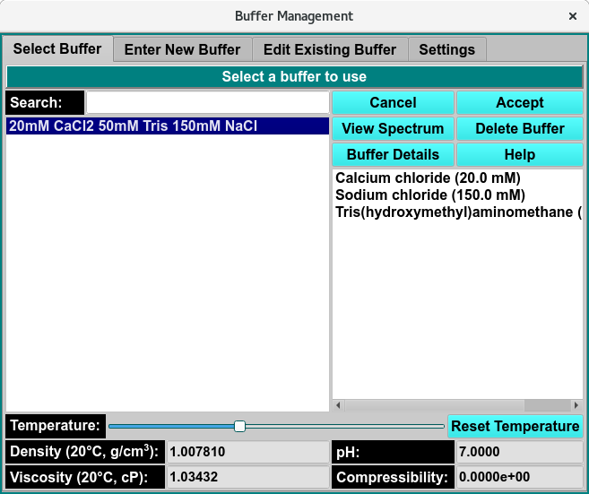

=========================
Manage Buffer Information
=========================

This window allows the user to manage buffer information by creating new buffer compositions, editing existing entries, and synchronizing buffer data between your local system and the user database.

In each panel, tabs are visible at the top of the window to enable the user to move to another panel, to perform specific buffer subtasks. 

.. toctree::
   :maxdepth: 1
   :caption: Table of Content:
   
   buffer_select 
   buffer_new
   buffer_edit
   buffer_settings

**Select buffer** A panel whose primary purpose is to select a buffer to return to the caller.

**Enter New Buffer** A panel whose primary purpose is to enter a brand new buffer, defined mostly by specifying components and each one's concentration. 

**Edit Existing Buffer** A panel whose primary purpose is to change non-hydrodynamic characteristics of an already existing buffer. 

**Settings** A panel whose primary purpose is to set Database-or-Disk input, the investigator; or to synchronize the local buffer components file from the database. 

