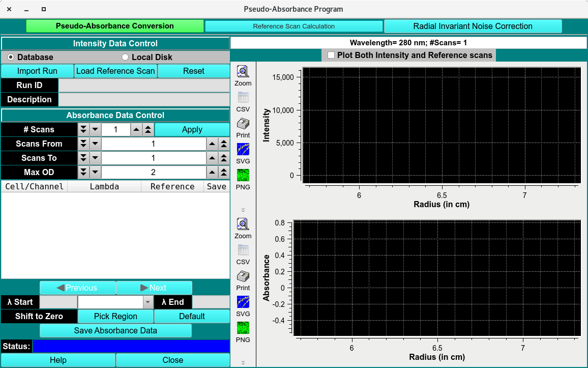
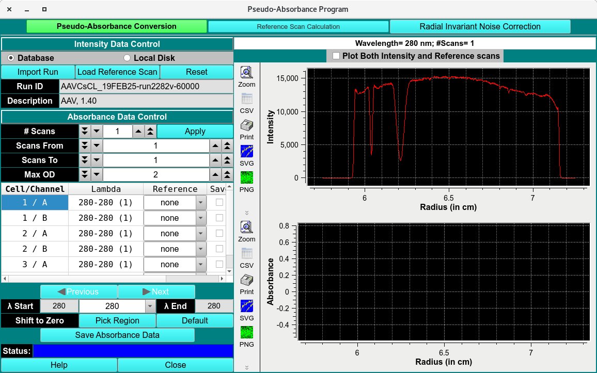
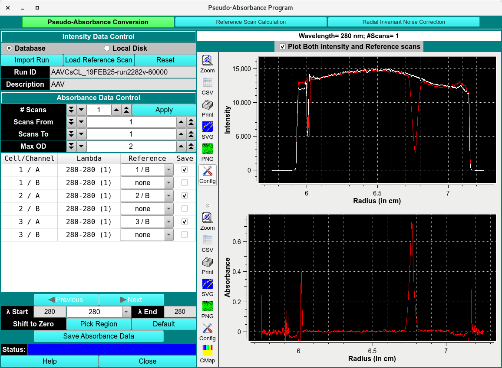
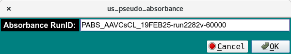

==================================
Pseudo-Absorbance Program
==================================

.. toctree:: 
  :maxdepth: 3

.. contents:: Index
  :local: 

The Pseudo-Absorbance Program is the first processing step in the characterization and quantification of Analytical Buoyancy Density Equilibrium (ABDE) experiments used to determine AAV capsid loading. In ABDE, solutes are separated according to their buoyant density. This module initializes the data by converting raw intensity scans into pseudo-absorbance data through reference subtraction and baseline correction. Reference scans are defined and subtracted from the sample scans, and the resulting corrected data are saved with the prefix **PSAB-**. Reference scans used by this module must be acquired from the Reference channel (B) of the same centerpiece.

.. rst-class::
    :align: center

    **ABDE**

PsAP Process:
==============

1. Click **Import Run** and load ABDE dataset using a :ref:`Load Run Data Dialog <fe-data-loader>`.

2. Assign the reference channel in the Reference pulldown menu. The reference will automatically be subtracted. Select which Triple to save by clicking the **Save** checkbox.  

3. Ensure the subtraction is saved by **apply**. Edit name and save **PABS-** auc file in $HOME/ultrascan3/imports. 

Pseudo-Absorbance Conversion 
================================

.. _pseudo-absorb-conv:

Pseudo-Absorbance Functions: 
------------------------------

.. list-table::
  :widths: 20 50
  :header-rows: 0 

  
  * - **Database**
    - Select to specify data input from the database.
  * - **Local Disk** 
    - Select to specify data input from local disk or the database.  
  * - **Import Run** 
    - Click here import the dataset using :ref:`Load Data Dialog <fe-data-loader>`, select a run ID for the data set to load.  
  * - **Load Reference Scan**
    - Load a reference scan from a different dataset if no Reference Scan was included.    
  * - **Reset**
    - Reset all parameters to defaults.  
  * - **Run ID**
    - the Run identifier. 
  * - **Description**
    - The name of the solution and user inputted comments   
  * - **# Scan** 
    - The number of the scan.   
  * - **Scan From** 
    - Select Scan from   
  * - **Scans To**
    - Select Scan To   
  * - **Max OD**
    - The OD cutoff of the absorbance.     
  * - **Cell/Channel**
    - Cell and channel column   
  * - **Lambda** 
    - The wavelength(s) samples were measured by.   
  * - **Reference**
    - Define the reference scans in this column.   
  * - **Save**
    - Select which Cell/Channel to save.   
  * - **Previous** 
    - Navigate to the previous wavelength.   
  * - **Next**
    - Navigate to the next wavelength.  
  * - **Lambda Start**
    - Start range of the wavelengths detected.   
  * - **Lambda End** 
    - End range of the wavelengths detected.   
  * - **Shift to Zero** 
    - Select region at baseline and shift whole scan to baseline.   
  * - **Pick Region**
    - Define the region to baseline.   
  * - **Default**
    - Use default parameters.   
  * - **Save Absorbance Data**
    - Save the absorbance data.   
  * - **Status**
    - Status bar.   
  * - **Plot Both Intensity and Reference Scans** 
    - checkbox to include both sample and reference scans.   
  * - **Intensity Plot**
    - Plot of Intensity data, before subtraction.    
  * - **Absorbance Plot** 
    - Plot of absorbance data, after subtraction.   
  * - **Help**
    - Open help documentation of this module.   
  * - **Close**
    - Close window. 

