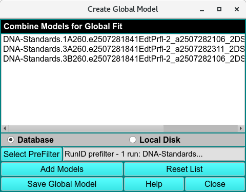
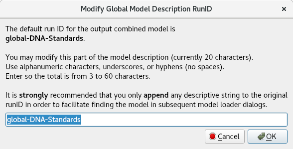

==================================================
Create Global Model
==================================================

.. toctree:: 
  :maxdepth: 3

.. contents:: Index
  :local: 

This utility combines selected models into a single global model that can be used in global fits. The most common use of its output is to form an input to the Initialize Genetic Algorithm program in which a global set of buckets may be created for use in a global fit Genetic Algorithm run.

.. rst-class::
    :align: center

    **Create Global Model**

**Window Controls**

.. list-table::
  :widths: 20 50
  :header-rows: 0 

  * - **(models list)**
    - Look here to see the list of component models so far selected.
  * - **Database**
    - Select to specify model input from the database.
  * - **Local Disk**
    - Select to specify model input from local disk.
  * - **Select PreFilter:**
    - Open a `Models Pre-Filter dialog <common_dialogs.html#data-loader>`_ to select Run IDs on which to pre-filter lists of models for loading. 
  * - **Add Models**
    - Open a `Model Loader dialog <common_dialogs.html#load-distribution-model>`_ to select model(s) to load into the list of component models to the global model.
  * - **Reset List**
    - Clear the list of input models in order to start over in the model selection process.
  * - **Save Global Model**
    - Open a dialog (see below) to save the output combined global model.

**Window Controls**

.. list-table::
  :widths: 20 50
  :header-rows: 0 

  * - **Help** 
    - Display this detailed Create Global Model help.
  * - **Close** 
    - Close all windows and exit.

When the Save Global Model button is clicked, a dialog reports on the combined global model to be created and allows the user options in saving it.

.. rst-class::
    :align: center

    **Save a Global Model**

If the user wishes to modify the RunID part of the output model description, a click on the **Edit** button brings up a dialog for entering new ID text.

.. rst-class::
    :align: center

    **Edit Global Model Name**

