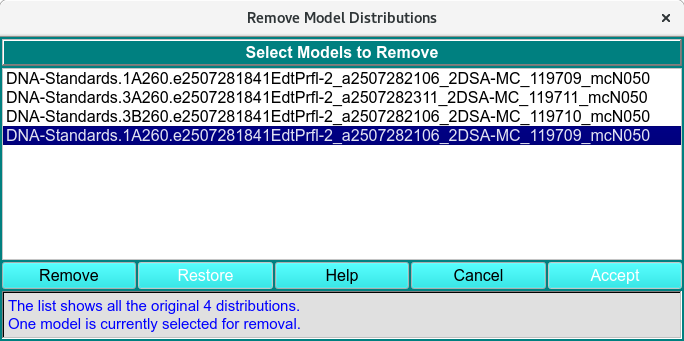
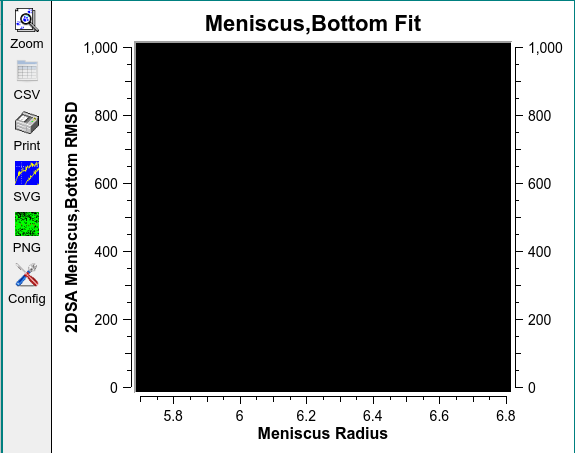
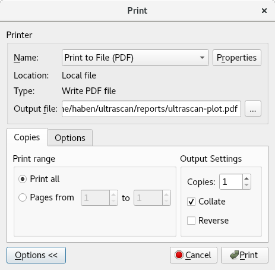
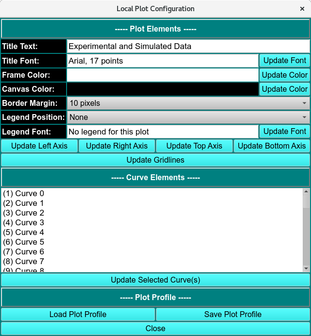

=========================================
Common Dialogs of Ultrascan III
=========================================

.. toctree:: 
  :maxdepth: 3

.. contents:: Index
  :local: 

UltraScan III provides several dialogs for inputting data for analysis or viewing, including options to load run data or load/remove distribution/fitted model data.

Data Loader 
=============

.. _fe_data_loader:

UltrascanIII modules can load models by first loading the Run as **Experiment**, **PreFilter** or **Run Data**.

.. image:: /_static/images/fe_load_data.png
    :align: center

.. rst-class::
    :align: center

    **Load Run Data from DB**

Data Set Selection
--------------------

Most often, you need not expand the list tree and need only select the top level run ID description. This effectively selects all triples for the run and selects the first listed edit for each triple. In the default case where Latest Data Edit was checked in the calling dialog, there will be only one edit (the latest) for each triple. If Latest Data Edit was not checked, there may be multiple edits for triples. In this case, selecting a Run description or a Triple description effectively selects the earliest edit(s).

You may, of course, select specific triples of a run.
Similarly, in the case where Lastest Data Edit was not checked, you may select any edit of a triple.

.. image:: /_static/images/data_loader-edits.png
    :align: center

.. rst-class::
    :align: center

    **Select Specific Data Sets and Edits**

Load Run Functions:
----------------------

.. list-table::
  :widths: 20 50
  :header-rows: 0 

  * - **Database**
    - Check this radio button to generate a list from the database. 
  * - **Local Disk** 
    - Check this radio button to generate an edit list from local disk */ultrascan/results* files. 	 
  * - **Select Investigator**
    -  Click on this button to open an Investigator Dialog that enables you to browse potential database investigators and select one. This button is disabled for normal non-privileged users and whenever Local Disk is selected. 
  * - **(investigator text)**
    - This read-only text box displays the current investigator ID, last name, and first name. 
  * - **Search**
    - As characters are entered in the text box to the right of the Search label, the list of data sets is modified to consist of matching entries. A blank field restores the full list. Note that the search is case-insensitive. 
  * - **Run**
    - The Run ID given in the `Import stage <import.html>`_. 
  * - **date**
    - The date the data was imported to Ultrascan or generated using connected instruments.
  * - **Database identification (DbID)**
    - The Database ID number.
  * - **Run**
    - The Run Label given in the `Import stage <import.html>`_. 
  * - **Show Edits**
    - Click to transform the data list from showing only runs to showing a data tree with triple and edit children. If no Run List entry is selected, the entire data tree will be transformed. If a Run is selected, only that run with its triple and edit descendants will be shown. 
  * - **Load**
    - Click to accept the choice(s) highlighted in the data list and pass data back to the caller. 

**Window Controls**

.. list-table::
  :widths: 20 50
  :header-rows: 0 

  * - **Help**
    - Click to bring up this documentation.
  * - **Cancel**
    - Click to close the dialog with no model list modifications made.

.. note:: 
  Note that multiple selections must all be from the same run. Only one selection is allowed for each triple.

Load Distribution Model 
================================

.. _fe_model_loader:

After the Run has been loaded the triplicate analysis model is loaded using *Load Distribution Model*.

.. image:: /_static/images/fe_load_model_distrib.png
    :align: center

.. rst-class::
    :align: center

    **Load Distribution Model**

Advanced Model List Options 
----------------------------

.. list-table::
  :widths: 20 50
  :header-rows: 0 
  
  * - **Monte Carlo Singles** 
    - Checking the Monte Carlo Singles box expands the list to include all the Monte Carlo singles of any triplicate with Monte Carlo analysis done. 
  * - **Filter by Edit/Run**
    - Filters the list by the experimental run initially selected and the latest Edit of the experiment selected. 
  * - **Edit-Unassigned one** 
    - 
  * - **Last Edit only**
    - 

Remove Model Distributions
===========================

.. _remove_mod_dis: 

The dialog is presented when **Remove Distribution(s)** is clicked. The dialog shows a list of loaded models, by selecting items in this list and clicking on a Remove button, you can remove models from the original distribution list. After all the desired removals have been performed, an Accept button passes the reduced model data to the caller. 

.. rst-class::
  :align: center

  **Remove Distribution Model**

Remove Functions:
------------------

.. list-table::
  :widths: 20 50
  :header-rows: 0 

  * - **(list)**
    - The list box is initially populated with a passed list of all loaded models. Individual or multiple item lines can be selected for removal.
  * - **Remove**
    - After making selections, click this button to remove selections from the list.
  * - **Restore**
    - Click on this button to restore the list to its original full-list state.
  * - **Help**
    - Click to bring up this documentation.
  * - **Cancel**
    - Click to close the dialog with no model list modifications made.
  * - **Accept**
    - Click to accept the modified list as it appears and pass it back to the caller.
  * - **(status)**
    - The ongoing status of the list and current selections is documented here.

Common Plot Controls 
=======================

Ultrascan III uses common functions to modify and save displayed plots.

.. rst-class::
  :align: center

  **Plot Controls**

Plot Functions 
--------------

.. list-table::
  :widths: 20 50
  :header-rows: 0 

  * - **Zoom**
    - Click Zoom and select the area to zoom in by holding left mouse key and dragging across the area of interest to zoom. Right to click to reset to previous zoom until the original plot is displayed. 
  * - **CSV**
    - Export the plot displayed in a CSV format in *ultrascan/report*. 
  * - **Print**
    - Print the :ref:`displayed plot <print>` as a PDF in *ultrascan/report*.
  * - **SVG**
    - Export the displayed plot as an SVG image format. 
  * - **PNG**
    - Export the displayed plot as an PNG image format. 
  * - **Config**
    - The :`configuration panel <config_plot>` of the local plot. The panel is used to change the plot profile. 

.. _print:

.. rst-class::
  :align: center

  **Print Controls**

.. _config_plot:

.. rst-class::
  :align: center

  **Local Plot Configuration Controls**