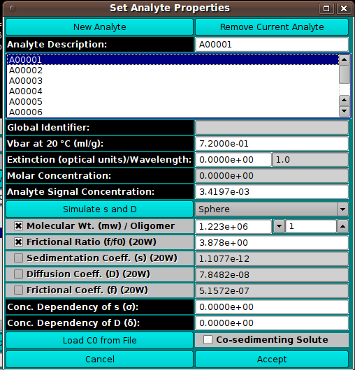

========================================
Model Components
========================================

.. toctree:: 
  :maxdepth: 3

.. contents:: Index
  :local: 

In this dialog, you can set the properties of components of a model.

.. rst-class:: 
    :align: center

    **Analyte Properties**

Functions:
===========

.. list-table::
  :widths: 25 50
  :header-rows: 0

  * - **New Analyte**
    - Click to create a new analyte and add it to the list of model components, using an `Analyte Management dialog <analyte/analyte_new.html>`_.
  * - **Remove Current Analyte**
    - Click to remove from the list of model components the analyte currently selected.
  * - **Edit Current Analyte**
    - Click to replace a model components with a new or ready-made analyte and add it to the list of model components, using an `Analyte Management dialog <analyte/analyte_new.html>`_. 
  * - **Analyte Description:**
    - Enter in the text box the name to be given a newly created analyte or the new name to be given to a currently selected analyte.
  * - **(Analyte List)**
    - Click on the name of an analyte to select it for editing of its properties.
  * - **Global Identifier**
    - Read-only global identifier of the analyte.
  * - **Vbar at 20 °C (ml/g):**
    - Enter the vbar value at 20 degrees centigrade.
  * - **Extinction (optical units)/Wavelength:**
    - Enter the extinction value for the read-only-displayed wavelength.
  * - **Molar Concentration:**
    - Read-only molar concentration calculated from Extinction and Signal Concentration.
  * - **Analyte Signal Concentration:**
    - Enter the analyte's signal concentration value.
  * - **Simulate s and D**
    - Bring up a `Shape dialog <predict1.html>`_ that uses axial ratio to model s, D, and f from MW for 4 basic shapes.
  * - **(Shape)**
    - Select molecule shape: Sphere, Prolate Ellipsoid, Oblate Ellipsoid, or Rod. The selection here should be made before any use of the Shape dialog.
  * - **(Parameters/Coefficients)**
    - Exactly 2 of the 5 component parameters to follow should be checked and their values possibly modified. If a different pair than currently checked is desired, you must first uncheck one of the boxes to enable selection of an alternate. Values for unchecked parameters are calculated from the two selected.
  * - **Molecular Wt. (mw) / Oligomer:**
    - Check Molecular Weight to enable setting a value for it in the text box. For a polygomer component, set the Oligomer value greater than 1.
  * - **Frictional Ratio (f/f0) (20W)**
    - Select frictional ratio and set a value for it.
  * - **Sedimentation Coeff. (s) (20W)**
    - Select sedimentation coefficient and set a value for it.
  * - **Diffusion Coeff. (D) (20W)**
    - Select diffusion coefficient and set a value for it.
  * - **Frictional Coeff. (f) (20W)**
    - Select frictional coefficient and set a value for it.
  * - **Analyte is a Product**
    - click if the analyte is a product. 
  * - **Oligomer**
    - Set the oligomeric status. 
  * - **Conc. Dependency of s (σ):**
    - Set a non-zero value to specify concentration dependency and its sedimentation coefficient sigma factor.
  * - **Conc. Dependency of D (δ):**
    - Set a non-zero value to specify concentration dependency and its diffusion coefficient delta factor.
  * - **Load C0 from File**
    - Click this button to begin an input file dialog in which you can specify a file with first-scan concentration values.
  * - **Co-sedimenting Solute**
    - Check this box to specify that the current component is a co-sedimenting solute.
  * - **Cancel**
    - Close the dialog and do not return component selections to the caller.
  * - **Accept**
    - Close the dialog and return component selections to the caller.
