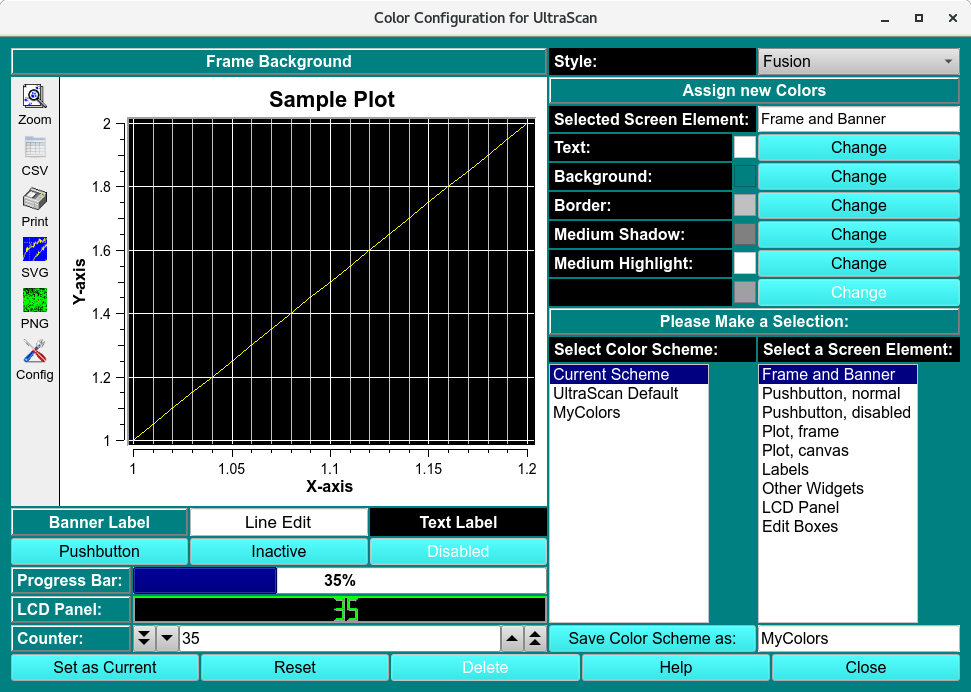
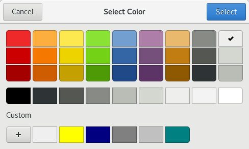
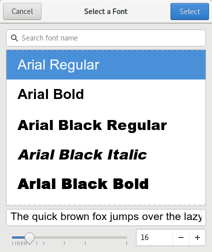

=========================================
UltraScanIII Configuration and Preference
=========================================

.. toctree:: 
  :maxdepth: 3

.. contents:: Index
  :local: 

There are a number of parameters that can be set to customize UltraScan III according to personal preferences. The configuration panel is accessed from the main menu under the Edit menu: 

.. rst-class::
    :align: center

    **UltraScanIII Configuration**

If you start UltraScan for the first time, the configuration settings will be set to the UltraScan default settings. After starting the configuration panel, you can edit the items in the list or click on the respective pushbutton for the file selection window to select your preferred web browser or set data paths. When a path is required, select the desired directory name. For the browser, select a filename of a prefered browser. 

Configuration Functions: 
^^^^^^^^^^^^^^^^^^^^^^^^^^^^

.. list-table::
  :widths: 20 50
  :header-rows: 0
  
  * - **WWW Browser:**
    - This is the path to the executable of your html browser. If your preferred browser (for example, firefox) is in your search path, the single word 'firefox' will suffice here, otherwise enter the complete path.
  * - **Base Work Directory:** 
    - The root path where your instrument(s) (XL-A, XL-I, Optima) saves aquired data. 
  * - **Import Directory:**  
    - The location where all imported data files are stored. 
  * - **Temporary Directory**
    - The location where UltraScan should place temporary files.

**Miscellaneous Settings:**

.. list-table::
  :widths: 20 50
  :header-rows: 0        

  * - **Default Data Location**
    - The default location of the data storage and retrieval.         
  * - **Color Preferences:** 
    - See the Color Configuration below on the :ref:`Change <col_change>` button if you want to load or define a different color scheme.
  * - **Font Preferences:** 
    - See the Font Configuration below on the :ref:`Change <fon_change>` button if you want to set a new default font for all of UltraScan's applications. 
  * - **Database Preferences:** 
    - See the Database Configuration below on the :ref:`Change <dat_change>` button if you want to set the database username, password, database name and server host name.
  * - **Master Password:** 
    - See the Database Configuration below on the :ref:`Change <mp_change>` button to set or reset your personal **UltraScanIII** password. Be sure to remember the password. If it is lost, you will need to reset all saved database information in the *Database Preferences* panel.
  * - **Advanced Settings:** 
    - See the Database Configuration below on the :ref:`Change <adv_change>` button to set advanced settings related to debug, advanced level, and number of threads.

Once all settings are correct, click on **Save** to make your settings permanent.

Color Configuration Panel:
==========================

.. _col_change:

.. rst-class::
    :align: center

    **Color Configuration Panel**

The color configuration control can be invoked from the configuration panel by clicking on the *Change* button from the color preferences option.

The panel has two sections, a *preview* section (on the left) and a *control* section (on the right). With this module you can select custom color combinations for all screen elements (widgets) used by UltraScan and save them as custom color schemes. You can also set the desired margin around graphs.

To change a widget's color, select the widget you would like to change from the screen element listbox. All applicable colors for that widget will be shown in the Assign new Colors section. Click on the Change button for the desired color definition of the selected widget. A **Color Select** dialog will be displayed that lets you select and define custom colors for the selected color definition. After you click on the "OK" button you will be returned to the color configuration control window and the new color will be applied to the preview section of the screen. Continue to define new colors for each widget until all color changes you want to make have been applied.

.. rst-class::
    :align: center

    **Color Select Dialog**

To reset to the previous color definition, click on the *Reset* button. Click on *Set as Current* to apply the colors to the current scheme. If you want to save the scheme, define a name (without spaces) under Save Color Scheme as: and click on the Save Color Scheme as: button. Keep in mind that certain names are reserved for predefined UltraScan color schemes, and they cannot be overridden.

The number of colors that can be simultaneously displayed on the screen depends on your display adapter's memory and resolution. Common display settings are 16 bit (65536 colors), and 24 bit (~16.8 million colors).

If you want to delete a custom scheme, select the scheme and click on the Delete button. Predefined UltraScan schemes cannot be deleted. To select a different scheme from the list of available color schemes, simply double click on the desired scheme and click on the Save as Current button. 

Font Configuration Panel:
==========================

.. _fon_change:

.. rst-class::
    :align: center

    **Current Font Dialog**

Using this dialog, you can change the default font for all of UltraScan's applications. All fonts used in UltraScan are listed in this dialogue, and you should pick a font that displays well in the allotted space. When changing the font, a **Font Selection Dialog** will be displayed that lets you select and define custom fonts for UltraScan. After you click on the OK button you will be returned to the font configuration control window and the new font will be applied to the preview section of the screen.

Selecting *Save* will save the currently displayed font as the UltraScan *default* font.

.. rst-class::
    :align: center

    **Font Selection Dialog**

Database Configuration Panel:
===============================

.. _dat_change:

.. note::
    Whenever UltraScan needs to use a database entry, it needs the user's master password. The first time it is needed, it will prompt for it and save it in memory, but not on disk storage. When needed again, UltraScan uses the stored password. Before this can be done, the master password needs to be set up and a cryptographic hash of the password stored. Use the Master Password panel, accessed form the main configuration panel, to set up or change the master password. 

.. rst-class::
    :align: center

    **Database Configuration**

The database configuration panel allows you to configure the connection to the database that holds your experimental data. Here you can enter the name of the database, the username you use to connect to the database engine as well as your database login password, and finally the name of the host on which the database engine is running. UltraScan offers the option to configure multiple databases for facilities that may use multiple databases from different sites. The currently selected database is listed with the "(default)" tag. To change the default database, simply double-click on the desired database in the "Database List" section to select the database that needs to be set as default. Now click on the Save as Default button. The name in the database list with the "(default)" tag will then reflect the new default database.

When Reset is selected, the fields are cleared and a new entry can be entered. The Test DB Connectivity button will try to connect to the database in the Detailed Information fields to provide a confimation that the data is correct.

To delete an entry, select it and click on Delete Current Entry. 

Master Password Panel:
======================

.. _mp_change:

.. rst-class::
    :align: center
    
    **Change Master Password**

The user's master password needs to be entered in order to access encrypted database information. Enter the **old password** and the **new password** *twice* to change the password. When entering the password for the first time, the Old Password entry will not be shown.

.. caution::
     There is no way to recover the master password so it must be remembered. If the password is lost, UltraScan can be reset, but all database login settings will have to be manually reentered. 

Advanced Configuration Panel:
=============================

.. _adv_change:

.. note:: 
    Some **UltraScan III** applications output debug text to STDOUT or a log file. Some only include certain GUI elements when in an advanced mode. Certain applications can benefit from use of more than one thread. These variations are governed by the configuration values that are set in this panel. Actual values should be set only under the guidance of software developers, since meanings of settings vary considerably from application to application.

.. rst-class::
    :align: center

    **Advanced Settings**

Functions: 
--------------

.. list-table::
  :widths: 20 50
  :header-rows: 0
  
  * - **Debug Text List**
    -  Additional debugging to aid in trouble-shooting can be turned on or off based on a debug text phrase. One or more of such phrases may be entered in this list. Leading or trailing blanks and multiple consecutive blanks are ignored.
  * - **Debug Level:** 
    - The quantity of debug outputs may be determined by the magnitude of the value selected here. The greater the count,the greater the number of debug lines output for applications that take advantage of the debug level value. 
  * -  **Advanced Level:** 
    - For certain applications, there are options that should only be visible and changeable by a highly knowledgeable user working in advanced mode. The level of advanced mode may be set with the counter here.
  * - **Number of Threads:** 
    - A threads count greater than one is advantageous in certain applications that are thread-aware. A number from one to ten may be set here.
  * - **Noise Dialog Level:** 
    - This function enables user to select from multiple noise profiles that are associated with a model. When the level flag is 1 (enabled), in `Finite Element Viewer <fe_match/fe_match_main.html#noise-vector-selection>`_, user is prompted to select from a list of noise profiles, where the earlier profiles will have higher Model Sibling 000#. See `Finite Element Viewer <fe_match/fe_match_main.html#noise-vector-selection>`_ help documentation for further instructions.
  * - **Reset to Last Saved** 
    -  All of the above settings can be made to revert to last-saved settings by clicking this button.

**Window Controls**

.. list-table::
  :widths: 20 50
  :header-rows: 0 

  * - **Reset** 
    - Indicate that parameters are to be reset and the plots re-displayed based on original parameters.
  * - **Help** 
    - Display this detailed Fit Meniscus help.
  * - **Close** 
    - Close all windows and exit.

Optima Host Configuration Panel: 
================================

.. _opt_change:

.. note:: 
    Whenever UltraScan needs to use an Optima host entry, it needs the user's master password. The first time it is needed, it will prompt for it and save it in memory, but not on disk storage. When needed again, UltraScan uses the stored password. Before this can be done, the master password needs to be set up and a cryptographic hash of the password stored. Use the :ref:`Master Password <mp_change>` panel, accessed from the main configuration panel, to set up or change the master password. 

.. rst-class::
    :align: center

    **Instrument Configuration**

The optima host configuration panel allows you to configure the connection to one or more Optima instruments in your lab. Here you can enter the description, host address and port of the Optima instrument, as well as Optima database name, user name, and password. Additional information includes a radial calibration wavelength, a file from which to upload a chromatic aberration array, and installed optical systems.

When Add *New Entry* or *Edit Current Entry* is selected, one of the following dialogs is opened: 

.. subfigure:: AB     
  :class-grid: outline 
  :gap: 8px
  :align: center

  .. image:: _static/images/optima_config_new.png
    :align: left
    :width: 100%

  .. image:: _static/images/optima_config_edit.png
    :width: 100%
    :align: right

.. rst-class:: center

    **New Entry and Modify Current Entry Dialogs**

**Optima Host Connection Information**

.. list-table::
  :widths: 20 50
  :header-rows: 0

  * - **Instrument Host Description**
    - An Optima host description, always given in a strict “Optima (number)” form, such as “Optima 1”.
  * - **Instrument Serial Number**
    - The instrument's serial number.
  * - **Instrument DB Host Address**
    - IP address to the Optima, generally in a local domain.
  * - **Instrument DB Port**
    - Port to the Optima's Postgresql database; for example, 5432.
  * - **Instrument Status Msg Port:**
    - Port used for the UltraScan data acquisition software (ssl-encrypted data exchange)
  * - **Instrument DB Name**
    - Name of the PostGreSQL database on the Optima AUC system.
  * - **Instrument DB Username**
    - Optima database login name.
  * - **Instrument DB Password**
    - Optima database login password.

**Chromatic Aberration Information**

.. list-table::
  :widths: 20 50
  :header-rows: 0

  * - **Radial Calibration Wavelength**
    -  Wavelength at which radial calibration was performed. 
  * - **(Load) Chromatic Aberration Array**
    -  A file (specified in a file dialog) containing an array of wavelength/value pairs that specify radial position corrections for each wavelength.
  * - **Save Entry**  
    -  Update instrument settings in the database.
  * - **Cancel**
    -  Close the dialog without updating the database.
  * - **Installed Optical Systems**
    - Up to three optical systems available on the instrument where choices are: 
  * - * UV/visible
      * Rayleigh interference
      * Fluorescence
      * (not install) - Availbale optical slot
    -

**Installed Optical Systems**: 
Text description of which optical system is installed (Uv/visible, Rayleigh Interference, Fluorescence or available slot)

Test the connection to the new or modified instrument by clicking *Test Connectivity*

For appropriate Optima Host values, consult with your administrator or with the authors of this software.

.. note::
    To delete an entry, select it and click on Delete Current Entry.

