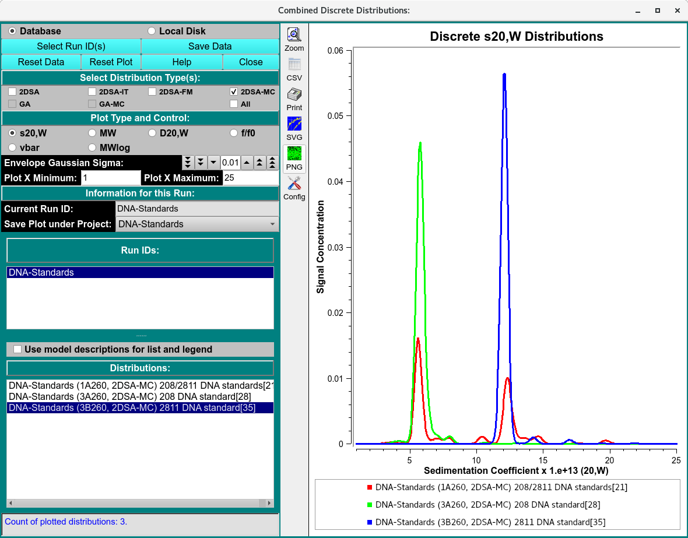
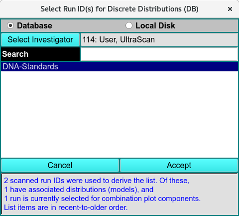

========================================
Discrete Distributions Combined Plots
========================================

.. toctree:: 
  :maxdepth: 3

.. contents:: Index
  :local: 

To combine model distributions from multiple datasets (either from different cells of the same run or from different runs), use **Combine Discrete Distributions** from the *Velocity* menu. This will allow you to compare bar plots of distributions from different cells to each other.

.. note::
    Distribution plots present relative concentration (Y) for X points where the "X" type may be sedimentation coefficent, molecular weight, diffusion coefficient, frictional ratio or vbar (specific density). Vertical bars are computed at every 2% mark of the X range. 

Functions:
===========

.. list-table::
  :widths: 20 50
  :header-rows: 0 

  * - **Database**
    - Check this radio button to indicate that distribution data to be selected is in the database.
  * - **Local Disk**
    - Check this radio button to indicate that distribution data to be selected is on local disk file systems. 
  * - **Select Run ID(s)**
    - Click on this button to open a :ref:`Run ID Select Dialog <runid_select>` in which one or more run IDs may be selected from which distribution data files can be taken.
  * - **Save Data**
    - Save combined discrete distribution plots and data to a local data file and, if input source so indicates, to the database.
  * - **Reset Data**
    - Clear all data, lists and plots. To choose runs and distributions, a new set of Select Run ID(s) selections must be made. 
  * - **Reset Plot**
    - Clear all plots. 

**Window Controls**

.. list-table::
  :widths: 20 50
  :header-rows: 0 

  * - **Reset Plot** 
    - Indicate that parameters are to be reset and the plots re-displayed based on original parameters. Data is still saved, so a new set of plots can be created by simply selecting runs and distributions (models).
  * - **Help** 
    - Display this detailed Disctete Distribution Plots help.
  * - **Close** 
    - Close all windows and exit.

**Select Distribution Type(s):** Check one or more of the check-box options below this banner to filter the list of Distributions (see below).

.. list-table::
  :widths: 20 50
  :header-rows: 0 

  * - **Select Plot Type:**
    - Select one of the options below this banner to specify the "X" type of the combined distribution plot.
  * - **Current Run ID:**
    - The read-only text to the right of this label indicates the  currently selected run. 
  * - **Save Plot under Project:**
    - The name shown to the right of this label specifies the project subdirectory under which the combination is to be saved. By default, the name shown is the first run selected for plotting, but this can be changed by the user to any listed name. If "All" is selected, plot copies will be saved to all of the component run IDs.

**Run IDs:**
The list below shows all runs selected in Select Run ID(s) dialogs. Click on a list line to reveal the distribution (model) choices for the run.

.. list-table::
  :widths: 20 50
  :header-rows: 0 

  * - **Distributions:**
    -  The list below shows the distributions for the currently selected run. Click on a model line to have its bar plot added to the combined plot.

.. _runid_select:

.. rst-class:: center

    Run ID Select Dialog

Related
====================

`Integral Distributions Combined Plots <integral.html>`_

`Finite Element Model Viewer <fe_match/fe_match.html>`_

`2-Dimensional Spectrum Analysis <2dsa.html>`_