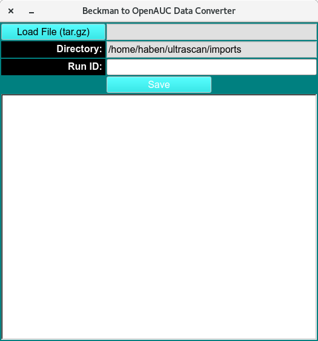

==================================
Discrete Model Genetic Algorithm 
==================================

.. toctree:: 
  :maxdepth: 3

.. contents:: Index
  :local: 

The Discrete Model Genetic Algorithm (DMGA) initialization window lets users define the components of a model, along with the dissociation constant (K_D) and the (k_off) rate constant that govern binding. After these inputs are set, the initialized DMGA model is simulated by genetic-algorithm analysis.

.. rst-class:: 
    :align: center

    **Discrete Genetic Algorithm Initialization**

Process: 
============

1. If an existing model is available, Load Model and teh text box will update. if model doesn't exist, define base model and open the `Model Editor window <model_editor.html>`_. components.html (need at least 2 components), associations.html and Save. 

2. If an existing Constraints is available, Load Constraints and the text box will update. if Constraints  doesn't exist, define base Constraints and open the `load distribution model <load model distribution.html>`_. 
Load of Define and Save. 

3. Send Model + Constraints to GA Analysis on LIMS

dmga_init_constr.html (define which attribute is floated)