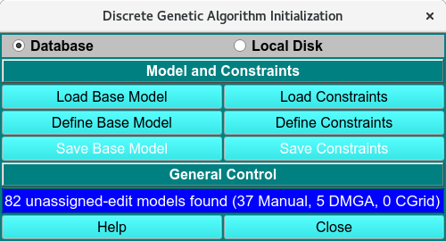

==================================
Discrete Model Genetic Algorithm 
==================================

.. toctree:: 
  :maxdepth: 3

.. contents:: Index
  :local: 

The Discrete Model Genetic Algorithm (DMGA) module employs user-defined interacting and non interacting models to fit sedimentation velocity data to parameters of those
models. While there is no restriction on the type of model that can be built to fit a particular system, the method is most often used
for fitting reversibly associating systems, such as oligomerization or self-association, or hetero-associating systems. The method uses genetic
algorithms to optimize non-linear fitting problems using stochastic approaches. The user has to define a model and the :doc:`constraints <dmga_init_constr>` for the parameters of the model to initialize the DMGA routine. The fit is performed on the **LIMS** using the **Discrete Model GA Control**.

.. rst-class:: 
    :align: center

    **Discrete Genetic Algorithm Initialization**

DMGA Process: 
==============

1. If an existing model is available, **Load Base Model** and use the
:doc:`Load Distribution Model <common_dialogs>`
dialog to select the desired model. If a model needs to be created first, use **Define Base Model** to open the :doc:`Model Editor window <model_editor>` and select **Save Base Model**.

2. If constraints for all parameters have been defined
previously, **Load Constraints** will allow the user to select a predefined constrained from the :doc:`Load Distribution Model <common_dialogs>` dialog. If a set of
constraints needs to be created first, use **Define Constraints** to open
the `Discrete Model GA Constraints Editor <dmga_init_constr>`, enter
the parameter constraints for the **Components** and any **Associations
(reactions)**, and **Accept** the changes. At this point, **Save Constraints** in the main window will
allow you to save the DMGA initialization to the LIMS database. By default, the constraints model will
be named with the current timestamp, but selecting **Edit** allows you to use a custom name in the database.

3. To start the analysis, select the same constraints model in the
**Setup Discrete Model GA Control** on the **LIMS** page.
