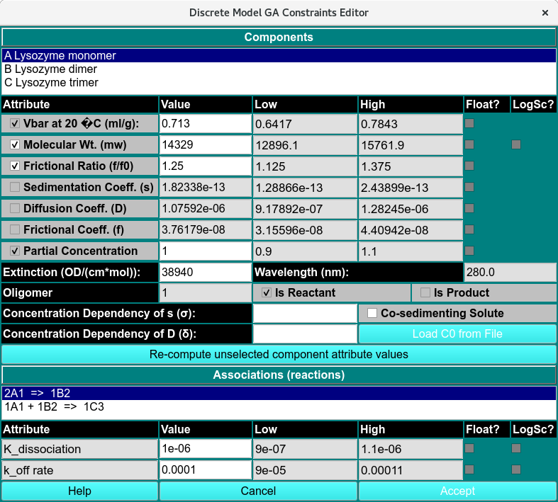

=============================================
Discrete Model Genetic Algorithm Constraints
=============================================

.. toctree:: 
  :maxdepth: 3

.. contents:: Index
  :local: 

The Discrete Model GA Constraints Editor is a sub-module of the `DMGA Initialization <dmga_init.html>`_ module that 
allows the user to define constraints for each parameter of the selected model, and to determine which parameters
are held fixed and which are floated. 

.. rst-class::
    :align: center

     **DMGA Contraints**

Component Parameters:
======================

For each component defined in the model, the following parameters can be defined:

  * **Vbar at 20 °C (mL/g):**
  * **Molecular Wt.(MW)**
  * **Frictional ratio (f/f0)**
  * **Sedimentation Coeff. (s)**
  * **Diffusion Coeff. (D)**
  * **Friction coeff.(f)**
  * **Partial Concentration**

Multiple parameter combinations can be selected for fitting, but hydrodynamic constraints restrict
the total number of parameters that can be fitted simultaneously. Select three out of the 6 possible
parameters to define each component by selecting the checkbox in the front of the parameter name.
Parameter values highlighted in white are writeable and can be changed in the white field. Greyed-out
values are read-only and can be recomputed with the **Re-compute unselected component parameter values**.
Any parameters selected for fitting need to be floated by selecting the **Float?** checkbox. Floated 
parameters require a **Low** and **High** limit between which the parameter is allowed to float. Select
parameters can be set to a logarithmic scale by checking the **LogSc?** checkbox.

DMGA Constraint Functions:
===========================

Component Parameters:
----------------------

.. list-table::
  :widths: 20 50
  :header-rows: 0 

  * - **Components**
    - Displays the list of analytes included in the model.
  * - **Vbar at 20 °C  (mL/g):**
    - Displays the vbar value for the selected analyte. If this parameter is selected for fitting, enter the desired **Low** and **High** Vbar limits.
  * - **Molecular Wt. (MW)**
    - Displays the molecular weight (MW) for the selected analyte. If this parameter is selected for fitting, enter the desired **Low** and **High** MW limits.
  * - **Frictional ratio (f/f0)**
    - Displays the frictional ratio (f/f0) for the selected analyte. If this parameter is selected for fitting, enter the desired **Low** and **High** f/f0 limits.
  * - **Sedimentation Coeff. (s)**
    - Displays the sedimentation coefficient (s) for the selected analyte. If this parameter is selected for fitting, enter the desired **Low** and **High** s limits.
  * - **Diffusion Coeff. (D)**
    - Displays the diffusion coefficient (D) for the selected analyte. If this parameter is selected for fitting, enter the desired **Low** and **High** D limits.
  * - **Frictional coeff. (f)**
    - Displays the frictional coefficient (f) for the selected analyte. If this parameter is selected for fitting, enter the desired **Low** and **High** f limits.
  * - **Partial Concentration**
    - Displays the partial concentration for the selected analyte. This parameter is always fitted automatically using either the default or user-defined **Low** and **High** partial concentration limits.
  * - **Extinction (OD/(cm*mol)).**
    - Displays the extinction value for the selected analyte at select wavelength (nm).
  * - **Wavelength (nm):**
    - The wavelength value.
  * - **Oligomer**
    - The oligomer number assigned to the selected analyte.
  * - **is (Reactant or Product)**
    - Indicates whether the selected analyte is defined as a reactant or a product in the model.
  * - **Concentration Dependency of s (σ)**
    - If the component has concentration dependent non-ideality of sedimentation, the sigma value (also called ks) can have a non-zero value.
  * - **Concentration Dependency of D (δ)**
    - If the component has concentration dependent non-ideality of diffusion, the delta value can have a non-zero value.
  * - **Re-Compute unselected component attribute values**
    - Recalculates the values of unselected component attributes based on the currently selected fitting parameters.

Association Parameters:
------------------------

.. list-table::
  :widths: 20 50
  :header-rows: 0 
  
  * - **Association (reactions)**
    - The association reactions defined for the model.
  * - **K_Dissociation**
    - The dissociation constant (**K_Dissociation**) for the selected reaction.
  * - **K_off rate**
    - The dissociation rate constant (**K_off**) for the selected reaction.

Window Controls:
-----------------

.. list-table::
  :widths: 20 50
  :header-rows: 0 

  * - **Help**
    - Open the DMGA constraints editor documentation. 
  * - **Cancel**
    - Reset and close window . 
  * - **Accept**  
    - Accept the user-defined parameters. 

