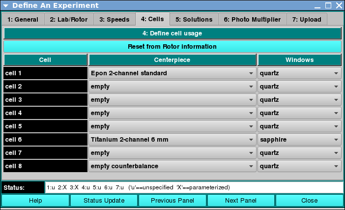

===============================================
Cells: Define Cell Centerpieces and Windows
===============================================

.. toctree:: 
  :maxdepth: 3

.. contents:: Index
  :local: 

Panel Tab Options: 
===================

In each panel, tabs are visible at the top of the window to enable the user to move to another panel, to perform specific experiment subtasks. 

1. `General <general.html>`_: A panel whose primary purpose is to specify the experiment run ID (a description string), select a parent project name, and possibly change data source (database or local disk) or database investigator name. 
2. `Lab/Rotor <rotor.html>`_: A panel whose primary purpose is to select the Laboratory, Rotor, and Calibration values for the experiment. 
3. `Speeds <speeds.html>`_: A panel whose primary primary purpose is to specify one or more speed steps. For each step, speeds and durations may be given. 
4. :ref:`Cells <cells>`: A panel whose primary purpose is to select the centerpieces (or counterbalance) for the cells, along with a quartz/sapphire windows selection. 
5. `Solutions <solutions.html>`_: A panel whose primary purpose is to specify the solution to be used in each cell/channel. 
6. `Optics <optics.html>`_: A panel whose primary purpose is to select the optical system used to scan.  
7. `Range <range.html>`_: A panel whose primary purpose is to select the wavelength ranges and cell radius measured.  
8. `Submit <submit.html>`_: A panel whose primary purpose is save and upload the protocol to the Optima/Instrument and database.  

Cells Panel:
=============

.. _cells:

Using this panel, you can define centerpiece and windows information for each cell of a proposed experiment. 
As with all panels, a set of tabs allows you to navigate to other panels in order to perform specialized subtasks relating to experiment creation. Links to and summaries of the panels are given in the final section of this page. 

.. rst-class::
    :align: center

    **Cell Components Panel**

Functions:
--------------

.. list-table::
  :widths: 20 50
  :header-rows: 0 

  * - **Centerpiece:** 
    - For each cell, a centerpiece or counterbalance may be selected from a pull-down list. 
  * - **Windows:** 
    - For each cell, **quartz** or **sapphire** windows type may be selected from a pull-down list. 

Shared Panel Functions:
========================

A panel status box and multiple buttons are shared by all panels. The `General <general.html>`_ tab help page has detailed explanations of these items. 