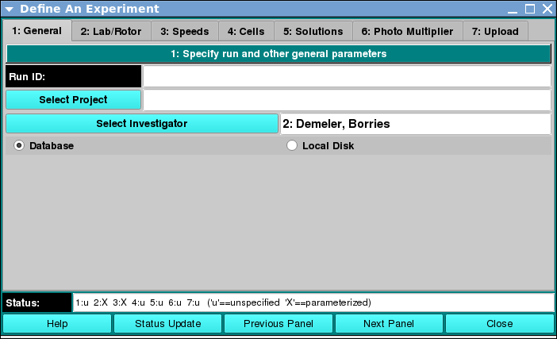

==========================
General: Create Experiment
==========================

.. toctree:: 
  :maxdepth: 3

.. contents:: Index
  :local: 

Panel Tab Options: 
===================

In each panel, tabs are visible at the top of the window to enable the user to move to another panel, to perform specific experiment subtasks. 

1. :ref:`General <general>`: A panel whose primary purpose is to specify the experiment run ID (a description string), select a parent project name, and possibly change data source (database or local disk) or database investigator name. 
2. `Lab/Rotor <rotor.html>`_: A panel whose primary purpose is to select the Laboratory, Rotor, and Calibration values for the experiment. 
3. `Speeds <speeds.html>`_: A panel whose primary primary purpose is to specify one or more speed steps. For each step, speeds and durations may be given. 
4. `Cells <cells.html>`_: A panel whose primary purpose is to select the centerpieces (or counterbalance) for the cells, along with a quartz/sapphire windows selection. 
5. `Solutions <solutions.html>`_: A panel whose primary purpose is to specify the solution to be used in each cell/channel. 
6. `Optics <optics.html>`_: A panel whose primary purpose is to select the optical system used to scan.  
7. `Range <range.html>`_: A panel whose primary purpose is to select the wavelength ranges and cell radius measured.  
8. `Submit <submit.html>`_: A panel whose primary purpose is save and upload the protocol to the Optima/Instrument and database.  

General Panel: 
===================

.. _general:

Using this panel, you can define general experiment parameters, such as Run ID and Project, along with data source (database or local disk) and investigator. 
As with all panels, a set of tabs allows you to navigate to other panels in order to perform specialized subtasks relating to experiment creation. Links to and summaries of the panels are given in the final section of this page. 

.. rst-class::
    :align: center

    **General Definitions Panel**

Functions:
--------------

.. list-table::
  :widths: 20 50
  :header-rows: 0 

  * - **Run ID:** 
    - Enter a unique run identifier string that will identify the experiment to be run. 
  * - **Select Project:** 
    - Click this button to open a full Project dialog in which a new project may be created or an existing one modified. Hitting the Accept button in that dialog will cause selection of a project for the experiment. 
  * - **(project list):** 
    - Pulling down and releasing on an item in the existing projects list causes the created experiment to be associated with that project. 
  * - **Select Investigator:**
    - Click this button to open a full database Investigator dialog in which an investigator may be chosen. 
  * - **(investigator text):** 
    - Any investigator chosen will be displayed in this text box. You may manually modify this text. 
  * - **Database:** 
    - Select this radio button to indicate that data used in creating the experiment comes from the database. 
  * - **Local:** 
    - Disk Select this radio button to indicate that data used in creating the experiment comes from the local disk. 

Shared Panel Functions:
========================

A panel status box and multiple buttons are shared by all panels. 

.. list-table::
  :widths: 20 50
  :header-rows: 0 

  * - **Status:** 
    - A text box shows the status of completion of needed parameterization for all the panels. Only when all panels have a 'X' state is upload of controls possible. 
  * - **Help:** 
    - Display the help manual page for the current panel. 
  * - **Status:** 
    - Update Click this button to re-read elements of all panels to compose updated status summary text. 
  * - **Previous Panel:** 
    - Convenience button to move to the panel previous to the current one. 
  * - **Next Panel:** 
    - Convenience button to move to the panel that follows the current one. 
  * - **Close:** 
    - Close the Experiment dialog. Note that any changes to database values or any upload of experiment controls is governed to elements within the panels of the Experiment dialog. This Close button merely closes the dialog, regardless of experiment definition state.
