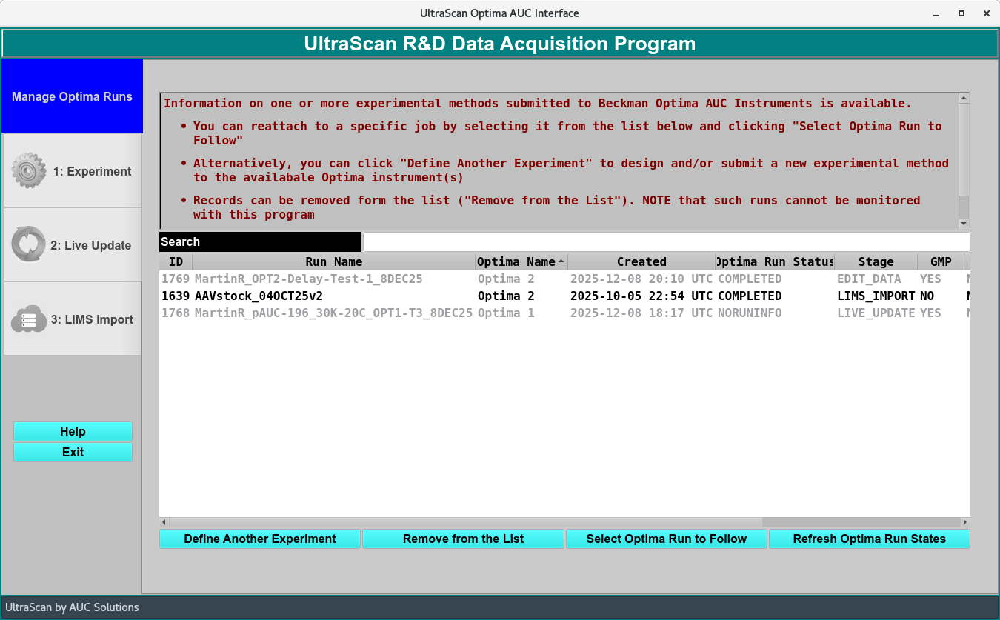

=====================================================
Research and Development AUC Data Acquisition Module
=====================================================

.. toctree:: 
  :maxdepth: 3

.. contents:: Index
  :local: 

.. toctree::
   :maxdepth: 1
   :caption: 1: Define an Experiment:
   
   general
   rotor
   speeds
   cells
   solutions
   optics
   range
   submit

.. toctree::
   :maxdepth: 1
   :caption: Monitor and Import an Experiment:

   liveupdate
   import
   
Data Acquisition
==================

.. rst-class::
    :align: center

    **Submission Panel**