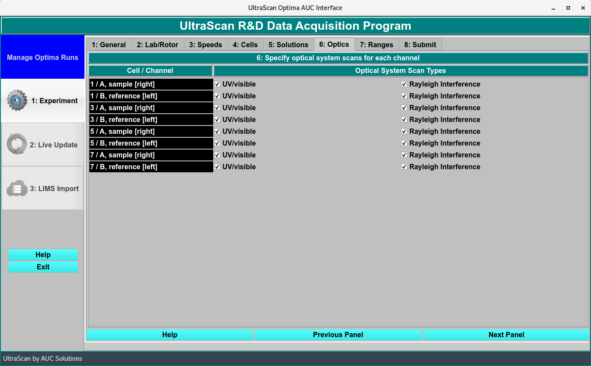

===============================================
Optics: Define Optical System Scan Types 
===============================================

.. toctree:: 
  :maxdepth: 3

.. contents:: Index
  :local: 

Panel Tab Options: 
===================

In each panel, tabs are visible at the top of the window to enable the user to move to another panel, to perform specific experiment subtasks. 

1. `General <general.html>`_: A panel whose primary purpose is to specify the experiment run ID (a description string), select a parent project name, and possibly change data source (database or local disk) or database investigator name. 
2. `Lab/Rotor <rotor.html>`_: A panel whose primary purpose is to select the Laboratory, Rotor, and Calibration values for the experiment. 
3. `Speeds <speeds.html>`_: A panel whose primary primary purpose is to specify one or more speed steps. For each step, speeds and durations may be given. 
4. `Cells <cells.html>`_: A panel whose primary purpose is to select the centerpieces (or counterbalance) for the cells, along with a quartz/sapphire windows selection. 
5. `Solutions <solutions.html>`_: A panel whose primary purpose is to specify the solution to be used in each cell/channel. 
6. :ref:`Optics <optics>`: A panel whose primary purpose is to select the optical system used to scan.  
7. `Range <range.html>`_: A panel whose primary purpose is to select the wavelength ranges and cell radius measured.  
8. `Submit <submit.html>`_: A panel whose primary purpose is save and upload the protocol to the Optima/Instrument and database.  

Optics Panel:
=============

.. _optics:

Define which optical system(s) will be used to scan each cell. The 'Optical System Scan Type' options are **UV/visible** and **Rayleigh Interference**. 

.. note::
    The instrument collects scans on a cell-by-cell basis, so the selections for a cell apply to both of its channels. 
            

.. rst-class::
    :align: center

    **Select Optical System Panel**

Shared Panel Functions:
========================

A panel status box and multiple buttons are shared by all panels. The `General <general.html>`_ tab help page has detailed explanations of these items. 