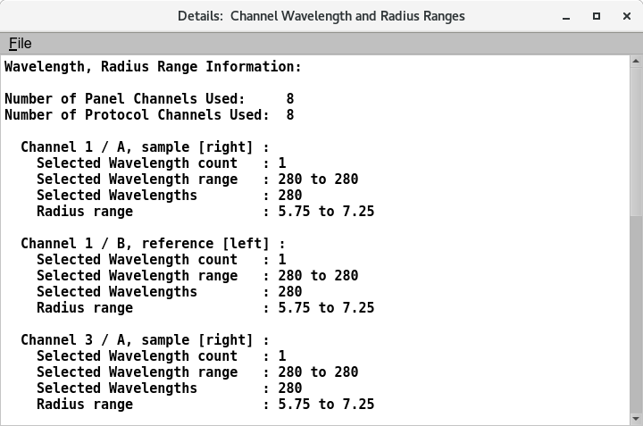

============================================================
Ranges: Define Wavelengths and Scanning Range of Cell Radius
============================================================

.. toctree:: 
  :maxdepth: 3

.. contents:: Index
  :local: 

Panel Tab Options: 
===================

In each panel, tabs are visible at the top of the window to enable the user to move to another panel, to perform specific experiment subtasks. 

1. `General <general.html>`_: A panel whose primary purpose is to specify the experiment run ID (a description string), select a parent project name, and possibly change data source (database or local disk) or database investigator name. 
2. `Lab/Rotor <rotor.html>`_: A panel whose primary purpose is to select the Laboratory, Rotor, and Calibration values for the experiment. 
3. `Speeds <speeds.html>`_: A panel whose primary primary purpose is to specify one or more speed steps. For each step, speeds and durations may be given. 
4. `Cells <cells.html>`_: A panel whose primary purpose is to select the centerpieces (or counterbalance) for the cells, along with a quartz/sapphire windows selection. 
5. `Solutions <solutions.html>`_: A panel whose primary purpose is to specify the solution to be used in each cell/channel. 
6. `Optics <optics.html>`_: A panel whose primary purpose is to select the optical system used to scan.  
7. :ref:`Range <range>`: A panel whose primary purpose is to select the wavelength ranges and cell radius measured.  
8. `Submit <submit.html>`_: A panel whose primary purpose is save and upload the protocol to the Optima/Instrument and database.  

Ranges Panel:
=============

.. _ranges:

.. image:: ../_static/images/experiment_range.png
    :align: center

.. rst-class::
    :align: center

    **Wavelength and Radius Ranges Panel**

Functions:
--------------

.. list-table::
  :widths: 20 50
  :header-rows: 0 
  
  * - **View Ranges**:
    - Click to see a :ref:`details .txt 
` file on of the cell channels, wavelength measured and radius range scanned. 
  * - **Scan Interval: UV/vis.(in red if updated)**
    - The interval time of each UV/vis scan.
  * - **Scan Interval: Interference(in red if updated)**
    - The interval time of each interference scan.
  * - **Stage 1. Number of Scans per Triple (UV/vis):####**
    - Number of totals UV/vis scans per triple (cell/channel/wavelength). 
  * - **Stage 1. Number of Scans per Triple (Interference):####**
    - Number of totals Interference scans per triple (cell/channel/wavelength). 
  * - **Cell / Channel**
    - The cell number and channel selected to be measured.  
  * - **Wavelengths**
    - The :ref:`wavelength ranges <selector>` can be picked by a selector dialog or manually dialog options. 
  * - **Radius Range**
    - For each cell, users can select the cell radius range to be measured from 5.75 cm to 7.25 cm. e

.. _details:

.. rst-class::
    :align: center

    **Details of Ranges Selected**

.. _selector:

.. subfigure:: AB     
  :class-grid: outline 
  :gap: 8px
  :align: center

  .. image:: ../_static/images/experiment_range_selector.png
    :align: left
    :width: 100%

  .. image:: ../_static/images/experiment_range_selmanual.png
    :width: 100%
    :align: right

.. rst-class:: center

    **Wavelength Selection Options**

Shared Panel Functions:
========================

A panel status box and multiple buttons are shared by all panels. The `General <general.html>`_ tab help page has detailed explanations of these items. 