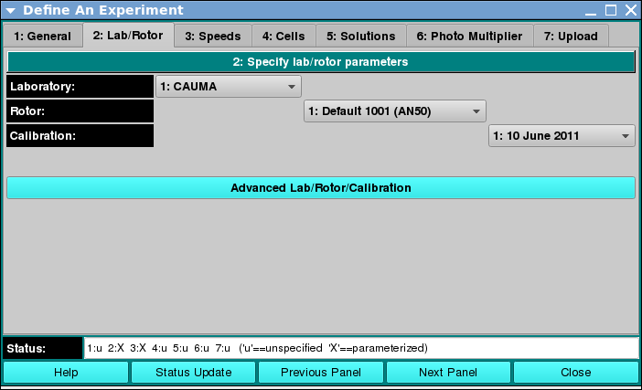

===============================================
Lab/Rotor: Define Lab and Rotor Conditions
===============================================

.. toctree:: 
  :maxdepth: 3

.. contents:: Index
  :local: 

Panel Tab Options: 
===================

In each panel, tabs are visible at the top of the window to enable the user to move to another panel, to perform specific experiment subtasks. 

1. `General <general.html>`_: A panel whose primary purpose is to specify the experiment run ID (a description string), select a parent project name, and possibly change data source (database or local disk) or database investigator name. 
2. :ref:`Lab/Rotor <rotor>`: A panel whose primary purpose is to select the Laboratory, Rotor, and Calibration values for the experiment. 
3. `Speeds <speeds.html>`_: A panel whose primary primary purpose is to specify one or more speed steps. For each step, speeds and durations may be given. 
4. `Cells <cells.html>`_: A panel whose primary purpose is to select the centerpieces (or counterbalance) for the cells, along with a quartz/sapphire windows selection. 
5. `Solutions <solutions.html>`_: A panel whose primary purpose is to specify the solution to be used in each cell/channel. 
6. `Optics <optics.html>`_: A panel whose primary purpose is to select the optical system used to scan.  
7. `Range <range.html>`_: A panel whose primary purpose is to select the wavelength ranges and cell radius measured.  
8. `Submit <submit.html>`_: A panel whose primary purpose is save and upload the protocol to the Optima/Instrument and database.  

Lab/Rotor Panel:
===================

.. _rotor:

Using this panel, you can specify the rotor to be used on a proposed experiment. Specifications include the laboratory, the rotor type, and the calibration. 
The `Rotor Management <../rotor.html>`_ module help page has detailed explanations of these items. 

.. rst-class::
    :align: center

    **Lab and Rotor Panel**

Functions:
--------------

.. list-table::
  :widths: 20 50
  :header-rows: 0 

  * - **Laboratory:** 
    - Pull down a list and release on the laboratory to which the experiment belongs. 
  * - **Rotor:** 
    - Pull down a list and release on the type of rotor to be used in the experiment. 
  * - **Calibration:** 
    - Pull down a list and release on the calibration (in date string form) for use in the experiment. 
  * - **Advanced Lab/Rotor/Calibration:** 
    - Click on this button to open a full Rotor dialog in which laboratory/rotor/calibration information may be created/selected. Selections in that dialog will be reflected in the other Experiment Rotor Panel GUI elements. 
  

Shared Panel Functions:
========================

A panel status box and multiple buttons are shared by all panels. The `General <general.html>`_ tab help page has detailed explanations of these items. 