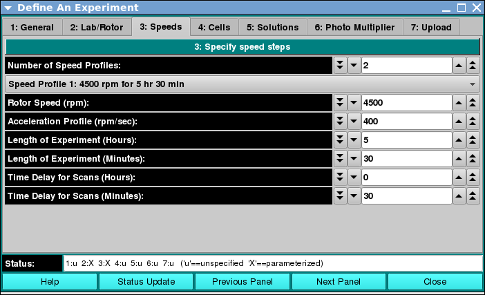

===============================================
Speeds: Define Speed and Duration Profiles
===============================================

.. toctree:: 
  :maxdepth: 3

.. contents:: Index
  :local: 

Panel Tab Options: 
===================

In each panel, tabs are visible at the top of the window to enable the user to move to another panel, to perform specific experiment subtasks. 

1. `General <general.html>`_: A panel whose primary purpose is to specify the experiment run ID (a description string), select a parent project name, and possibly change data source (database or local disk) or database investigator name. 
2. `Lab/Rotor <rotor.html>`_: A panel whose primary purpose is to select the Laboratory, Rotor, and Calibration values for the experiment. 
3. :ref:`Speeds <speeds>`: A panel whose primary primary purpose is to specify one or more speed steps. For each step, speeds and durations may be given. 
4. `Cells <cells.html>`_: A panel whose primary purpose is to select the centerpieces (or counterbalance) for the cells, along with a quartz/sapphire windows selection. 
5. `Solutions <solutions.html>`_: A panel whose primary purpose is to specify the solution to be used in each cell/channel. 
6. `Optics <optics.html>`_: A panel whose primary purpose is to select the optical system used to scan.  
7. `Range <range.html>`_: A panel whose primary purpose is to select the wavelength ranges and cell radius measured.  
8. `Submit <submit.html>`_: A panel whose primary purpose is save and upload the protocol to the Optima/Instrument and database.  

Speeds Panel: 
===================

.. _speeds:

.. rst-class::
    :align: center

    **Speed Profile Panel**

Functions:
--------------

.. list-table::
  :widths: 20 50
  :header-rows: 0 

  * - **Number of Speed Profiles:** 
    - Select a counter value that specifies the number of constant rotor speeds to be used for the duration of the experiment. Most often, this will be "1". 
  * - **(step description):** 
    - This pull-down menu selection sets the speed step for which the speed and duration to follow apply. 
  * - **Rotor Speed (rpm):** 
    - Select a counter value to specify the rotor speed for the speed step. 
  * - **Acceleration Profile (rpm_sec):** 
    - Select an acceleration value for the transition from zero speed or from the speed of the previous step. 
  * - **Length of Experiment (Hours):** 
    - Specify the duration in hours of the portion of the experiment at the current rotor speed. 
  * - **Length of Experiment (Minutes):** 
    - Specify the residual minutes of duration of the portion of the experiment at the current rotor speed. This specification may be a floating point value. 
  * - **Time Delay for Scans (Hours):** 
    - Specify the duration in hours of the portion of the experiment spent in transitioning from zero speed or the previous speed to the current constant rotor speed. 
  * - **Time Delay for Scans (Minutes):** 
    - Specify the residual minutes of duration of the portion of the experiment spent in transitioning from zero speed or the previous speed to the current constant rotor speed. This specification may be a floating point value. 
  

Shared Panel Functions:
========================

A panel status box and multiple buttons are shared by all panels. The `General <general.html>`_ tab help page has detailed explanations of these items. 