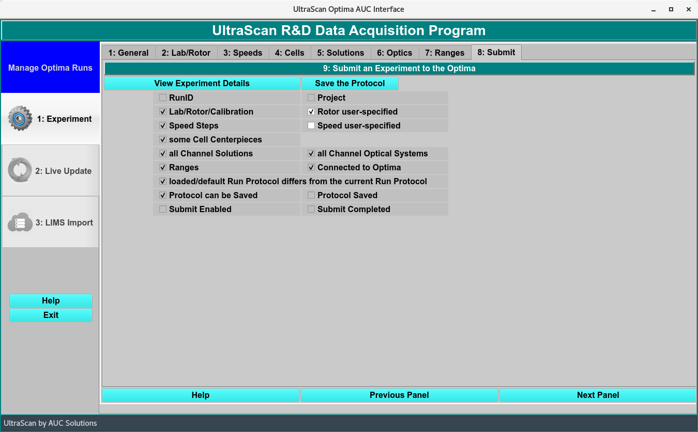
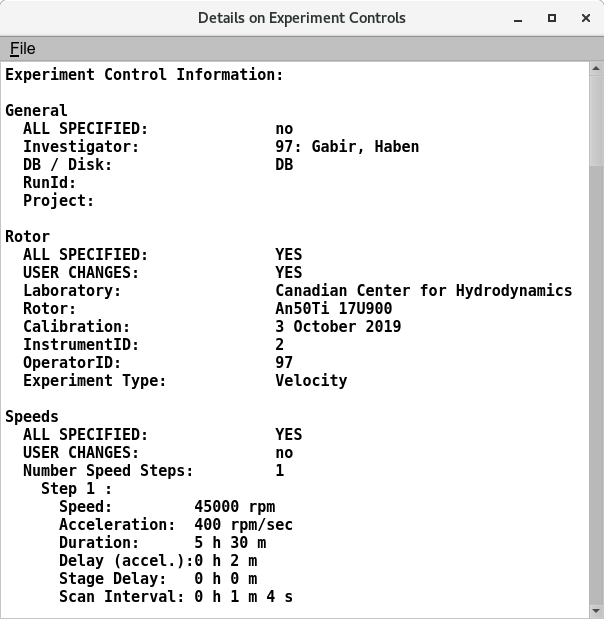

===============================================
Submit: Submission Checklist and Save Protocol
===============================================

.. toctree:: 
  :maxdepth: 3

.. contents:: Index
  :local: 

Panel Tab Options: 
===================

In each panel, tabs are visible at the top of the window to enable the user to move to another panel, to perform specific experiment subtasks. 

1. `General <general.html>`_: A panel whose primary purpose is to specify the experiment run ID (a description string), select a parent project name, and possibly change data source (database or local disk) or database investigator name. 
2. `Lab/Rotor <rotor.html>`_: A panel whose primary purpose is to select the Laboratory, Rotor, and Calibration values for the experiment. 
3. `Speeds <speeds.html>`_: A panel whose primary primary purpose is to specify one or more speed steps. For each step, speeds and durations may be given. 
4. `Cells <cells.html>`_: A panel whose primary purpose is to select the centerpieces (or counterbalance) for the cells, along with a quartz/sapphire windows selection. 
5. `Solutions <solutions.html>`_: A panel whose primary purpose is to specify the solution to be used in each cell/channel. 
6. `Optics <optics.html>`_: A panel whose primary purpose is to select the optical system used to scan.  
7. `Range <range.html>`_: A panel whose primary purpose is to select the wavelength ranges and cell radius measured.  
8. :ref:`Submit <submit>`: A panel whose primary purpose is save and upload the protocol to the Optima/Instrument and database.  

Submit Panel:
=============

.. _submit:

.. rst-class::
    :align: center

    **Submission Panel**

Functions:
--------------

.. list-table::
  :widths: 20 50
  :header-rows: 0 

  * - **View Experiment Details**
    - Once all the Panels have been filled out, the details of the experiment can be viewed in a :ref:`Details 
` dialog.
  * - **Save the Protocol**
    - Click to save the protocol once all the check ark boxed are checked. 

.. _details:

.. rst-class::
    :align: center

    **Experimental Details in the Submission Panel**

Checklist to Save:
---------------------
  * RunID
  * Project
  * Lab/Rotor/Calibration
  * Rotor user-specified
  * Speed Steps 
  * Speed user-specified
  * Some Cell centerpieces
  * All Channel Solutions
  * All Channel Optical Systems
  * Ranges  
  * Connected to Optima
  * loaded/default Run Protocol differs from the current Run Protocol
  * Protocol can be Saved

  * Protocol Saved
  * Submit Enabled
  * Submit Completed

Shared Panel Functions:
========================

A panel status box and multiple buttons are shared by all panels. The `General <general.html>`_ tab help page has detailed explanations of these items. 