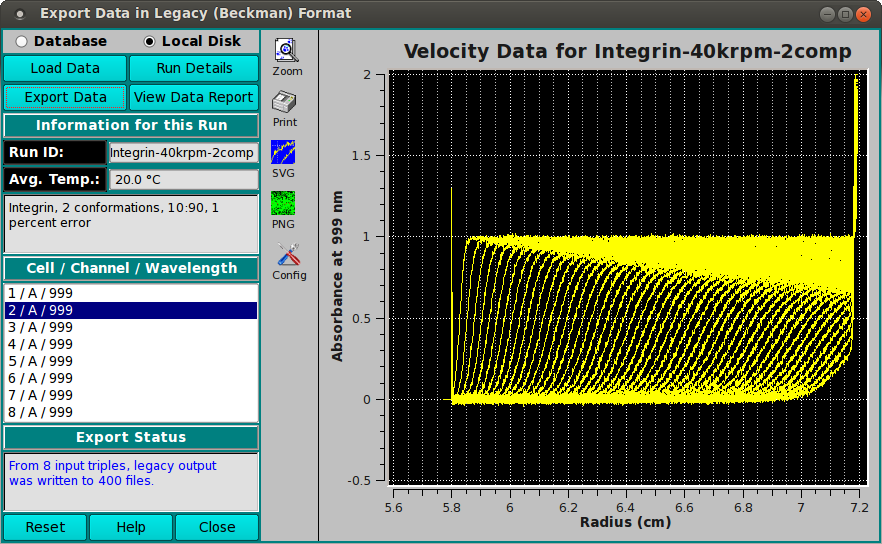
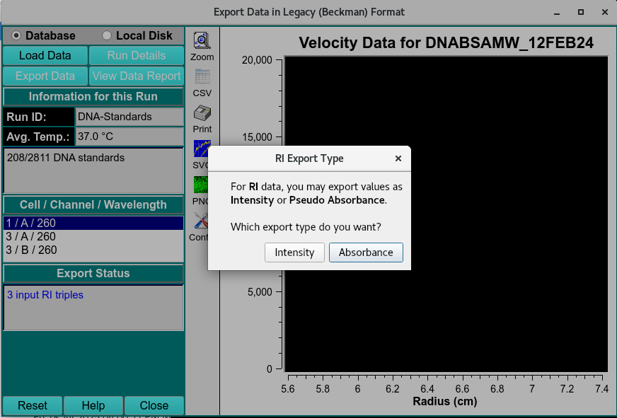
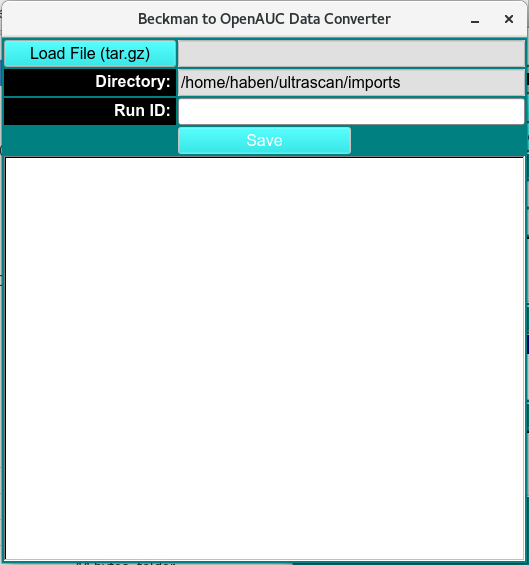

==================================
Export Data in Legacy Format: 
==================================

.. toctree:: 
  :maxdepth: 3

.. contents:: Index
  :local: 

This module enables you to load a run with one or more triplicates in UltraScan III format (.auc) and export the data to files in legacy (Beckman) format. 

.. rst-class::
    :align: center

    **Export Data into Legacy (Beckman) Format**

Once loaded by clicking **Load Data**, sedimentation velocity data that has been converted to pseudo-absorbance from intensity by the `Import <import.html>`_ module can be exported as Intensity(RI) or as Pseudo-absorbance (RA) data. 

A popup dialog will appear to prompt the type the user wants to export 

.. rst-class::
    :align: center

    **Data Type Prompt**

.. list-table::
  :widths: 50 50 
  :header-rows: 1   

  * - * Intensity(.RI)
    - * Pseudo-absorbance (.RA)
  * - 
    -

.. subfigure:: AB     
  :class-grid: outline 
  :gap: 8px
  :align: center

  .. image:: _static/images/export_leg_RI.png
    :align: left
    :width: 100%

  .. image:: _static/images/export_leg_RA.png
    :width: 100%
    :align: right 

.. note:: 
    Legacy Beckman  and UltraScan III format are organized as in the table below, so when importing into Ultrascan III, Beckman format files have to be compressed into .tar.gz files and converted into UltraScan III format using :ref:`Beckman to OpenAUC Data Converted <data_converter>`.

.. list-table::
  :widths: 50 50 
  :header-rows: 1   

  * - * The .auc files are defined as:
    - * The legacy (Beckman) files configured as:
  * - 
    -

.. subfigure:: AB     
  :class-grid: outline 
  :gap: 8px
  :align: center

  .. image:: _static/images/export_leg_auc.png
    :align: left
    :width: 100%

  .. image:: _static/images/export_leg_beck.png
    :width: 100%
    :align: right 

Beckman (tar.gz) to OpenAUC Data Converter:
============================================
.. _data_converter:

This conversion tool allows the user to convert tar.gz archives created by the Beckman-Coulter's web-based data acquisition application into the OpenAUC format for use by UltraScan III.

.. rst-class:: center

    **Beckman to OpenAUC Data Converter**

Functions:
===========

.. list-table::
  :widths: 20 50
  :header-rows: 0 

  * - **Database**
    - Select to specify data input from the database.
  * - **Local Disk** 
    - Select to specify data input from local disk or the database.
  * - **Load Data**
    - Click here and, in the resulting `Load Data Dialog <common_dialogs.html#data-loader>`_, select a run ID for the data set to load.
  * - **Run Details**
    - Pop up a dialog showing run details.
  * - **Export Data**
    - Click to export all triples of the data to files in legacy (Beckman) format.
  * - **View Data Report** 
    - Generate a report file and view it in a dialog.
  * - **Run ID:** 
    - The Run identifier string is displayed for the loaded data sets.
  * - **Avg. Temp.:** 
    - The average temperature over all the scans of the currently selected triple.
  * - **(experiment description)**
    - A text string is displayed giving a fairly detailed description of the experiment.
  * - **Cell / Channel / Wavelength** 
    - One or more rows of raw data triples. Click on a row to display its data in the plot window to the right.
  * - **Export Status** 
    - This text window displays continually updated summaries of computational activity and results.
  * - **(right side plot)** 
    - This plot shows the Experimental data for the currently selected triple.
  * - **Reset**
    - Reset all parameters to defaults.
  * - **Help** 
    - Display this and other documentation.
  * - **Close**
    - Close the window and exit.

