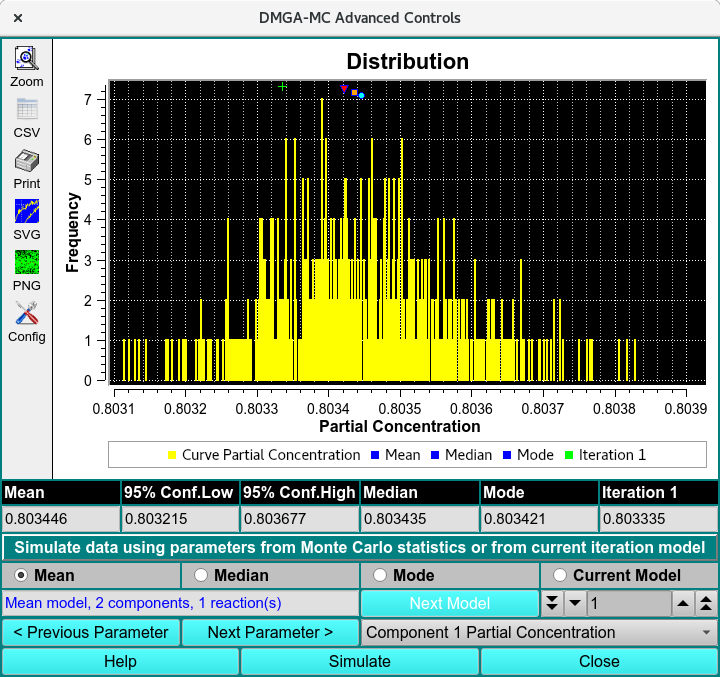

===================================
DMGA-MC Advanced Analysis
===================================

.. toctree:: 
    :maxdepth: 3

.. contents:: Index
    :local: 

Review the Monte Carlo results of a Discrete Model Genetic Algorithm simulation using the DMGA-MC advanced Controls window. 

.. rst-class:: 
    :align: center

    **Discrete Genetic Algorithm Results**

DMGA-MC Functions: 
====================

.. list-table::
  :widths: 20 50 

  
  * - **Distribution Plot**
    - Displays the distribution of fitted parameter values generated from the Monte Carlo simulation. This plot helps visualize the spread, frequency, and confidence of the parameter estimates.
  * - **Mean** 
    - Shows the average value of the selected parameter across all Monte Carlo iterations.
  * - **95% Conf.Low**
    - Displays the lower bound of the 95% confidence interval for the selected parameter.
  * - **95% Cong. High**
    - Displays the upper bound of the 95% confidence interval for the selected parameter.
  * - **Median** 
    - Shows the median value of the selected parameter distribution, representing the midpoint of all simulated results.
  * - **Mode** 
    - Displays the most frequently occurring value in the selected parameter distribution.
  * - **Iteration**
    - Indicates the current Monte Carlo iteration or selected model instance being displayed.

Statistics
-------------

.. list-table::
  :widths: 20 50 

  * - **Mean** 
    - Displays the arithmetic average of the selected parameter across all Monte Carlo results.
  * - **Median**
    - Displays the middle value of the selected parameter distribution when the results are ordered from lowest to highest.
  * - **Mode** 
    - Displays the most common value observed for the selected parameter in the Monte Carlo simulation.
  * - **Current Model**
    - Shows the parameter value for the currently selected model or iteration.
  * - **Textbox**
    - Allows manual entry of a model or iteration number for direct navigation to a specific result.
  * - **Next Model** 
    - Advances to the next model or iteration in the Monte Carlo result set.
  * - **Previous and Next parameters**
    - Moves between the available fitted parameters for review and comparison.
  * - **Component parameter pulldown menu**
    - Allows selection of the component and parameter to display in the statistics and distribution plot.
  * - **Simulate**
    - Recalculates or displays the simulation results for the currently selected model and parameter.
  * - **Help**
    - Opens the help documentation for the DMGA-MC Advanced Analysis window.
  * - **Close** 
    - Closes the DMGA-MC Advanced Analysis window.