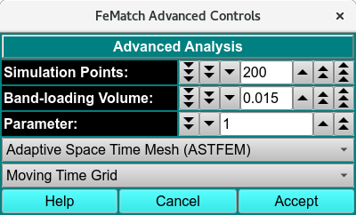

===================================
Advanced Analysis Dialog
===================================

.. toctree:: 
    :maxdepth: 3

.. contents:: Index
    :local: 

This dialog may be invoked from US_FeMatch in order to set advanced control parameters. 

.. rst-class::
    :align: center

**FEMatch Advanced Controls Dialog**

Advanced Control Functions
---------------------------------

.. list-table::
  :widths: 20 50
  :header-rows: 0 

    
  * - **Simulation Points:**
    -  Specify simulation points.
  * - **Band-loading Volume:**
    -  Specify a band-loading volume value.
  * - **Parameter:**
    -  Choose a parameter value.
  * - **(mesh type)**
    -  Select from one of several mesh types, including Adaptive Space Time (ASTFEM), Claverie, Moving Hat, user File, or Adaptive Space Volume (ASVFEM).
  * - **(grid type)**
    -  Select a moving-time or constant-time grid type.
  * - **Help**
    -  Display this and other documentation. 
  * - **Cancel**
    -  Close this dialog and exit with no selections made.
  * - **Accept**
    -  Close the dialog and communicate selections made here to the calling dialog.
 