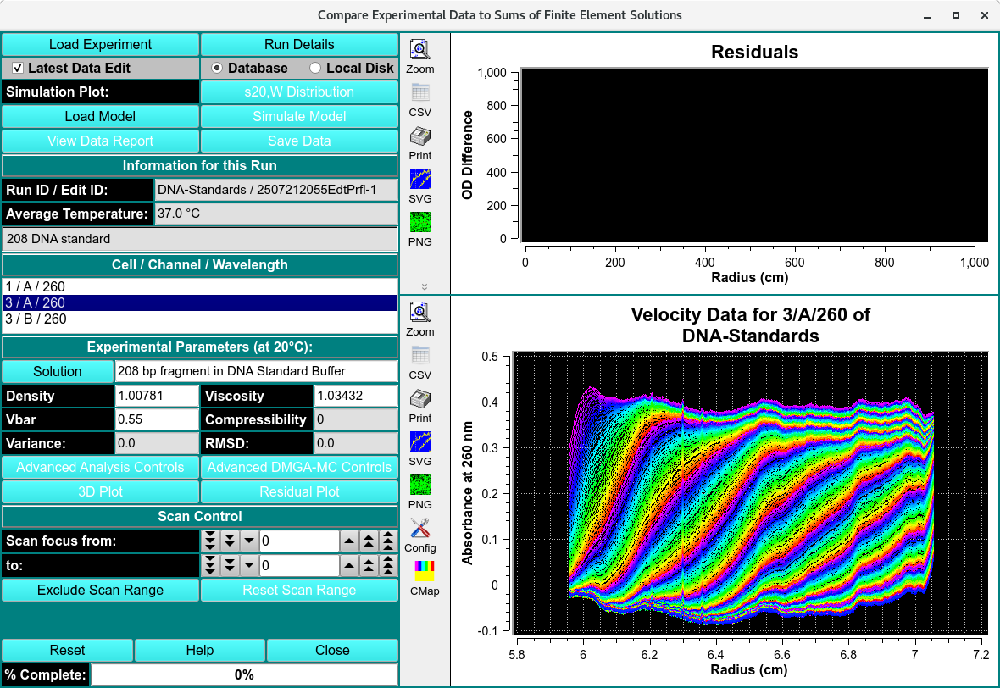
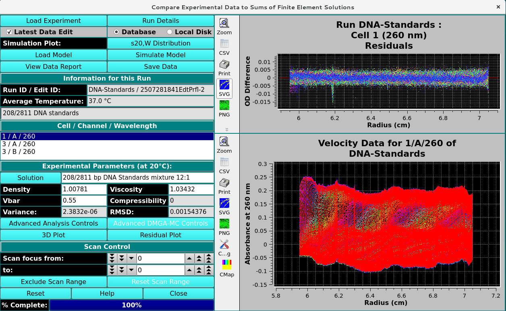

===========================================
Finite Element (FE) Model Viewer
===========================================

.. toctree:: 
    :maxdepth: 3

.. contents:: Index
    :local: 

This module is used to display, and export FE solutions fitted to velocity experiments by various methods. The program can import models from *finite element nonlinear fitting sessions*, from *2-dimensional spectrum analysis* fits, from *genetic algorithm* fits, and from *C(s)* fits. The program will then compare the fitted model to the experimental data and display residual plots, sedimentation and diffusion coefficient distributions, as well as molecular weight distributions. The model can be displayed as a 3-dimensional plot showing the partial concentrations mapped onto a 2-dimensional grid of any two of the following parameters: s, D, f, f/f :sub:`0` , and MW. Residual plots including deconvoluted time- and radially-invariant noise plots can also be displayed. The results can be saved for inclusion into a velocity result report.

.. rst-class:: center

    **Compare Experiment to Finite Element Solution**

.. rst-class:: center

    **Simulated Finite Element Solution**

Functions:
==============

.. list-table::
  :widths: 20 50
  :header-rows: 0

  * - **Load Experiment** 
    - Click here and, in the resulting `Load Data Dialog <../common_dialogs.html#data-loader>`_, select an edited data set to load.
  * - **Run Details**
    - Pop up a dialog showing `Run details <../run_details.html>`_.	
  * - **Latest Data Edit** 
    - Uncheck to allow choosing an edit other than the latest one for the raw experimental data.
  * - **Database**
    - Select to specify data input from the database.	
  * - **Local Disk** 
    - Select to specify data input from local disk.			
  * - **Load Model**
    - Load model data, choosing a model in a `Model Loader dialog <../common_dialogs.html#load-distribution-model>`_. If appropriate noise exists, you may also be presented with a :ref:`Noise Loader dialog <manage_noise>` to select time-invariant and/or radially-invariant noise vector(s) to load.
  * - **Simulate Model** 
    -  Run a simulation and display results. For details on the results of clicking this button, see `Simulate Model Results <fe_match_simulate.html>`_.
  * - **View Data Report**
    - Generate a report file and view it in a dialog.	
  * - **Save Data**
    - Generate reports and save to file.

**Simulation Plot**: Bar plot of the selected distributions. The choices are as follows:
        
.. list-table::
  :widths: 50 50 
  :header-rows: 1   

  * - * Residuals
    - * s :sub:`20,w` distribution
  * - 
    -

.. subfigure:: AB     
  :class-grid: outline 
  :gap: 8px
  :align: center

  .. image:: ../_static/images/residuals.png
    :align: left
    :width: 100%

  .. image:: ../_static/images/s20W_bar.png
    :width: 100%
    :align: right 

.. list-table::
  :widths: 50 50 
  :header-rows: 1   

  * - * MW distribution
    - * D :sub:`20,w` distribution
  * - 
    -

.. subfigure:: AB     
  :class-grid: outline 
  :gap: 8px
  :align: center

  .. image:: ../_static/images/MW-bar.png
    :align: left
    :width: 100%

  .. image:: ../_static/images/D20W_bar.png
    :width: 100%
    :align: right

**Information for this Run:**

.. list-table::
  :widths: 20 50
  :header-rows: 0
  
  * - **Run ID / Edit ID:**
    - The Run identifier string and the Edit identifier (generally a time string) are displayed for loaded edit.
  * - **Average Temperature:**
    - The average temperature over all the scans of the loaded data.
  * - **(experiment description)**
    - A text string is displayed giving a fairly detailed description of the experiment.
  	
**Cell / Channel / Wavelength:** One or more rows of data edit triples. If more than one, click on a row to select it as the data of interest.

**Experimental Parameters (at 20°C):**

.. list-table::
  :widths: 20 50
  :header-rows: 0

  * - **Solution**
    - Click this button to open a `Solution Management <solution/solution_select.html>`_ that allows changes to buffer and analyte characteristics of the data set.
  * - **Density**
    - Shows the density value for the loaded experiment. Click the Solution button to open a dialog in which density and other values may be changed.
  * - **Viscosity**
    - Shows the viscosity value for the loaded experiment. Click the Solution button to open a dialog in which viscosity and other values may be changed.	
  * - **Vbar**
    - Shows the vbar value for the loaded experiment. Click the Solution button to open a dialog in which vbar and other values may be changed.
  * - **Compressibility**
    - Compressibility value for the loaded experiment. The value shown here is set in Solution/Buffer dialogs, but may also be modified in this text box.
  * - **Variance:**
    - Variance value (square of RMSD) for residuals.
  * - **RMSD:**
    - Root-Mean-Square-of-Differences for residuals.
  * - **Advanced Analysis Controls**
    - Click to reveal an `Advanced Analysis Controls <fe_match_adv.html>`_, with options to set parameters related to Reversible Associations (RA) models or to show details on model components.
  * - **3D Plot**
    - Show a dialog of plot controls for a 3-dimensional model plot. See `3-Dimensional Plot Controls Details <3d_plot.html>`_.
  * - **Residual Plot**
    - Show a plot dialog with a more advanced set of data/residuals/noise plots. See `Simulate Model Results <fe_match_simulate.html>`_.

**Window Controls**

.. list-table::
  :widths: 20 50
  :header-rows: 0 

  * - **Reset** 
    - Indicate that window is reset and the plots are initiated.
  * - **Help** 
    - Display this detailed van Holde-Weischet Analysis help.
  * - **Close** 
    - Close all windows and exit.

The main **Compare Experiment to Finite Element Solution** window may need additional controls  when the model loaded includes Reversible Associations (RA). These controls can be revealed using the `Advanced Analysis Controls <fe_match_adv.html>`_ button to invoke a separate dialog.

Noise Vector Selection 
============================

.. _manage_noise:

When the **Noise Dialog Level** in the `Configuration and Preferences setting <../config.html#advanced-configuration-panel>`_ is enabled (1), the user can select the noise profiles to simulate the data with. 

.. image:: ../_static/images/noise_prompt.png
  :align: center

.. rst-class:: center

    **Noise Vector prompt**

**No** - no noise will be selected, model will be simulated without noise correction, 

**Yes** - User will be prompted to select the noise vector. 

.. image:: ../_static/images/noise_vec_db.png
  :align: center

.. rst-class:: center

    **Noise Vector Database Load**

.. note::
  The Model siblings are in the order of latest noise fitted. The n

Related
====================
`Simulated Finite Element Model Viewer <fe_match_simulate.html>`_

`2-Dimensional Spectrum Analysis <../2dsa.html>`_

`Initialize Genetic Algorithm <../ga_initialize.html>`_

