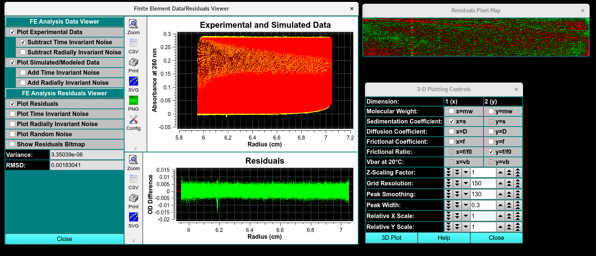
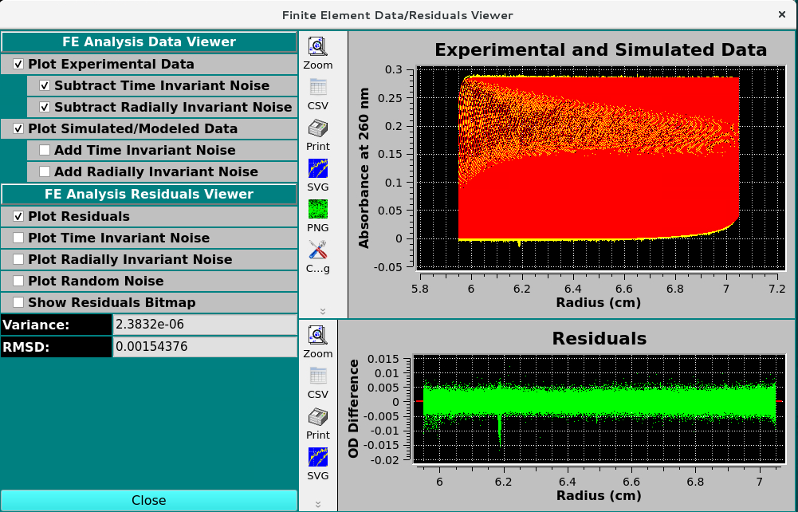
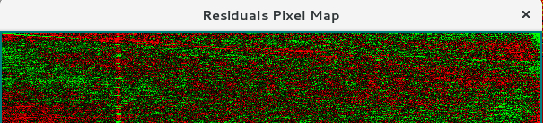
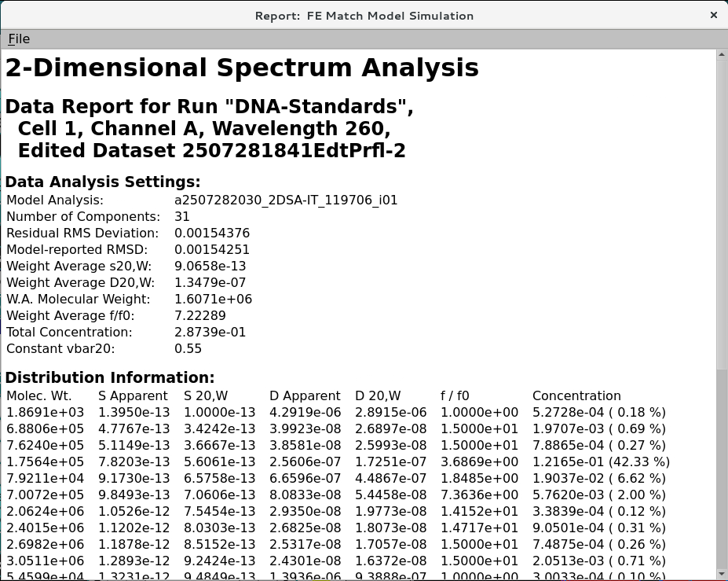

=====================================
Finite Element (FE) Model Simulation
=====================================

.. toctree:: 
  :maxdepth: 3

.. contents:: Index
  :local: 

Simulation Product Output Summary:
===================================

When the **Simulate Model** button is clicked in the **Finite Element Model Viewer** window, a simulation is performed using the Edit data, a Loaded Model, and simulation parameters primarily created using the edit data set. A simulation data set is created that has the same ranges as the edit set, but with readings values that are calculated and compared to the actual experimental data. The comparison spawns a number of new dialogs and options that allow the user to evaluate the quality of the model.

 * **Finite Element Data/Residuals Viewer** - Visual comparison of simulated and experimental data. Graphical display of time and radially invariant noises subtracted. 
 * **Residuals Pixel Map** - Bit map of every scan as a pixel line and the positive or negative difference of the model to the data are highlighted as red (negative) and green(positive) pixels. an Excellent residual map will have a random distribution of red and green pixels. 
 * `3-Dimensional Plot Controls <../3d_plot.html>`_ - 3D plots of the simulated data
 * **Data report File** - Generate a Simulated model Report file and view it in a dialog.

.. rst-class:: 
    :align: center

    **Simulation Results**

Finite Element Viewer
-----------------------
The simulation creates a data set with the same ranges as the edit experimental data set. The actual values for scan readings vectors are synthetically produced, as illustrated by the plot below.

.. rst-class:: 
    :align: center

    **Simulated Viewer Result**

Functions:
^^^^^^^^^^^^

**FE Analysis Data Viewer**

.. list-table::
  :widths: 20 50
  :header-rows: 0 
      
  * - Plot Experimental Data:
    - View the experimental data in the Experimental and Simulated Data Plot. 
  * - Subtract Time Invariant Noise:
    - Add Time Invariant Noise to the Experimental data in the Experimental and Simulated Data Plot. 
  * - Subtract Radially Invariant Noise:
    - Add Radially Invariant Noise to the Experimental data in the Experimental and Simulated Data Plot. 
  * - Plot Simulated/Modeled Data:
    -  View the simulated data in the Experimental and Simulated Data Plot. 
  * - Add Time Invariant Noise:
    -  Add Time Invariant Noise to the Simulated data in the Experimental and Simulated Data Plot. 
  * - Add Radially Invariant Noise:
    - Add Radially Invariant Noise to the Simulated data in the Experimental and Simulated Data Plot. 

**FE Analysis Residual Viewer**

.. list-table::
  :widths: 20 50
  :header-rows: 0 
      
  * - Plot Residuals
    - click to show the random residuals in the Residuals Plot  
  * - Plot Time Invariant Noise
    - click to show the time invariant noise in the Residuals Plot  
  * - Plot Radially Invariant Noise
    - click to show the Radially invariant noise in the Residuals Plot  
  * - Plot Random Noise
    - click to show the random residuals in the Residuals Plot 
  * - Show Residuals Bit map
    - Show a plot dialog of pixelated bit map. 
  * - Variance:
    - Variance value (square of RMSD) for residuals. 
  * - RMSD:
    - Root-Mean-Square-of-Differences for residuals.  

|

Noise Data analysis:
^^^^^^^^^^^^^^^^^^^^^^

.. list-table::
  :widths: 50 50
  :header-rows: 1

  * - **The Simulation**
    - **Overlap Plot**
  * - The simulation creates a data set with the same ranges as the edit experimental data set. The actual values for scan readings vectors are synthetically produced, as illustrated by the plot below. 
    - Upon completion of simulation computations the plot of experimental data (in yellow and cyan) is overlaid in the main window lower plot with the simulation data (in red), as shown in the image below. 
  
.. subfigure:: AB     
  :class-grid: outline 
  :gap: 8px
  :align: center

  .. image:: ../_static/images/fe_sim-1.png
    :align: left
    :width: 100%

  .. image:: ../_static/images/fe_sim-2.png
    :width: 100%
    :align: right

.. rst-class:: 
   :align: center

  **Simulated Data alone (red) and overlapped with Experimental Data (yellow)**

|

.. list-table::
  :widths: 50 50 50
  :header-rows: 1   

  * - Add time-invariant noise to data 
    - Add radially-invariant noise to data
    - Add time-invariant noise and radially-invariant to data
  * - 
    -
    -

.. subfigure:: ABC     
  :class-grid: outline 
  :gap: 8px
  :align: center

  .. image:: ../_static/images/add_TIN.png
    :align: left
    :width: 100%

  .. image:: ../_static/images/add_RIN.png
    :width: 100%
    :align: left

  .. image:: ../_static/images/add_RIN-TIN.png
    :width: 100%
    :align: right 

.. list-table::
  :widths: 50 50 50
  :header-rows: 1   

  * - Time-invariant noise plot
    - Radially-invariant noise plot
    - Random noise plot
  * - 
    -
    -

.. subfigure:: ABC     
  :class-grid: outline 
  :gap: 8px
  :align: center

  .. image:: ../_static/images/TINplot.png
    :align: left
    :width: 100%

  .. image:: ../_static/images/RINplot.png
    :width: 100%
    :align: left

  .. image:: ../_static/images/residualplot.png
    :width: 100%
    :align: right 

Residual Bit Map
-----------------
Experimental-Simulation residuals are plotted in another way in a bit map. This small window represents each residual #Scans x #Readings point as a color: green where simulation is greater than experimental; red where experimental is greater. A random distribution of colors throughout the bit map is indication of a good model fit. 

.. rst-class:: 
    :align: center

    **Pixel Bit Map**

Report: FE Match Model Simulation
-----------------------------------
The "Save Data" button produces a set of report files. One of these is displayable via the "View Report" button, which produces a dialog that shows the contents of a report. A dialog sample follows. 

.. rst-class:: 
   :align: center

  **Detailed 2DSA Report**

   - **Heading 1:** Analysis type
   - **Heading 2:** This heading indicates the "dataset named in the Import module", the cell number, channel, and wavelength triplicate, the edit profile processed in the Edit data module,  
   - **Model Analysis:** The name of the model is determined by the analysis number_the type of analysis completed_the database request number_number of models in the analysis cohort
   - **Number of components:** Number of components with unique s, and D values. 
   - **Residual RMS Deviation:** The RMSD determined by re-simulating the model in the finite element viewer module. 
   - **Model-reported RMSD:** The RMSD of the simulated model determined by message passing interface (MPI ) or the 2DSA GUI.
   - **Weight Averaged s20,W, D20,W, Molecular weight, and f/f0:** describe the weight averaged (using % of the total concentration) to calculate the s20,W, D20,W, Molecular weight, and f/f0 coefficients of each component at 20ºC and in water. 
   - **Total concentration:** The baseline and noise subtracted optical density at the measured wavelength of the absorbing components as a function of radius.  
   - **Constant vbar20:** The analyte vbar at 20ºC. 

.. note:: 
   Difference between the Residual RMSD and model-reported RMSD should be within 3 significant figures. Greater then 3 significant figures indicates an error in analysis. 

|

Distribution Information Units:
-------------------------------

- **Molec. Wt.:** Dalton
- **S Apparent:** seconds
- **S 20,W:** Seconds 
- **D Apparent:** cm²/s
- **D 20,W:** cm²/s
- **f/f0:** unitless
- **Concentration:** optical density (OD) at measured wavelength, (% contribution)

Related
====================

`Finite Element Model Viewer <fe_match_main.html>`_

`2-Dimensional Spectrum Analysis <../2dsa.html>`_

`Initialize Genetic Algorithm <../ga_initialize.html>`_