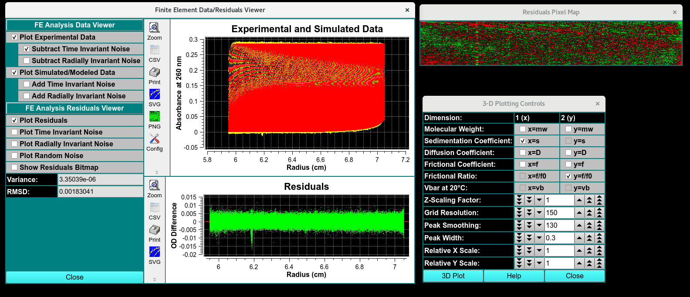
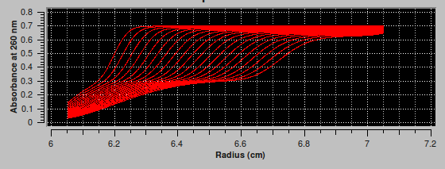

=====================================
Finite Element (FE) Model Simulation
=====================================

.. toctree:: 
  :maxdepth: 3

.. contents:: Index
  :local: 

Steps to compare Experiment to FE models: 
======================================================

*  **Step 1:** First, load experimental velocity data. Click on `Load Data <common_dialogs.html>`_* to select an edited velocity data set from the database or from local disk.

*  **Step 2:** Secondly, select a model from database or disk. Simply click on `Load Model <common_dialogs.html>`_ and choose a model in the resulting dialog. If they exist, you will be given the choice of also loading noise vectors.

*  **Step 3:** Next, simulate the loaded model with a finite element solution by clicking **Simulate Model**.

*  **Step 4:** After simulation, a variety of options are available for displaying simulation results, residuals, and distributions. Report text files and graphics plot files can also be generated.

Simulation Product Output Summary:
----------------------------------------------

When the "Simulate Model" button is clicked in the **Finite Element Model Viewer** window, a simulation is performed using the Edit data, a Loaded Model, and simulation parameters primarily created using the edit data set. A simulation data set is created that has the same ranges as the edit set, but with readings values that are calculated and compared to the actual experimental data. The comparison spawns a number of new dialogs and options that allow the user to evaluate the quality of the model.

 * **Finite Element Data/Resdiuals Viewer** - Visual comparison of simulated and experimental data. Graphical display of time and radially invarient noise 
 * **Residuals Pixal Map** - Bit map of 
* `3-Dimensional Plot Controls <3d_plot.html>`_``
 * **Data report File** - Report of the comparision

.. rst-class:: 
    :align: center

    **Simulation Results**

Finite Element Viewer
-----------------------
: The simulation creates a data set with the same ranges as the edit experimental data set. The actual values for scan readings vectors are synthetically produced, as illustrated by the plot below.

.. rst-class:: center

Functions
^^^^^^^^^^^^

**FE Analysis Data Viewer**

**FE Analysis Residual Viewer**

Comparison of SV data: 
^^^^^^^^^^^^^^^^^^^^^^^^
BitMap

Noise Data analysis:
^^^^^^^^^^^^^^^^^^^^^^^^^^^^^^^^^^^^
 Time- NOISE That doesn't change over time and has the same offset for every scan. Sources of time in 

 Radially : noise Constant offset of scan sources, exposure diffrence 

 Random: random and different time or radius

Report: FE Match Model Simulation
--------------------------------------

image

from top right to bottom left. type of analsysi, data report of run label, cell number, channel leter, wavelength, edit name. the data analysis, titled as the timeanddata submited to database, type f analysis, model number, i01
number of component found, rrmsD, mRRMSD, weight avaraged (what does that mean) total concen, the vbar selected to be constant. 

Distribution results of the m. weighm s apparent(**), s 20 D(apparant). d20, f/f0, conce (%)

Related
====================

`Finite Element Model Viewer <fe_match.html>`_