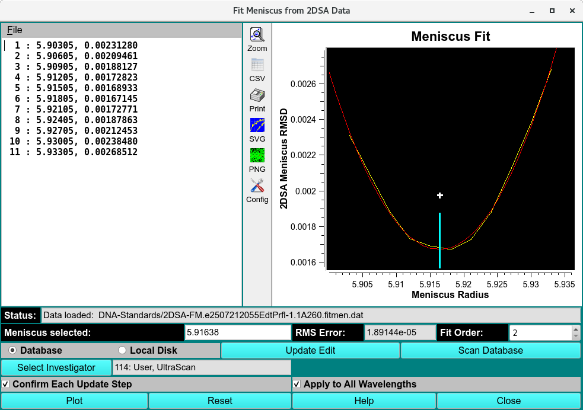
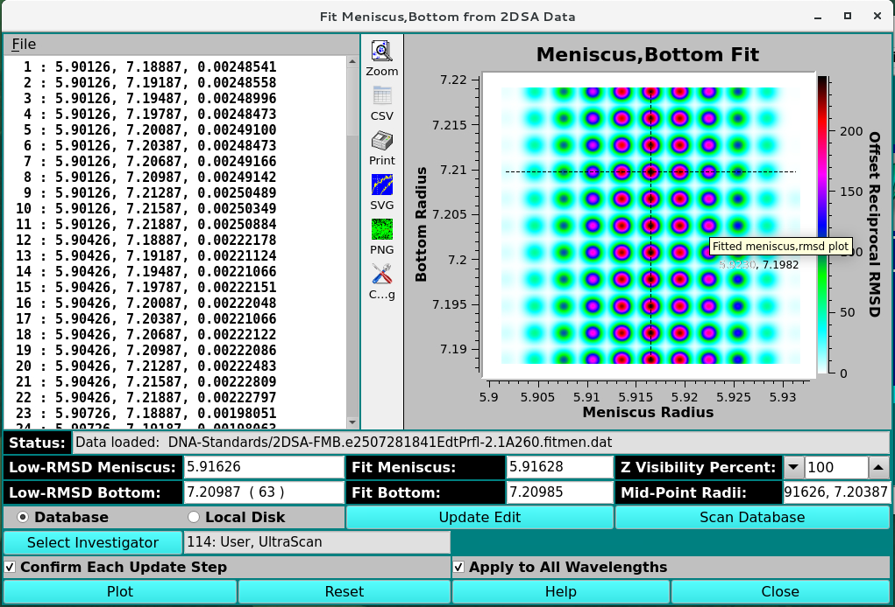
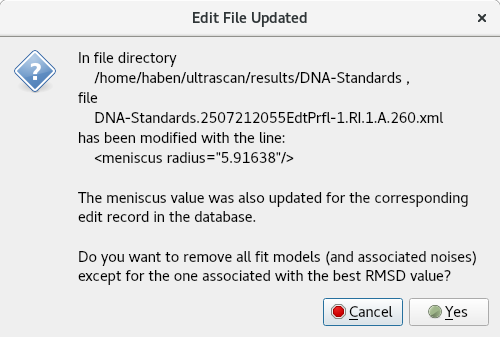

============================================================
Fit Meniscus
============================================================

.. toctree:: 
  :maxdepth: 3

.. contents:: Index
  :local: 

This module enables you to modify an Edited data set's meniscus value based on meniscus-fit models. A polynomial fit to a set of meniscus-RMSD points is plotted and its low point presented as the default new meniscus value. That value - or a manually modified one - can then replace the value in the associated Edited data set. The model with closest meniscus value in the set of fit-meniscus models that were obtained by a front-end or back-end meniscus fit 2DSA run can be preserved, while all other models in the set (and any associated noises) are removed. 

.. rst-class::
    :align: center

    **Meniscus Fitting**

.. rst-class::
    :align: center

    **Meniscus and Bottom Fitting**

Functions:
===========

.. list-table::
  :widths: 20 50
  :header-rows: 0

  * - **(Meniscus-RMSD points)**
    - The main left-side text box displays a list of meniscus-RMSD values from a selected fit output by 2DSA. The fit to display is chosen by a *File->Load* selection in a FitMen Load Dialog  that allows navigation to a ./results/directory and choice of a fitmen.dat file.
  * - **(right side plot)**
    - This plot shows a yellow curve connecting all fitmen radius-RMSD points; a red fitted polynomial curve; and a vertical bar with annotation delineating the meniscus value at the low point of the polynomial curve.
  * - **Status:**
    - A text box here displays the status of database scan or data load.
  * - **Fit Order**
    - The counter here may be modified to select the order of the polynomial to fit to meniscus-radius points.
  * - **Meniscus selected:**
    - The text box here is initially loaded with the meniscus value of the low point in the fitted curve.It may be edited to, for example, fit more closely to an actual entry in the meniscus-RMSD list. It's value at the time Update Edit is clicked determines the replacement value in an Edited data set and model and noises to be preserved after the update.
  * - **RMS Error:**
    - Displays the RMS error of the curve fitted to meniscus, RMSD points.
  * - **Database**
    - Select to include database model and noise records in the clean-up of non-selected models and noises after edit update; and to include the database Edited data in meniscus update.
  * - **Local Disk**
    - Select to limit any model and noise removal and any menicus value Edited data update to local disk.
  * - **Update Edit**
    - Click this button to update the associated Edited data with the currently selected meniscus value. After that update, a :ref:`Edited File Update Dialog <edited_file>` appears that also allows models and noises with meniscus values not the closest to the selected one to be removed.              
  * - **Scan Database**
    - Click this button to scan the database for any "fitmen" data sets that do not already have an associated local disk file. Any such files will be downloaded and their presence reported in the Status text box.
  * - **Plot**
    - Click this button to re-plot the currently selected fitmen set. This is generally not necessary.

|

.. _edited_file:

.. rst-class:: center

    **Edited File Update Dialog**

**Window Controls**

.. list-table::
  :widths: 20 50
  :header-rows: 0 

  * - **Reset** 
    - Indicate that parameters are to be reset and the plots re-displayed based on original parameters.
  * - **Help** 
    - Display this detailed Fit Meniscus help.
  * - **Close** 
    - Close all windows and exit.

Related
====================

`Time Derivative <time_derivative.html>`_

`Finite Element Model Viewer <fe_match/fe_match.html>`_

`2-Dimensional Spectrum Analysis <2dsa/2dsa.html>`_