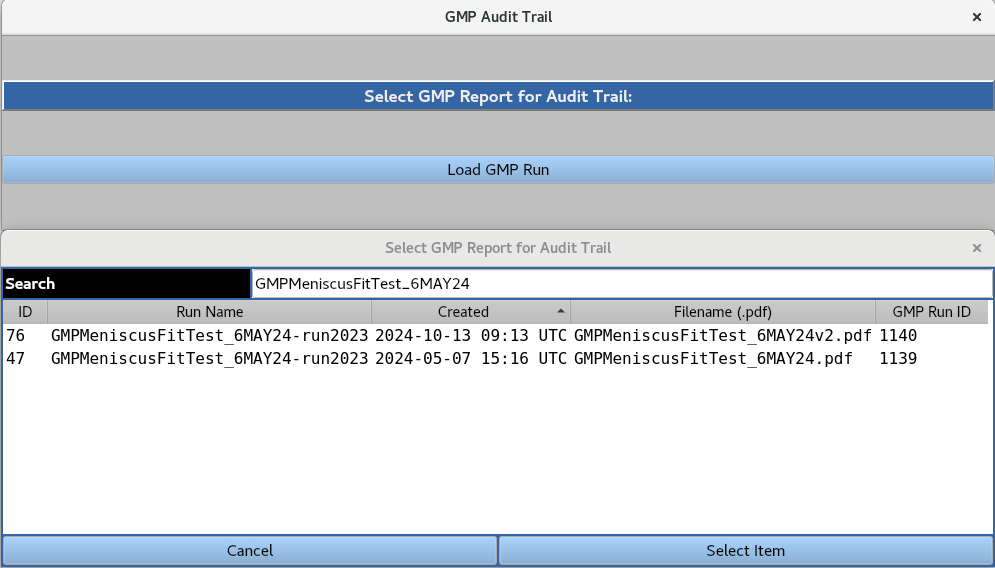
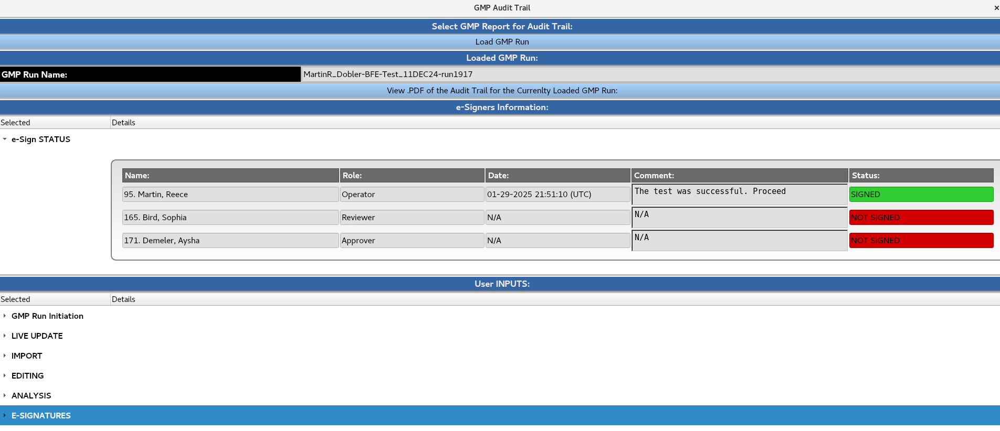

================================
Audit Trail
================================

.. toctree:: 
    :maxdepth: 1

.. contents:: Index:
    :local:

Logs all user interactions and electronic signatures for a GMP report PDF file.

A GMP run can be loaded from the database by highlighting it and clicking the **Select Item** button. The user is then presented with the following interface:

**e-Sign STATUS** section records the user ID, name, role, date, time, comments, and signing status for the GMP run.

**User INPUTS** section logs all user interactions at various stages of the GMP run to ensure traceability. Each entry includes the user ID, date, time, and associated comments.

**View .PDF of the Audit Trail of the Currently Loaded GMP Run** loads the audit trail PDF file containing a record of all user interactions and e-signatures associated with the GMP run. This PDF file is a summary of the 'e-Sign STATUS' and 'User INPUTS' sections.