================================
Automated GMP workflow setup
================================

.. toctree:: 
    :maxdepth: 3

.. contents:: Index
    :local: 

Setting up an experiment in the GMP module:
=============================================

By default, the investigator should be set to the person logging into the system. This user requires at least user level 2 to proceed. Enter a unique run ID for the experiment (GMP-PQ-version1), a verbose label (60 chars), give the protocol a name and select a project. There is no need to populate the project, but create a *New Project*, rename the project and *Save*, select it from the list, and close the Project dialog. 

**The “Temperature-Equilibration Delay” can be set to zero minutes because no real instrument is involved. The temperature should be set to the same temperature that was used in the simulation settings.**

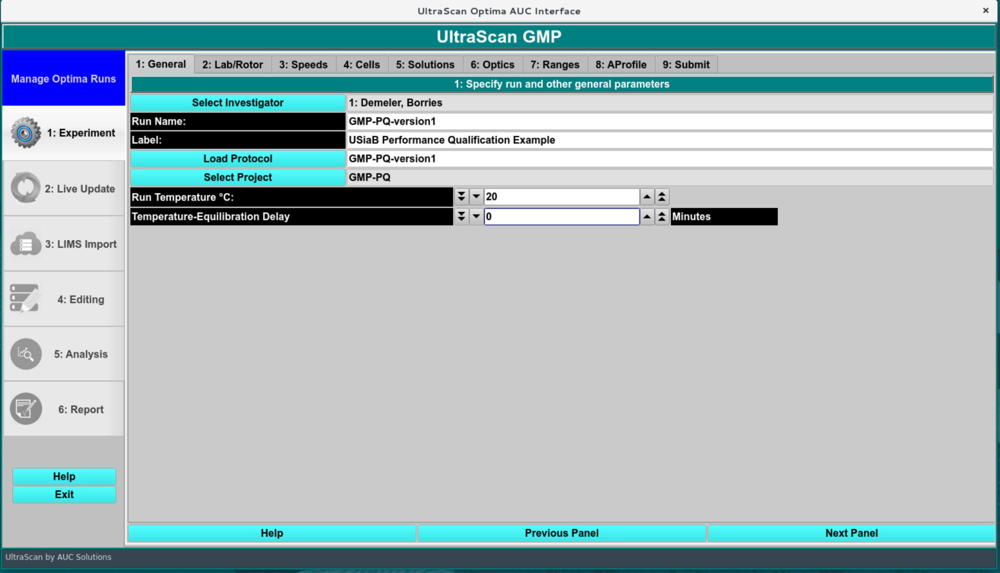

.. rst-class::
    :align: center

    **GMP Modules Access**

Set up the Lab and Rotor information:
----------------------------------------

In this screen, the laboratory, rotor, data source and GMP operator, reviewers, approver and SME  information needs to be chosen. If you do not have any operators, reviewers or approvers defined, please see your IT administrator to assign these roles to the relevant users. Select one of each and click “Add to List” to activate their GMP role for this project. **Select the same rotor and calibration that was used to simulate the data.** The data source should be set to import AUC data from disk, and point to the directory containing your simulated dataset.

The rotor setting also determines if the stretching calculation is used. If the simulation rotor is used, no stretching will be calculated. Calibrated rotors will include a rotor stretch value that is used for the bottom, and also will be added to the meniscus position specified in the simulation of the simulation dataset. To calculate the theoretical offset due to rotor stretching, go to the *Utilities:Rotors* module and select the rotor chosen for the simulation, and calculate the stretch distance using the first and second order coefficients:

**The rotor stretch value (in cm) is given by:**
(Rotor Stretch Coefficient 1)*(rotor speed) + (Rotor Stretch Coefficient 2) x (rotor speed)^2 

This value should be added to the simulated meniscus and should be recovered from the analysis as the meniscus position (available in the edit profile xml file).

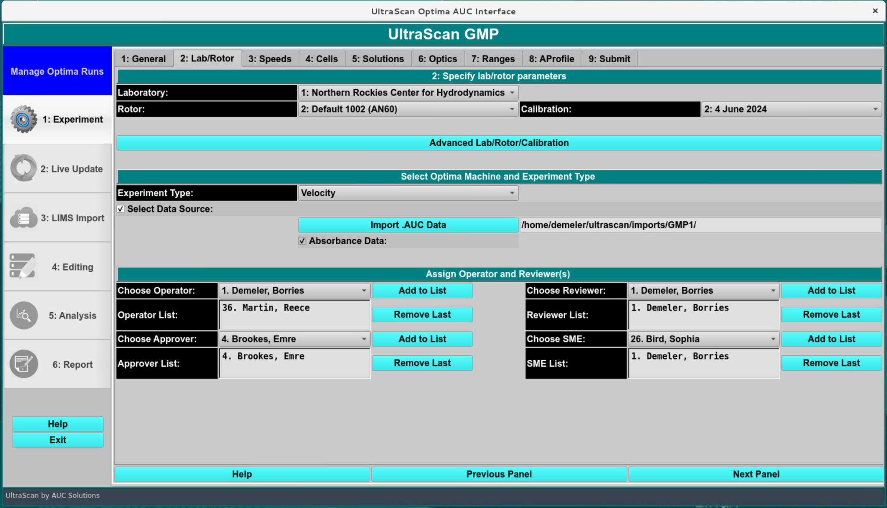

.. rst-class::
    :align: center

    **Lab/Rotor**

Speed Selection:
--------------------

In this screen, the rotor speed, data collection interval between successive scans, data collection duration (active scanning time), and the total number of scans in the experiment are specified. For imported data, all fields in this screen are parsed from the input data and should not be changed. 

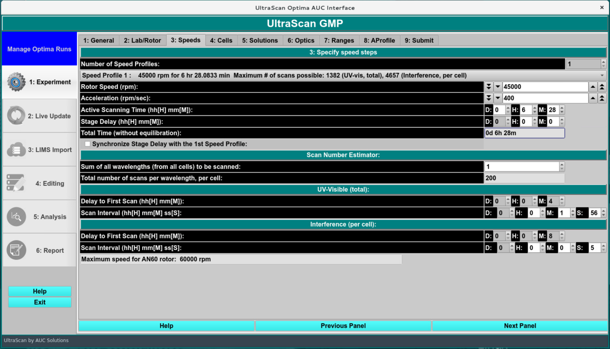

.. rst-class::
    :align: center

    **Speeds**

Cells:
-------------

As in the previous screen, all settings in this screen are parsed from the imported data and **should not be changed, unless a different centerpiece was used. Make sure to use the same centerpiece as was used in the simulation program,** to reflect the appropriate centerpiece geometry in the simulation.

.. note::
    **Leave the cell position unchanged!**

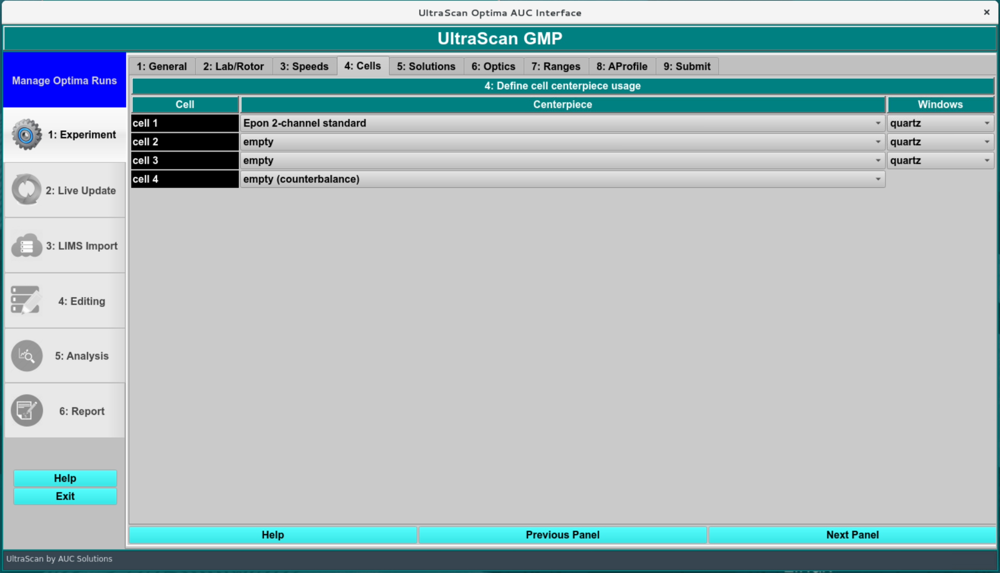

.. rst-class::
    :align: center

    **Cells**

Solutions:
----------------

In this screen **the same solution that was used for the simulation must be selected.** Optionally, add some comments for the cell content description (left blank here). 

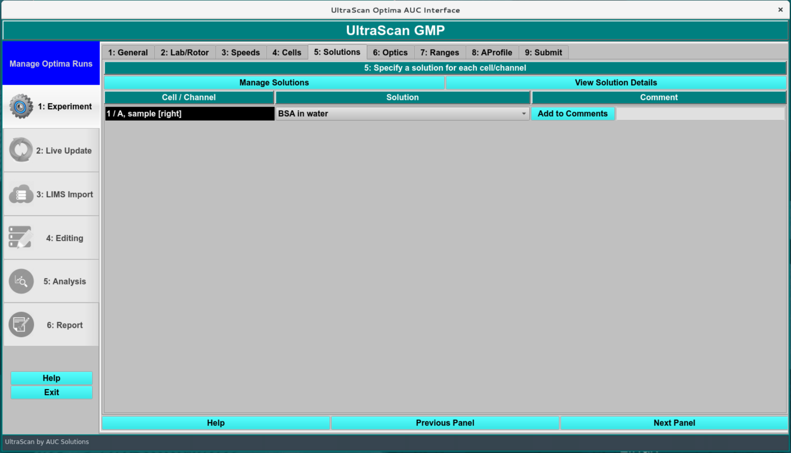

.. rst-class::
    :align: center

The 'OK' button brings up the 'Live Update' window which instructs the user to start the run from the instrument panel

    Alternatively, the user can press 'Return to Managing Optima Runs?' to return to the 'Manage Optima Runs' window.

    **Solutions**

Optics:
-----------------

The optical system simulated is reflected here and should not be changed.

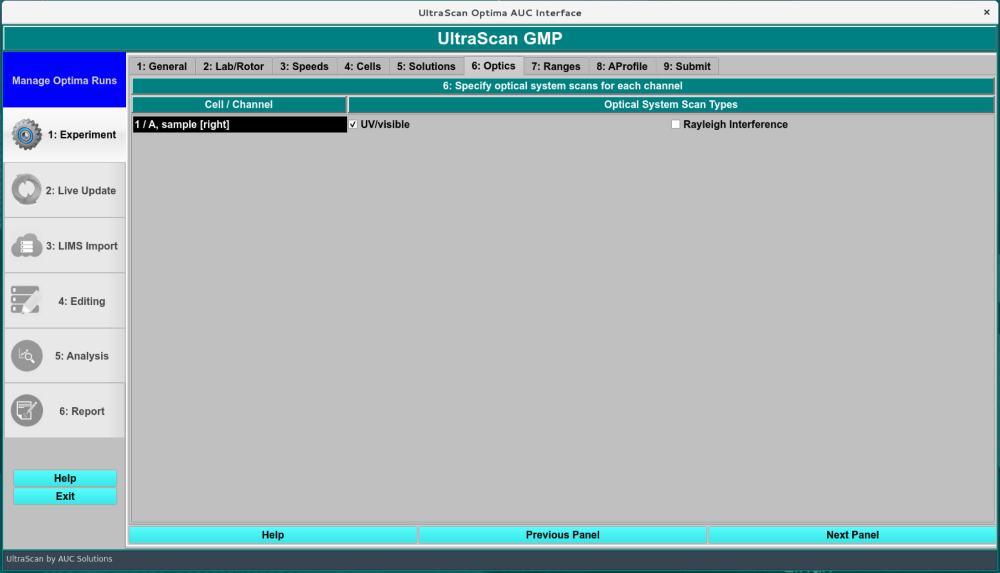

.. rst-class::
    :align: center

    **Optics**

Ranges:
--------------

All ranges for wavelength and radial observation are indicated on this screen. The user doesn’t have to change anything here because these details are parsed from the input data.

.. image:: ../_static/images/gmp/automation/ranges.png
    :align: center

.. rst-class::
    :align: center

    **Ranges**

Analysis Profile/Report Settings:
----------------------------------

In this screen the general report settings are entered, and integration limits are defined. The “Run” column needs to be checked for the dataset to be processed. A report will be generated if the “Run Report” is checked. The loading volume will be calculated based on the centerpiece geometry and the meniscus position by calculating the sector volume. This should match what was selected during the analysis. The data end is the bottom of the data range considered in the fitted data. This can be overwritten by using the manual edit function after the data import.

.. image:: ../_static/images/gmp/automation/Aprofile.png
    :align: center

.. rst-class::
    :align: center

    **Analysis Profile**

The global plot parameters can be edited for each analysis type individually. Manual x ranges can be chosen, as well as the regularization parameter for the plotting smoothness.

.. image:: ../_static/images/gmp/automation/plot.png
    :align: center

.. rst-class::
    :align: center

    **Plot Parameters**

Integration and Report settings:
-------------------------------------

Clicking the *Report* button in the previous screen brings up the integration and report settings dialog. Here the following items need to be set:

* 1. Simulated Concentration
* 2. Maximum RMSD
* 3. Intensity minimum for this wavelength (only needed for actual experimental data acquired with UV/vis absorbance optics)
* 4. experimental duration of the experiment (should match the simulated time)
* 5. Integration ranges. 
     - Integration reports can be provided for s, D, MW, and radius, as well as for 2DSA-IT, 2DSA-Monte Carlo, and PCSA models. The ranges should be matched to the simulated data. If no noise is simulated and the analysis grid matches the simulation grid, the fitted values should match exactly within the round-off limits of a single-precision floating data type (usually 6-7 significant digits). If noise is simulated, a range should be specified. Values that fall between the range limits will be averaged into a single weight-average value for reporting that can be compared to the target value. Accuracy of the reproduced values is a function of the simulated noise. The 2DSA-Monte Carlo analysis should provide the best weight average values. Statistical properties of the model returns from the Monte Carlo analysis can be checked with the Velocity:GA initialization module.

* 6. The report can provide differential and pseudo-3D contour plot representations for each combination listed. It is optional to provide these in the report. If multiple datasets are included in a report, overlay plots can be included as well (combined plots).

.. image:: ../_static/images/gmp/automation/report_editor.png
    :align: center

.. rst-class::
    :align: center

    **Integration and Report**

2DSA Settings:
--------------------

The 2DSA settings should closely match the simulation parameters for optimal resolution. Although larger grids can be set, the resolution needs to be increased by increasing the s or f/f0 grid point number to afford the same resolution. To compare resolutions in the grid, divide the maximum-minimum parameter range by the number of grid points to get the interval. The smaller the interval, the higher the chance the correct value used for the simulation is recovered. Using a custom grid that includes the appropriate value can provide an exact answer.

In this screen, specify the 2DSA workflow and analysis parameters, such as s-value and f/f0-value ranges, noise fitting, boundary condition fits, and Monte Carlo details. A manual or automatic meniscus/bottom position fit is available.

The recommended analysis flow chart is explained in this `Flowchart <../start_page.html>`_.

.. image:: ../_static/images/gmp/automation/2dsa.png
    :align: center

.. rst-class::
    :align: center

    **GMP 2DSA Analysis Profile**

PCSA settings:
--------------------

For PCSA analysis, select the appropriate fitting ranges (the same ranges as in the 2DSA analysis can be chosen), making sure the grid covers the target values. All other values should be left as default values. 

.. image:: ../_static/images/gmp/automation/pcsa.png
    :align: center

.. rst-class::
    :align: center

    **GMP PCSA Analysis Profile**

Submitting the run:
--------------------

The submission screen performs a sanity check on the GMP analysis, making sure all essential parameters for the analysis have been set. A unique name for the protocol and for the runID must be chosen for each analysis by the user, although protocols can be reused as long as no changes have been made to the protocol. Submission of a run from disk prompts the data import screen to be shown as indicated on the next page.

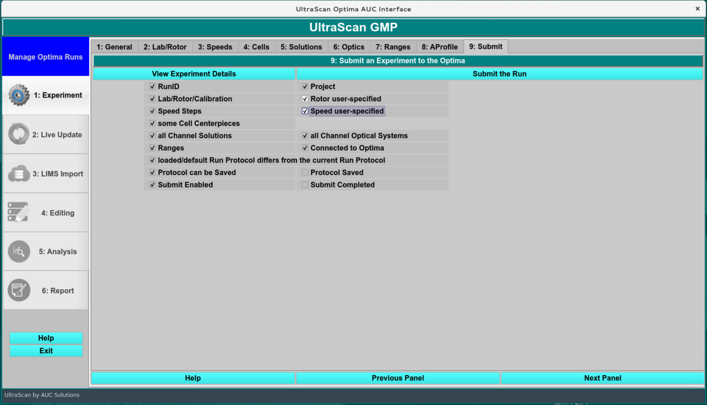

.. rst-class::
    :align: center

    **Protocol Submission**

LIMS Import: 
==============

In the LIMS import screen, the user inspects the data and saves/imports it in the LIMS database for downstream analysis.

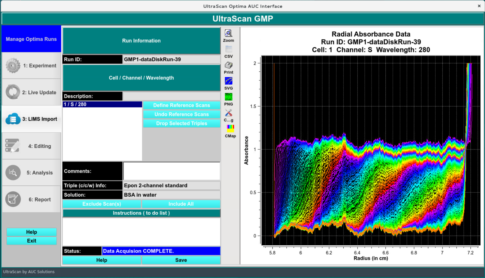

.. rst-class::
    :align: center

    **LIMS Import**

Edit Screen:
===============

In the first step after import, the data are edited, typically in an automated fashion. 

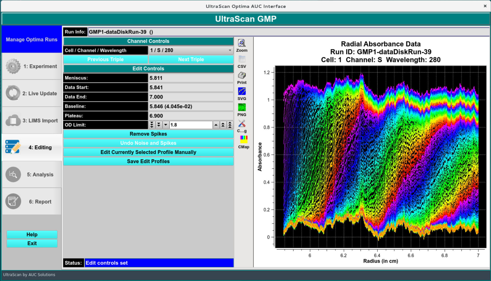

.. rst-class::
    :align: center

    **Edit Profile** 

Optionally, the manual editing option can be invoked, and new limits for the boundary conditions (meniscus position) and the data range can be specified. Any changes from the automated workflow must be documented with an electronic signature panel.

.. image:: ../_static/images/gmp/automation/man_edit.png
    :align: center

.. rst-class::
    :align: center

    **Manually Edited Profile** 

Data Analysis:
==================

The data analysis should commence immediately after the editing step has been electronically signed. Individual analysis steps are listed in sequential order for each triple in the analysis, and their status is indicated as “Waiting for prior stage(s) to complete”, “QUEUED”, “RUNNING”, or “COMPLETE”.

When all analysis steps are in “COMPLETE” stage, the GMP workflow will switch to the report generation and produce a GMP report. Review signatures from the operator, reviewers and approvers will be solicited via email, and added to the GMP report after signing. The electronic signature panel in the GMP menu will be used to review reports and provide the final signatures.

.. image:: ../_static/images/gmp/automation/analysis.png
    :align: center

.. rst-class::
    :align: center

    **GMP Automated Analysis Stages** 

Data validation:
=================

To validate that the software calculated the expected values, inspect the generated data by reviewing the experimental and simulated data overlays, inspect the magnitude of the RMSD, and the randomness of the residuals, and most importantly the integration results for concentration and sedimentation coefficient, or any other parameters specified in the report.

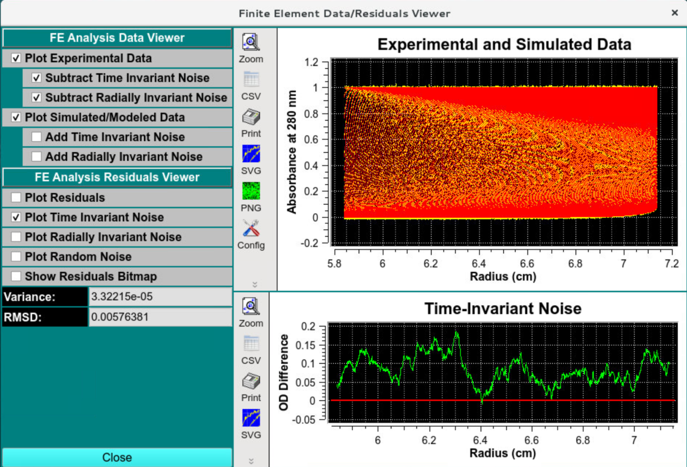

.. rst-class::
    :align: center

    **Data and Residual Viewer - Time Invariant Noise** 

Verify that the time invariant noise has been removed and the overlay appears to be smooth.
The residuals should appear random, and the RMSD should be commensurate with the simulated stochastic noise amplitude:

.. image:: ../_static/images/gmp/automation/data_viewer_rando.png
    :align: center

.. rst-class::
    :align: center

    **Data and Residual Viewer - Random Residuals** 

Radially invariant noise should look random and have the simulated amplitude:

.. image:: ../_static/images/gmp/automation/data_viewer_rin.png
    :align: center

.. rst-class::
    :align: center

    **Data and Residual Viewer - Radially Invariant Noise** 
    
The residual pixel map should show a mostly random pattern of a grainy red/green pattern without a visible diagonal pattern.

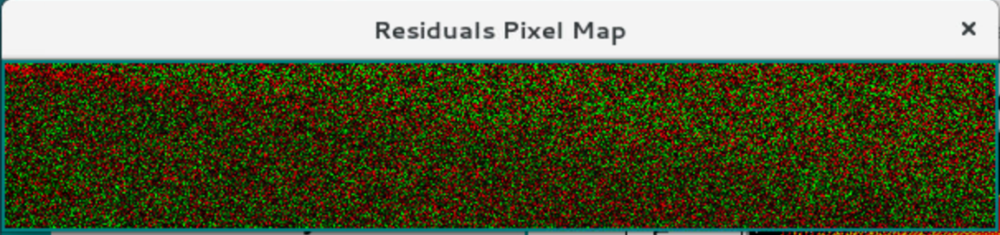

.. rst-class::
    :align: center

    **Pixel Bitmap** 

Report:
=======

Quality attributes analyzed by the GMP analysis routine should faithfully reproduce the parameter values for the fitted parameters listed in model parameters, and should agree among multiple analysis types. 

.. image:: ../_static/images/gmp/automation/2dsa_it.png
    :align: center

.. rst-class::
    :align: center

    **2DSA-IT** 

.. image:: ../_static/images/gmp/automation/2dsa_mc.png
    :align: center

.. rst-class::
    :align: center

    **2DSA-MC** 

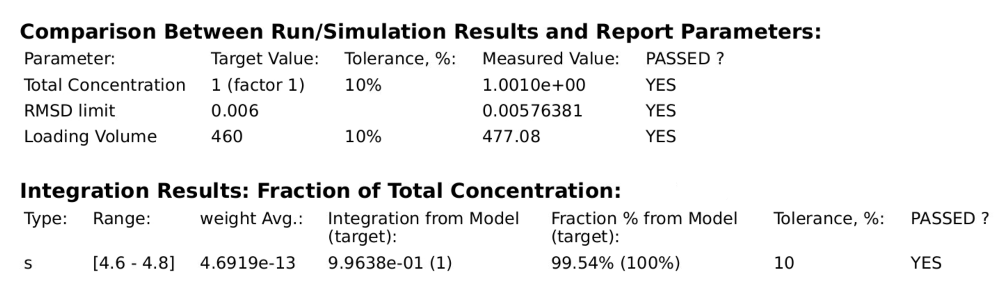

.. rst-class::
    :align: center

    **PCSA** 

.. rst-class::
    :align: center

    **Complete!!** 