================================
 Define Another Experiment
================================

.. toctree:: 
    :maxdepth: 1

.. contents:: Experiment Sections:
    :local:

This module allows for the creation and submission of protocols and runs for experiments. Sections can be accessed in any order using the navigation bar at the top of the window or sequentially using the **Previous Panel** and **Next Panel** buttons at the bottom of the window.

1. General
===========

.. _general:

Assign a Run Name, Label, and Protocol Name, as well as the run temperature and temperature-equilibration delay length.

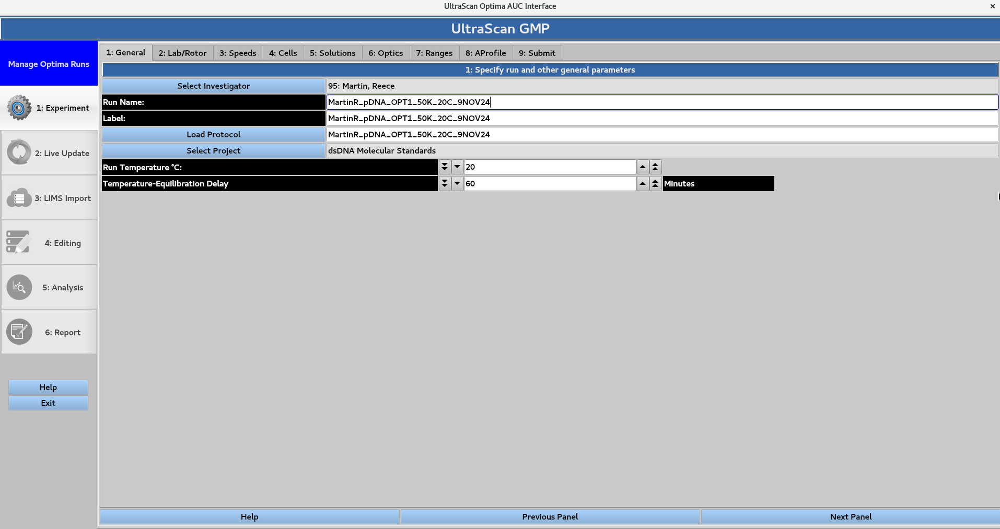

**In this page, the investigator, the protocol and the project are selected** 

        * :ref:`Select Investigator <select-investigator>`
        * :ref:`Load Protocol <load-protocol>`
        * :ref:`Select Project <select-project>` 

1.1 Select Investigator
------------------------

.. _select-investigator:

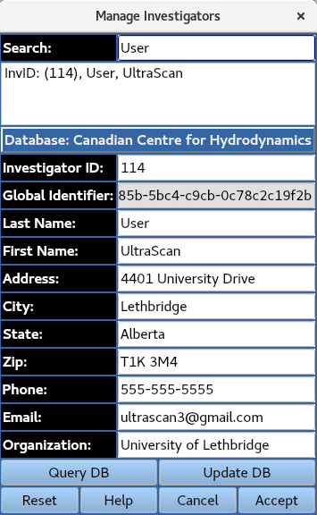

1.2 Load Protocol
--------------------

.. _load-protocol:

Load in the parameters from a pre-existing protocol in the database, 

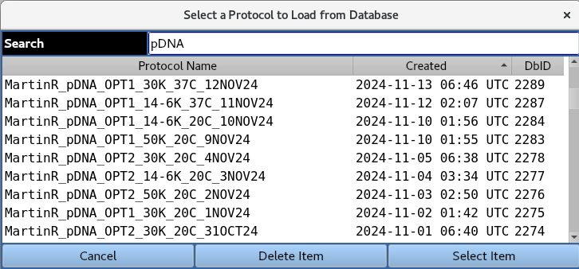

1.3. Select Project
--------------------

.. _select-project: 

Assign the run to a user-created Project in the `Project Management <../../us_project.html>`_ module. Each section requires information on the goals, molecules being analyzed, and experimental design.

2. Lab/Rotor
==============

.. _labrotor: 

Selection of the hardware and experiment type, along with the assignment of roles. The user selects the laboratory, rotor, rotor calibration profile, instrument, and experiment type using the drop-down menus. The roles of Operator, Reviewer, Approver, and Subject Matter Expert (SME) can then be assigned from the drop-down menus.

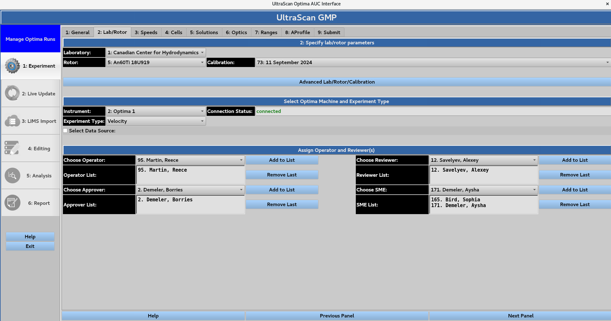

2.1. Advanced Lab/Rotor/Calibration
---------------------------------------

.. _advanced-lab:

5. Solutions
==============

Management of rotors and associated rotor (stretch) calibration profiles is accessed by calling the `Rotor Management <../../rotor.html>`_. 

.. image:: ../../_static/images/gmp/data_acquisition/experiment/gmp_data_acquisition_experiment_15.pngManage Optima Runs:
    :align: center

3. Speeds
===========

Set run parameters including rotor speed, experiment duration, and scanning in interval for each optical system.

Under **3: Specify speed steps**, the number of speed profiles in the GMP module is restricted to 1. The **Rotor speed** in revolutions per minute (rpm) can be set by typing the numerical value, or by using the arrows. The **Acceleration** in revolutions per minute per second (rpm/sec) can also be set. The **Active Scanning Time** can be set in terms of days, hours and minutes, while the **Stage Delay** can be set in terms of hours and minutes. The sum of these values gives the **Total Time (without equilibration)**. Under **Scan Number Estimator**, the   **Sum of all wavelengths (from all cells) to be scanned** gives the number of distinct wavelengths to be scanned. The **Total number of scans per wavelength per cell** is the number of scans for a single wavelength that will be collected for a cell (which produces data for channels A and B).

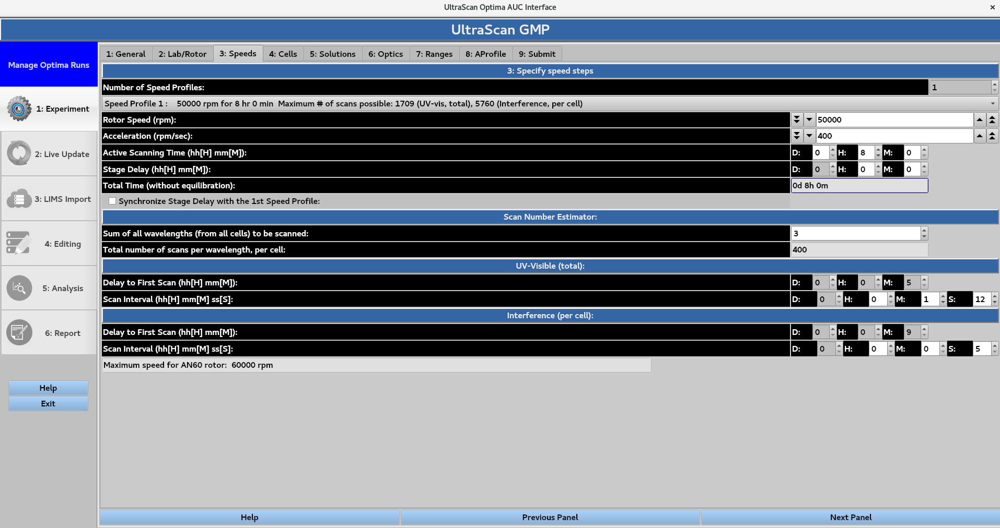

4. Cells
===========

Assignment of centrepiece or counterbalance type, as well as window type for each cell. Correct centerpiece selection is important as the cell bottom position defines the boundary conditions used when fitting the data. Selecting **empty counterbalance**, **Beckman counterbalance**, **Titanium counterbalance**, and **Fluorescence 5-channel counterbalance** will prevent the instrument from collecting scans for the specified holes. The **Windows** selection (options are **quartz** or **sapphire**) does not affect the parameters of the experiment.

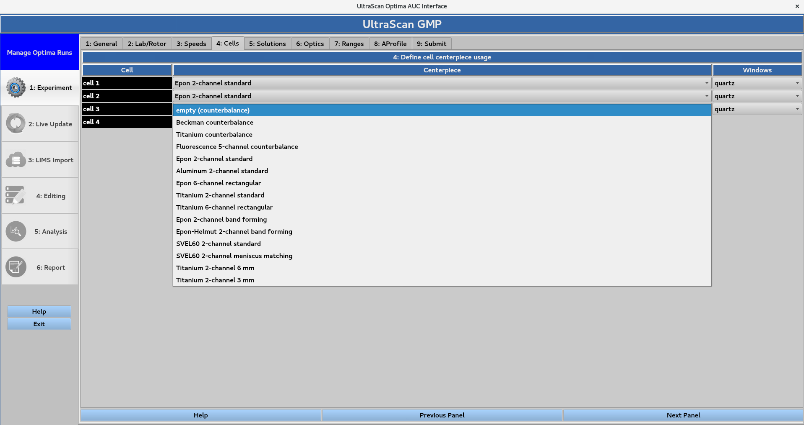

5. Solutions
==============
Define tje solutions comprised of analytes and buffers that will be measured in the experiment.

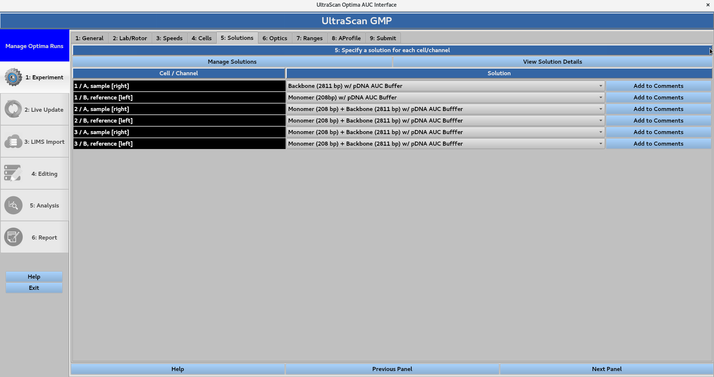

Pre-defined solutions can be assigned to each channel. **Add to comments** can be used to add notes pertaining to the solution in each channel.

**In this page:**

      * :ref:`5.1 Manage Solutions <manage-solutions>` 
      * :ref:`5.2. Solution Details <solution-details>`

5.1. Manage Solutions
------------------------

.. _manage-solutions:

Creation and management of solutions. Existing solution properties can be viewed in the **Select Solution** window by selecting the solution.

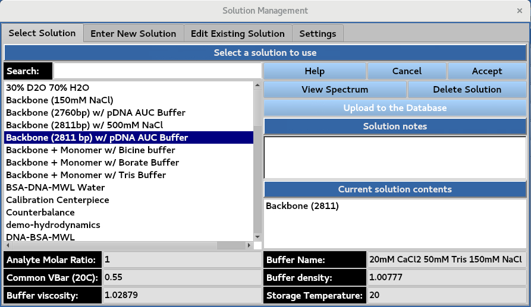

5.2. Solution details
----------------------

.. _solution-details:

Information on the analytes and buffer of the assigned solutions

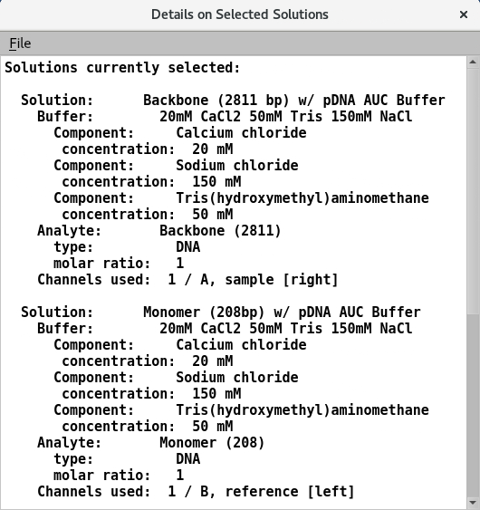

6. Optics
==============

Define which optical system(s) will be used to scan each cell.
The **Optical System Scan Type** options are **UV/visible** or **Rayleigh Interference**. Note that the instrument collects scans on a cell-by-cell basis, so the selections for a cell apply to both of its channels.

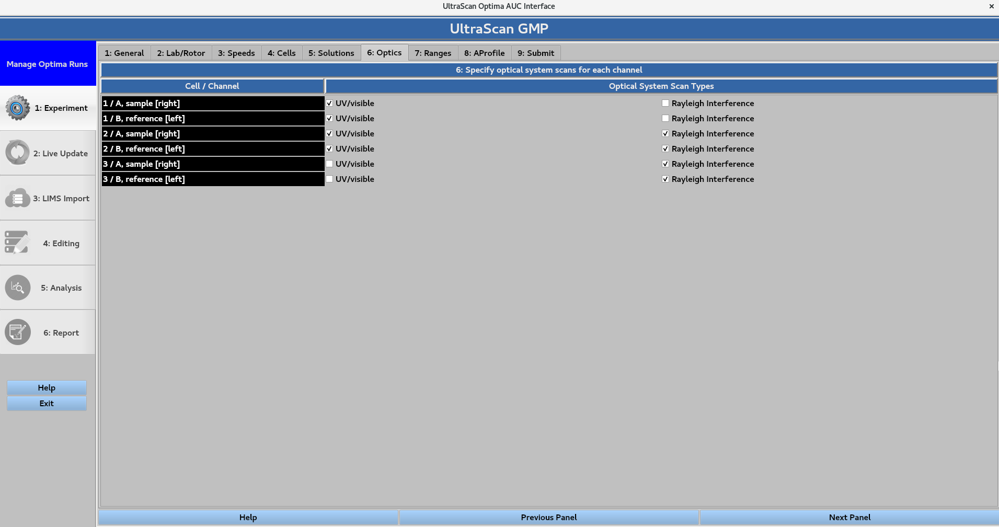

7. Ranges
=============

.. _ranges:

Define the wavelength ranges for each cell to be scanned using UV/visible optics.
When the wavelength ranges are defined for each cell, the **Scan interval** for the UV/visible and Rayleigh Interference optics appear highlighted in red if updated. This also changes the **Number of scans per Triple (UV/vis)** and the **Number of Scans per Cell (Interference)**. These changes are then reflected in the **3: Speeds** window.

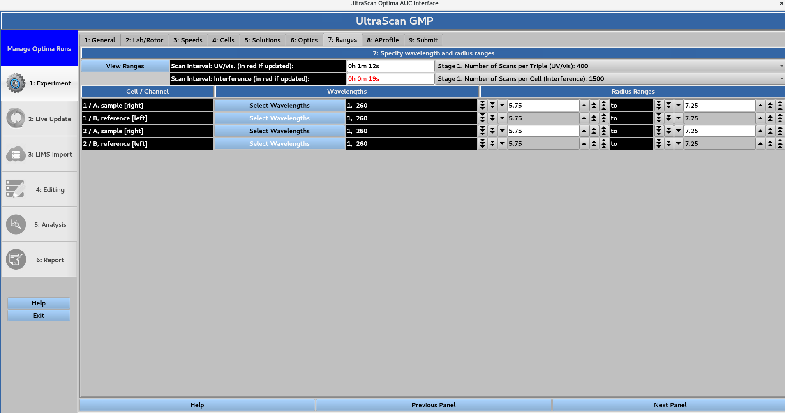

**In this page:**

        * :ref:`7.1. View Ranges <view-ranges>` 
        * :ref:`7.2. Select Wavelengths <select-wavelengths>`

7.1. View Ranges
------------------

.. _view-ranges:

View the wavelength and radius ranges for each channel in a file

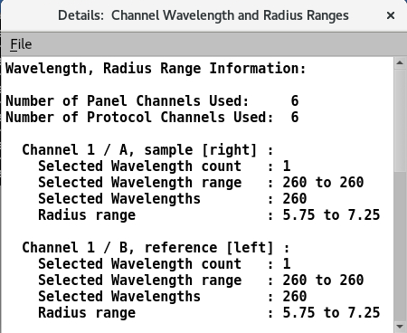

7.2. Select Wavelengths
--------------------------

.. _select-wavelengths: 

Assign wavelengths to be scanned on a cell-by-cell basis

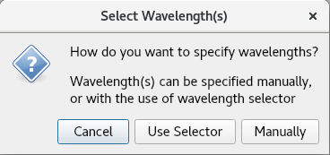

**Use Selector** allows for wavelengths at a specified increment across a defined range to be presented for selection. 

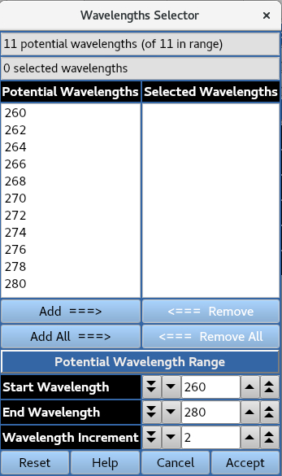

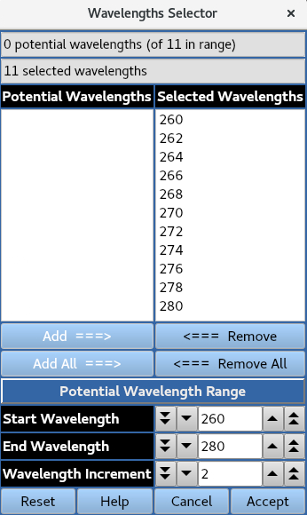

**Manually** uses the syntax listed below to define the wavelengths to be used

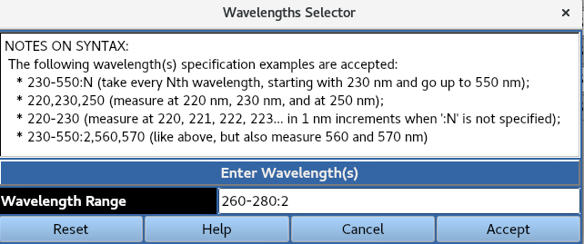

8. AProfile (Analysis Profile)
===============================

.. _aprofile:

Define edit profiles, analysis parameters and report settings for the experiment.

    **In this page:**

      * :ref:`8.1. General <aprofile-general>` 
      * :ref:`8.2. 2DSA <aprofile-2dsa>` 
      * :ref:`8.3. PCSA <aprofile-pcsa>` 

8.1. General
-----------------

.. _aprofile-general:

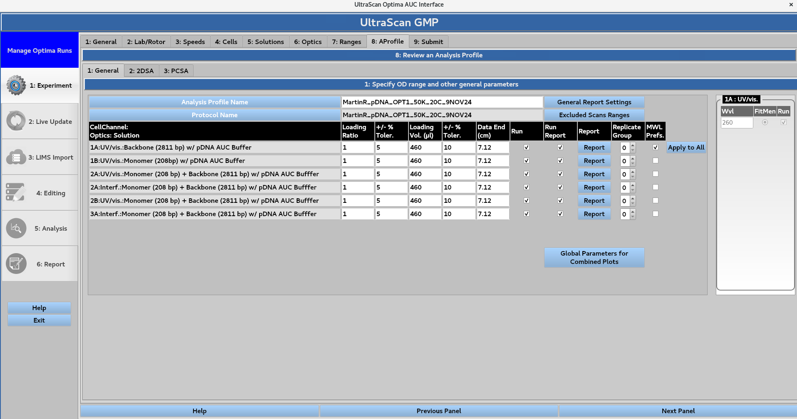

Define numerical values for **Loading Ratio**, the **± %Tolerance**, **Loading Volume (μL)**, the **± %Tolerance**, and **Data End (cm)**. The user can then select checkboxes to specify whether the analysis should be **Run**, and included in the **Run Report**.

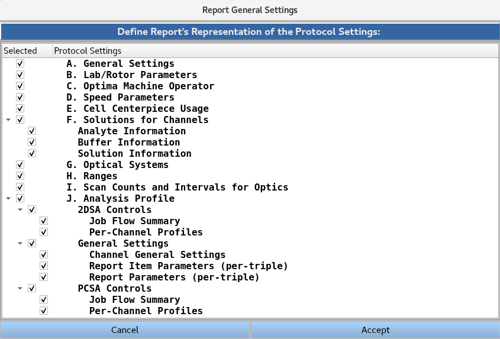

The **Report General Settings** windows allow the user to select/deselect which of the protocol settings (Sections 1-8) will be presented in the report. The {down arrow} button can be used to collapse or expand each subsection.

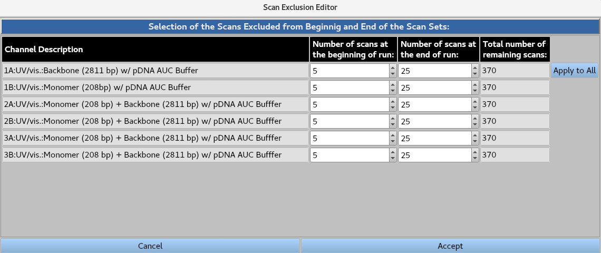

The **Scan Exclusion Editor** allows the user to numerically define the number scans to be removed from the beginning and end of each channel, either by typing the value or using the arrows. The **Apply to All** button applies the values for the first channel to all channels.

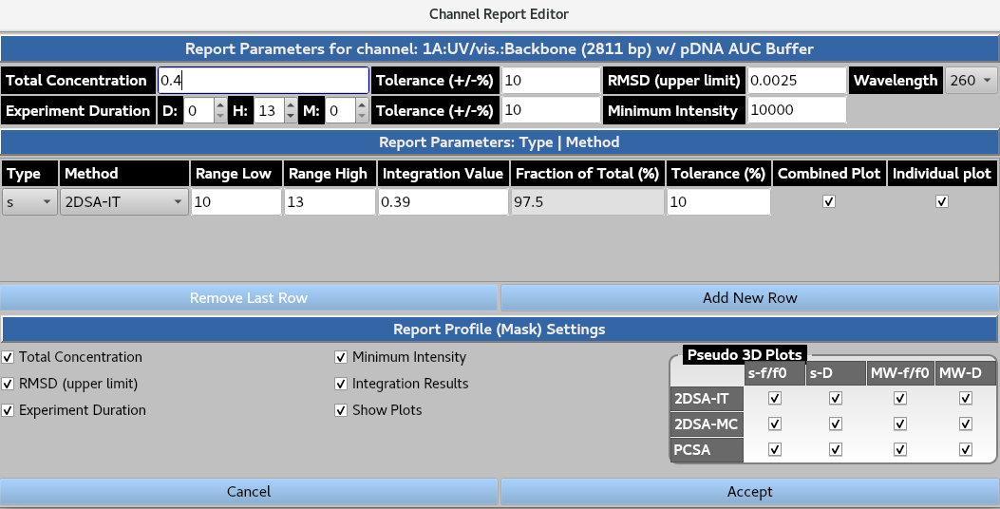

The **Report** button summons the channel-specific report settings window. The user defines the **Total Concentration**, the **± %Tolerance**, **RMSD (upper limit)**, the **± %Tolerance**, and the wavelength to extract these metrics from. The user then lists the expected **Experiment Duration**, the **± %Tolerance**, and **Minimum Intensity** at the selected wavelength from the xenon flash lamp that is deemed acceptable. In the **Report Profile (Mask) Settings** the user can select the following: **Total Concentration**, **Minimum Intensity**, **RMSD (upper limit)**, **Integration Results**, **Experiment Duration** and relevant plots (as well as the pseudo-3D plots for each parameter and analysis type) they wish to be included in the report.
 
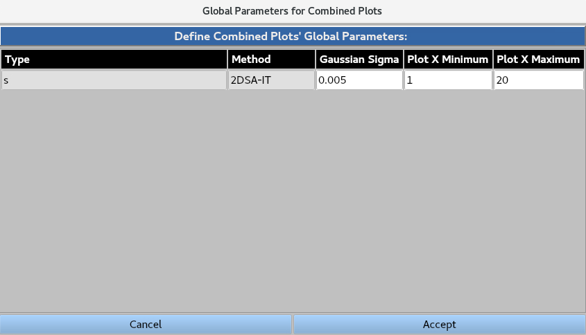

**Global Parameters for Combined Plots** allows the user to define the plot minimum, plot maximum and Gaussian sigma for each plot type.

8.2. 2DSA
----------------

.. _aprofile-2dsa:

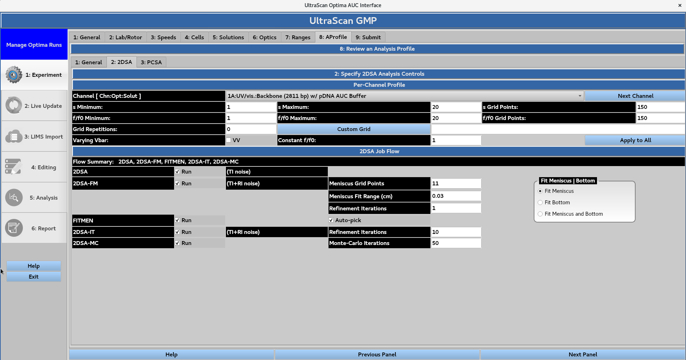

The user can define the 2-dimensional spectrum analysis (2DSA) controls for each channel. The grid size is defined by the minimum and maximum values for the sedimentation coefficient (*s*) and frictional ratio (*f/f0*), while the grid resolution is defined by the number of points for each of the parameters. A 2DSA **Custom Grid** (CG) can also be used if the user requires higher resolution in certain regions of the data, and only needs lower resolution in other regions. The user can also select to vary the partial specific volume or **Vbar** parameter and hold the frictional ratio constant at a specified value. The **Apply to All** button can be used to apply these settings to all of the channels.

The **2DSA Job Flow** panel allows the user to control which analysis steps are performed, including:

    * 2DSA
    * 2DSA with meniscus fit (FM), with a user-defined number of grid points, range (cm), and number of refinement iterations. The user can also choose to fit **only the bottom of the channel** or **both the meniscus and the bottom.**
    * FITMEN meniscus processing, with the option to **Auto-pick** the meniscus position
    * 2DSA with iterative refinement (IT), with a user-defined number of iterations
    * 2DSA with Monte Carlo iterations (MC), with a user-defined number of Monte Carlo iterations.

8.3. PCSA
------------

.. _aprofile-pcsa:

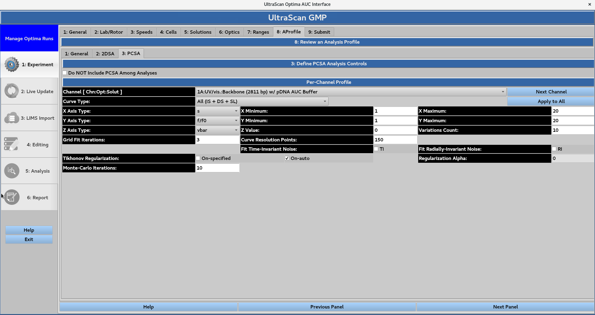

The user can select the option to not include the parametrically-constrained spectrum analysis (PCSA) in the submitted jobs. If the box is left unchecked, the user can define the PCSA controls for each channel.

The desired curve type is selected from the drop-down menu, and the user defines parameters for the x, y, and z axes.

    * The x and y axes are defined by minimum and maximum values
    * The z axis is assigned a value and a variation count
    * Numerical values are then assigned for the grid fit iterations and curve resolution points

Optional settings include:

    * Time- and radially-invariant noise fitting
    * Tikhonov regularization, with either an auto-picked or manually-selected alpha
    * Number of Monte Carlo iterations.

The **Apply to All** button can be used to apply these parameters and settings to all of the channels.

9. Submit
===========

.. _submit:

Save a protocol to the database or submit a run to an instrument.

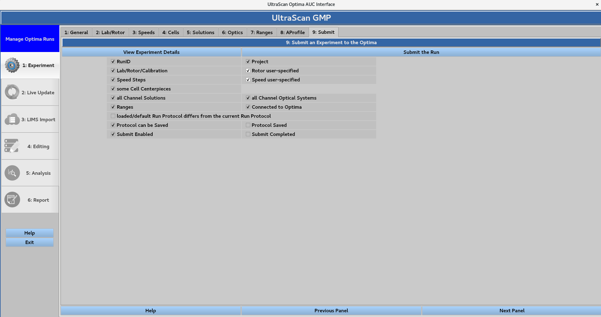

**In this page:**

      * :ref:`9.1. View Experiment Details <view-experiment>`
      * :ref:`9.2. Submit the Run/Save the Protocol <submit-run>`

9.1. View Experiment details
--------------------------------

.. _view-experiment:

Summary of the information defined in sections 1-8

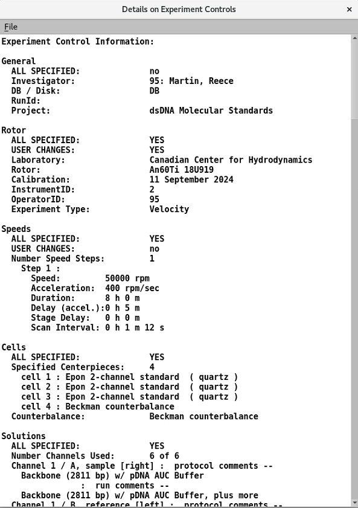

9.2. Submit the Run/Save the protocol
---------------------------------------

.. _submit-run:

If the **Run Name** field in 1: General is left empty, the submission will be saved as a protocol instead of a run. All sections (1-8) must be completed before the button in the top-right corner becomes active and allows for run submission or protocol saving. Submission prompts the following window:

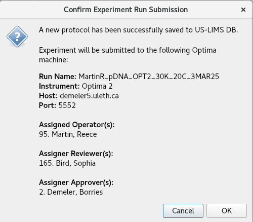

The **OK** button prompts the **GMP Run Submitter Form**, allowing the user to add a comment and prompting them for their master password for authentication.

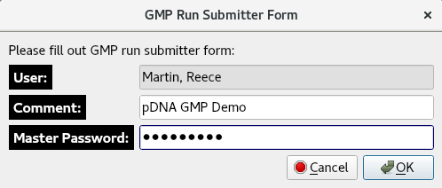

.. image:: ../../_static/images/gmp/data_acquisition/experiment/ gmp_data_acquisition_experiment_47.png
    :align: center

The **OK** button brings up the **Live Update** window which instructs the user to start the run from the instrument panel. Alternatively, the user can press **Return to Managing Optima Runs?** to return to the **Manage Optima Runs** window.