================================
GMP Data Acquisition
================================

.. toctree:: 
    :maxdepth: 1

.. contents:: Experiment Sections:
    :local:

Acquire, import, edit, and analyze data from the Optima AUC. 

After a run is initiated from the instrument, the user is presented with the 'Data Acquisition Window'. Which displays the current temperature, vacuum level, as well as the elapsed, running, and remaining time for the experiment. 

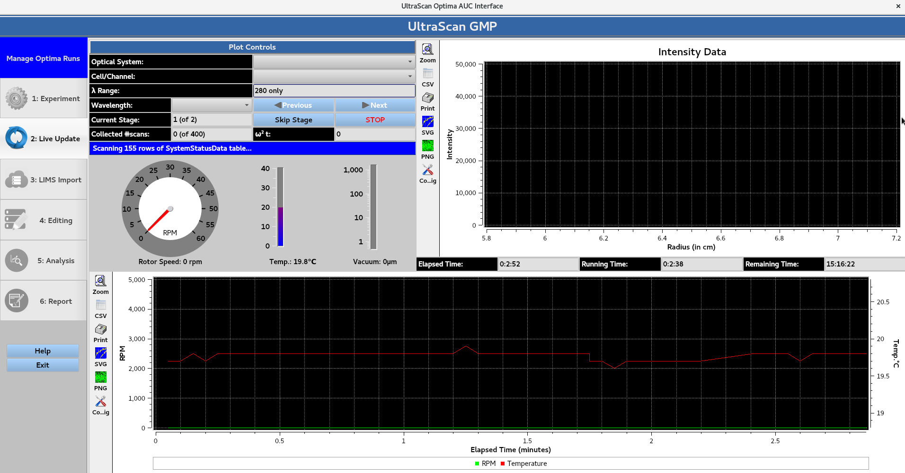

Once the machine reaches the desired rotor speed and begins acquiring scans, **Optical System** allows for the user to select the intensity/interference data. Each cell/channel/wavelength triple can be viewed using the **Cell/Channel** and **Wavelength** drop down menus, which can be cycled through using the **Next** and **Previous** buttons. **Skip Stage** allows for the current stage to be skipped. While **STOP** allows for the run to be stopped, and prompts the `GMP e-signature <../gmp_signature.html>`_ window for user authentication. 

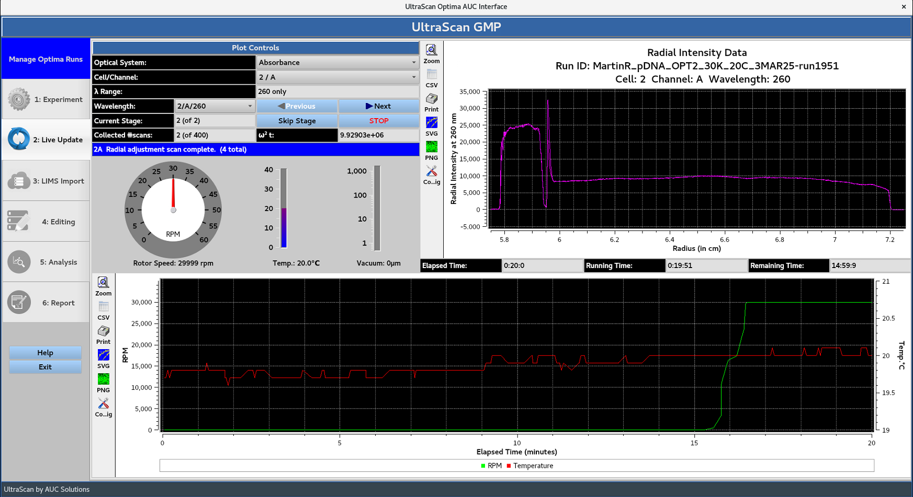

Once all of the scans defined in the experiment have been collected, the **Remaining Time** will be 00:00:00. 

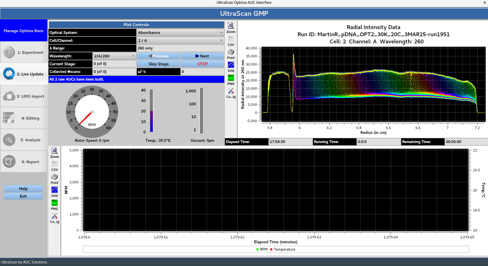

Next, the program moves to the 'IMPORT' stage, which displays the last scan of each triple from the intensity data. The user is prompted with the **Reference Scans: Automated Processing** message: 

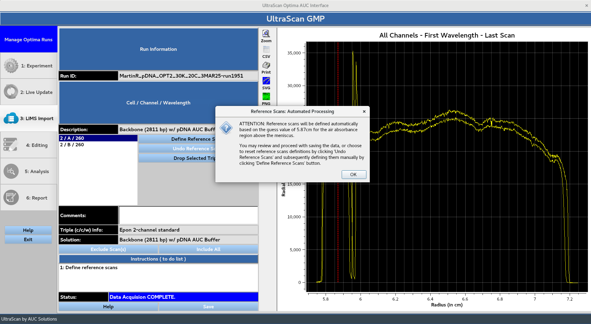

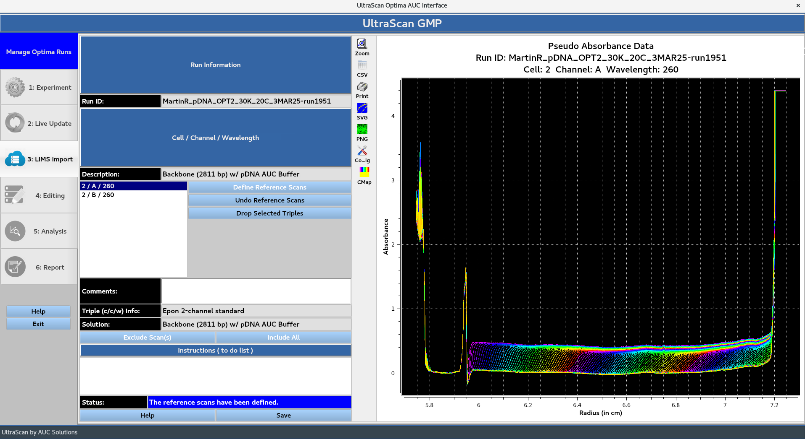

Clicking **OK** displays the converted absorbance data following the automated reference scan processing. If the user is not satisfied with the automated reference scans processing, the **Undo Reference Scans** button allows for them to be defined manually using the **Define Reference Scans** button. **Drop Selected Triples** can be used to drop unwanted triples. 

The 'Save' button prompts the 'GMP Run IMPORT Form', allowing the user to add a comment and prompting them for their master password for authentication. 

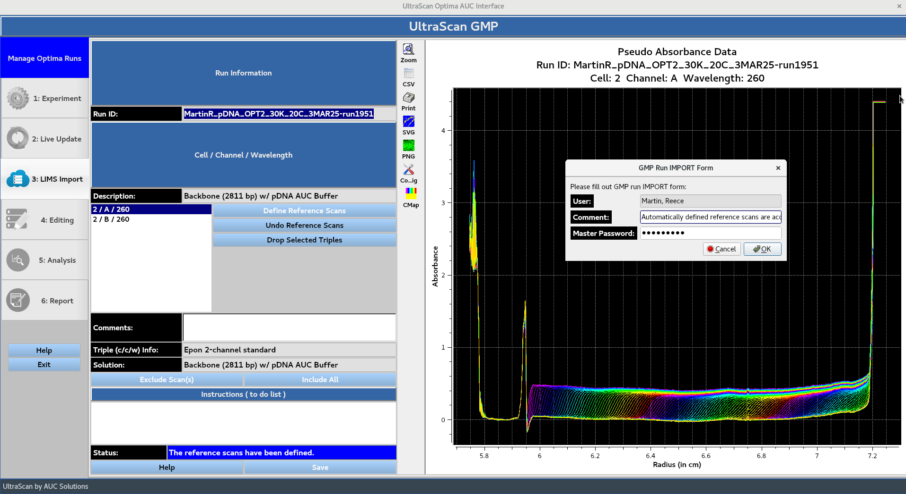

Once the data has been saved, the user is notified that the program is proceeding to the editing stage: 

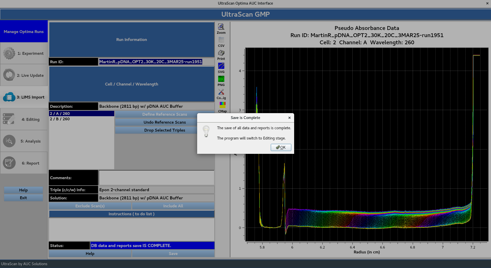

The editing window presents the user with the data edited in accordance with 'Data End' value and 'Excluded Scan Ranges' defined in the **Aprofile**. The 'Meniscus' position and 'Data Start' value are defined through automated processing. If the user is not satisfied with the automated processing, the **Edit Currently Selected Profile Manually** button allows for the 'Meniscus' position and 'Data End' values to be defined manually. **Remove Spikes** removes some sharp, irregular intensity spikes from data. Each cell/channel/wavelength triple can be cycled through using the **Previous Triple** and **Next Triple** buttons. 

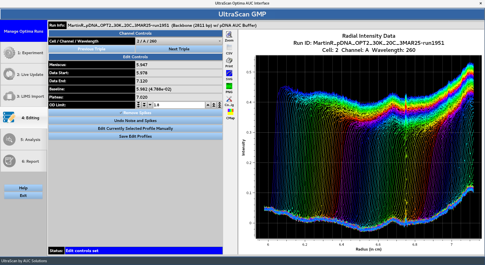

The **Save Edit Profiles** button prompts the **GMP Run EDIT Form**, allowing the user to add a comment and prompting them for their master password for authentication. 

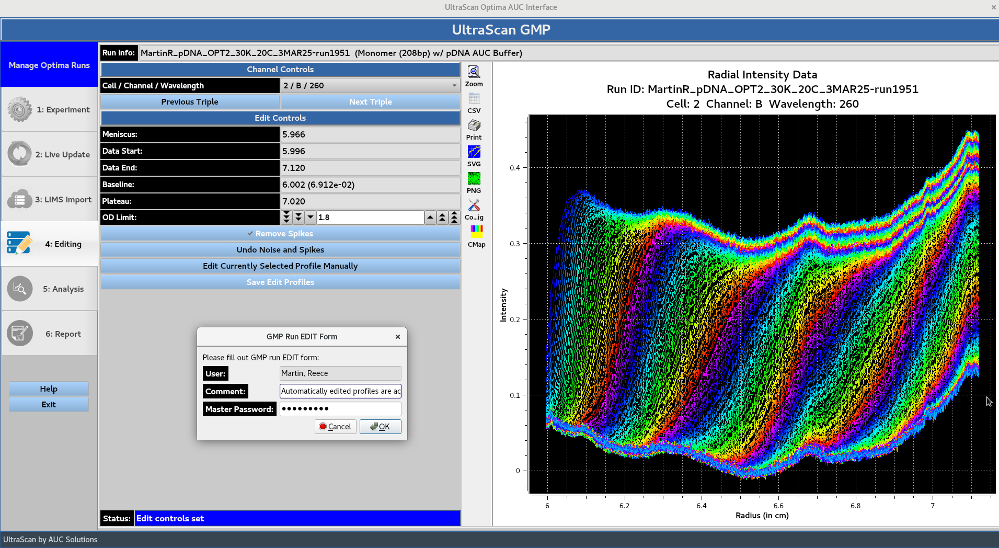

Once the edited profiles have been saved, the user is notified that the program is proceeding to the analysis stage: 

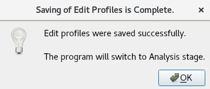

The analysis window displays the current status of the submitted jobs producing the models specified in the **Aprofile**. **Cancel** can be used to stop ongoing jobs. **View Fit** simulates completed model overlays and displays them. The **Expand All Triples** and **Collapse All Triples** buttons control all triples, while the {down arrow} button can be used to collapse or expand each individual triple. 

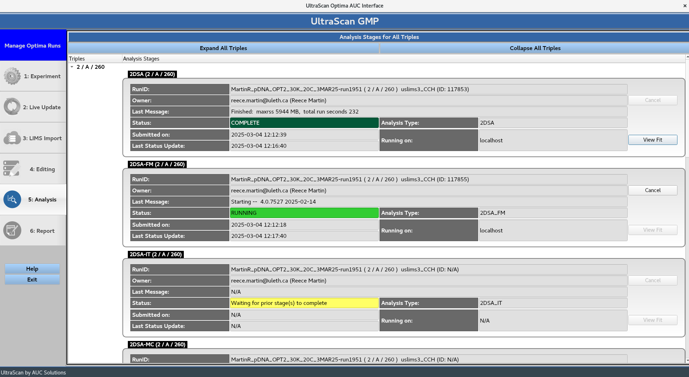

Once the analysis stage is complete, the models are simulated and the report is built. Which prompts the **Report Generation Complete** message box. 

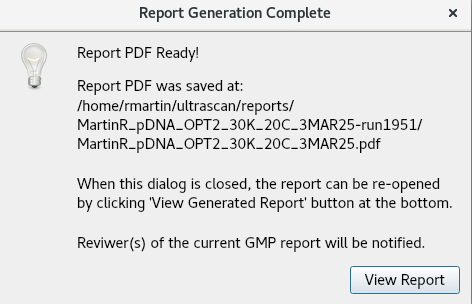

The **View Report** button opens the PDF file to be viewed: 

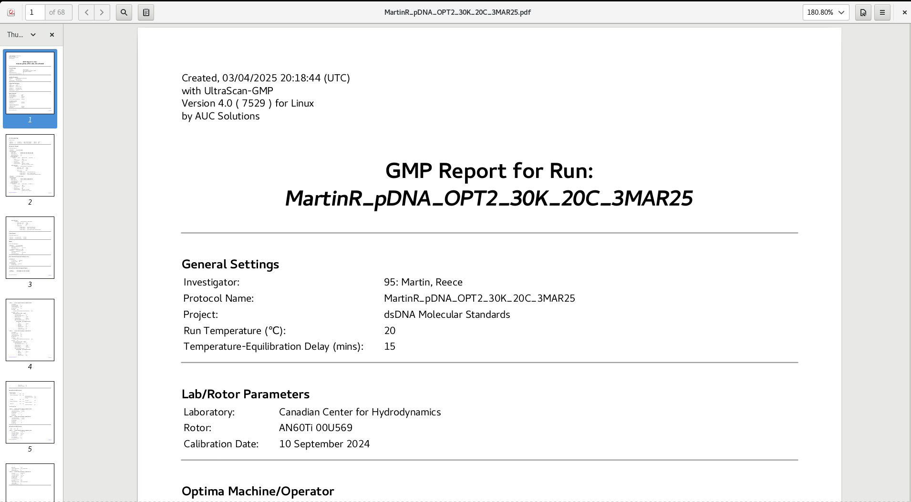
