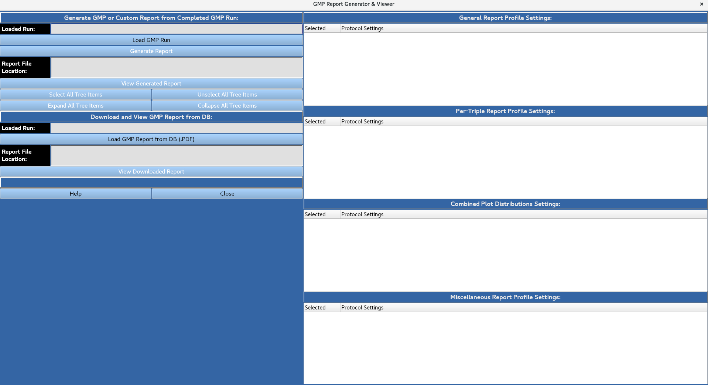
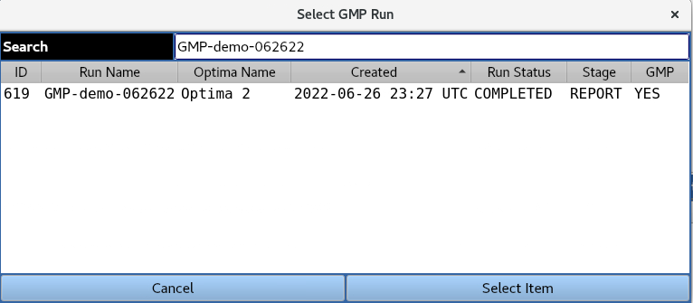
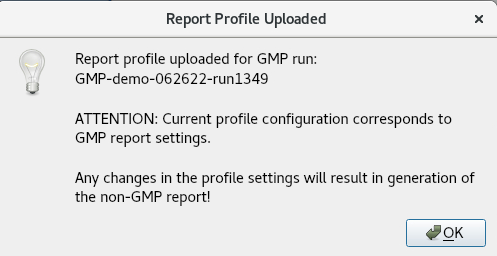
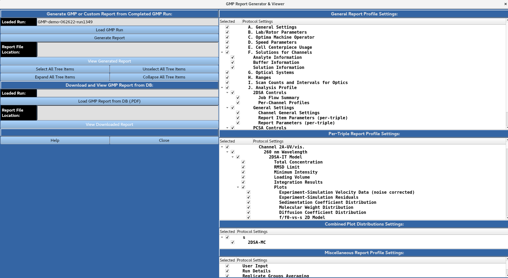
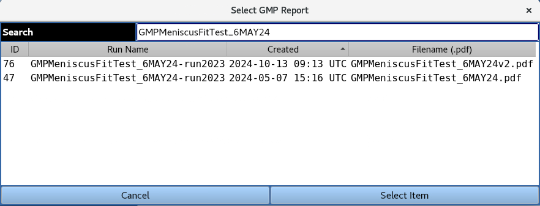
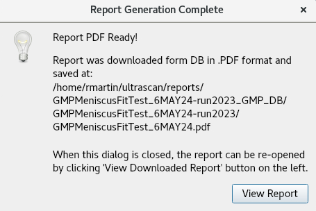

================================
GMP Report Generator and Viewer
================================

.. toctree:: 
    :maxdepth: 1

.. contents:: Index:
    :local:

Allows for the generation/viewing of GMP run reports. 

3a: Load GMP Run
=================

Provides a list of completed GMP runs in the database, as well as the current reporting stage (Report generation or collection of e-signatures).

A GMP run can be loaded from the database by highlighting it and clicking the 'Select Item' button. The user is then presented with the below message indicating the report profile used was defined in the original GMP run submission, and that any changes to the report profile settings will result in the generation of a non-GMP report.

The user then has the option to expand/collapse and select/unselect all tree items for the report settings using the buttons, or manually expand/collapse and select/unselect individual report items using the check boxes in the portion of the window.

    
The user then has the option to expand/collapse and select/unselect all tree items for the report settings using the buttons, or manually expand/collapse and select/unselect individual report items using the check boxes in the portion of the window.

3b: Load GMP Report from DB (.PDF)
======================================

Allows for the viewing of a previously-generated GMP report stored in the database as a PDF file.

A GMP report PDF file can be loaded from the database by highlighting it a clicking the 'Select Item' button. The below message appears indicating the report was downloaded from the database and saved to the specified location. The **View Report** button opens the PDF file to be viewed.

