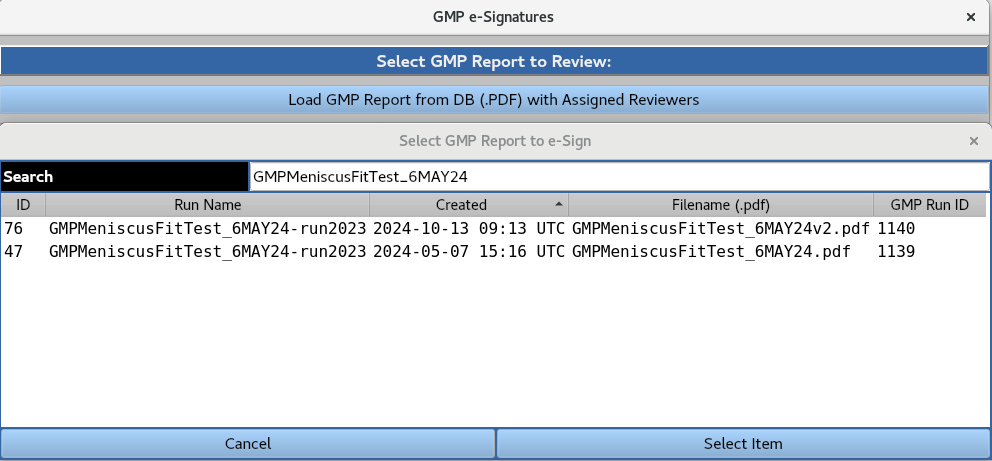

================================
GMP e-Signatures
================================

.. toctree:: 
    :maxdepth: 1

.. contents:: Index:
    :local:

Enables users with assigned roles to load and electronically sign GMP report PDF files.

A GMP report PDF file can be loaded from the database by highlighting it a clicking the 'Select Item' button. The user is presented with the following interface:

'Review Generated Report' opens the PDF file from the database, which includes the current e-signatures.

View e-signatures' opens a PDF file containing only the current e-signatures

'e-Sign Report' prompts the 'GMP e-Signing Form', allowing the user to add feedback in the form of a comment, and requiring their master password for authentication.

Completing this form prompts the 'Successful e-Signing' notification.

Returning to the GMP e-signature interface updates the e-signing status and prompts the next e-signer for electronic signature via email (email settings are configured by the System Administrator).

