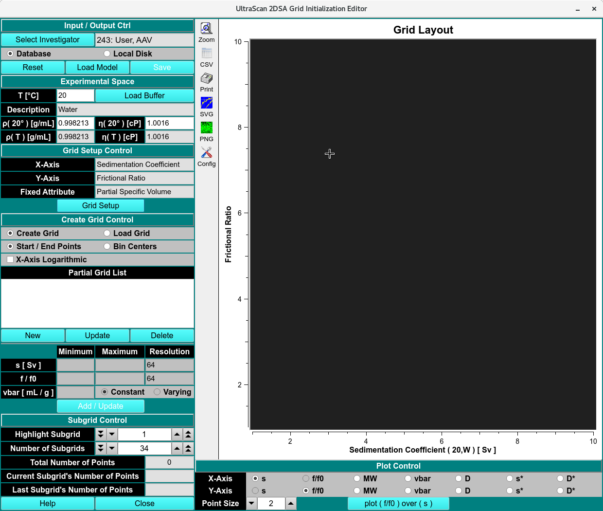

==================================================
Custom Grid Editor (CG)
==================================================

.. toctree:: 
  :maxdepth: 3

.. contents:: Index
  :local: 

This module enables you to edit custom 2-dimensional initialization grids for the 2-dimensional spectrum analysis. 

* Rectangular grids can be defined in both the sedimentation and molecular weight domain, as well as frictional ratio and partial specific volume domain. 
* It is also possible to define multiple grid regions and combine them into a single grid which defines multiple solute regions. 
* Each partial grid can be defined with a different frictional ratio range, molecular weight or sedimentation coefficient range. Each partial grid can also be defined with a different partial specific volume.
* Each grid can be re-displayed in the other domains. 

.. note:: 
  It is also possible to define grids that contain both sedimenting and floating species, in which case the grid needs to be defined for a fixed frictional ratio, but permits variations in vbar to account for the difference in buoyancy while maintaining positive molecular weights. 

* All combined partial grids are saved as a special model structure that can be stored in the database or on disk to be submitted with either the desktop or supercomputing version of the 2-dimensional spectrum analysis.

.. rst-class::
    :align: center

    **Custom Grid Editor - Create Model**

.. image:: _static/images/custom_grid-1.png
  :align: center

.. rst-class::
    :align: center

    **Custom Grid Editor - Load Model**

Functions:
===========

Input/Output Controls
---------------------

.. list-table::
  :widths: 20 50
  :header-rows: 0 

  
  * - **Select Investigator** 
    - click here to retrieve the investigator management widget for selecting the data owner (user level 3 is required). 
  * - **Database/Local Disk**
    - Select the data target. If Database is selected, the model will be stored in the database. This is required if submitting a supercomputing job for the custom grid. Local Disk will only save the grid to the local disk for use in the desktop version of the 2-dimensional spectrum analysis. 

Experimental Space
---------------------

.. list-table::
  :widths: 20 50
  :header-rows: 0 

  * - **T [C]** 
    - The temperature selected by the user in the `Buffer Management <buffer/index.html>`_ module. Manually setting the temperature will readout **arbitrary Value!!!** error. 
  * - **Load Buffer**
    - Load the buffer using the `Buffer Management <buffer/index.html>`_ module. 
  * - **Description**
    - Read out the buffer selected or error if temperature is not set in the buffer management module. 
  * - **p (20°C) [g/mL]**
    - The density and viscosity values are set by default to those of water at 20C. This means that all hydrodynamics variables are adjusted to standard conditions, which is what the analysis routines expect on input. For academic purposes, it is possible to change these values to see what the resulting grids look like. Under normal circumstances these values should never be adjusted. 
  * - **n (20°C) [cP]**
    - 
  * - **p (T°C) [g/mL]**
    -
  * - **n (T°C) [cP]**
    - 

Grid Setup Control
---------------------

.. list-table::
  :widths: 20 50
  :header-rows: 0 
  
  * - **X-Axis**
    - 
  * - **Y-Axis**
    - 
  * - **Fixed Attribute**
    - 
  * - **Grid Setup**
    - 

Create Setup Control
---------------------

.. list-table::
  :widths: 20 50
  :header-rows: 0 

  * - **Create Grid**
    - 
  * - **Load Grid**
    - 
  * - **Start / End Points**
    -
  * - **Bin Centers**
    - 
  * - **Partial Grid List**
    - 
  * - **New**
    -
  * - **Update**
    -
  * - **Delete**
    -   
  * - **Minimum and Maximum controls:** 
    - use these controls to adjust the minimum and maximum of the grid dimension. The labels will change according to the choice for X and Y dimensions. 
  * - **Resolution**
    - these controls allow you to set the grid resolution for any partial grid in both the X and Y dimensions. The label on these controls will change according to the selected X and Y dimensions, i.e., s-value or Mol. Weight Resolution:. The grid resolution should be high enough to cover the resolution contained in the experimental data. Excessive resolution will significantly increase the computational cost, without any appreciable benefit in goodness of fit. A too coarse resolution will not produce a good fit. If you see obvious step functions in the model that do not trace the underlying data well then you likely are not using sufficient resolution in your grid. 

  * - **Constant**
    -
  * - **Varying**
    -
  * - **Add**
    -

Subgrid Control
---------------------

.. list-table::
  :widths: 20 50
  :header-rows: 0 

  * - **Highlight Subgrid**
    - 
  * - **Number of Subgrids**
    -
  * - **Total Number of Points**
    - 
  * - **Current Subgrid's Number of Points**
    - 
  * - **Last Subgrid's Number of Points**
    - 
  * - **Help**
    - 
  * - **Close**
    - 

Plot Control
---------------------

.. list-table::
  :widths: 20 50
  :header-rows: 0 

  * - **X-Axis and Y-Axis**
    - these controls are used to switch between views of the defined grid. A rectangular grid may be defined in the sedimentation domain, which looks like this when displayed with the molecular weight view. 
  * - **Point Size**
    -
  * - **plot ( ) over ( )**
    - 

Adjust X/Y Axis as: - here you can select the variable to be used when adjusting the X-axis as either sedimentation coefficient or molecular weight, and the Y-axis as either the frictional ratio (anisotropy) or the partial specific volume (vbar). 
Sedimentation or Molecular Weight view - 

Counters: - Note: all counters can be adjusted by clicking on the arrow symbols or by typing the desired value into the white text area of the counter widget. 
X/Y Resolution: - 

Partial Spec. Volume/Frictional Ratio: - this counter allows you to set the partial specific volume (vbar) when the Frictional Ratio is defined as the Y-axis. When the Y-axis has been selected to reflect the Partial Specific Volume this counter is set to fix the frictional ratio at a constant value. 

Density and Viscosity -

Add this Grid - click here to add the currently defined grid to the final grid to be saved. Each grid should only be added once. Each added grid constitutes a partial grid of the final grid. Should partial subgrids overlap, duplicate solutes will be screened out before saving the overall model including each partial grid. By adding multiple grids together it is possible to define well-defined regions as a basis for the parameter search. For example, if one were to fit a system containing monomers, dimers, and trimers, where each oligomer is increasingly anisotropic, a grid like this one could be defined. It specifies a rectangular molecular weight grid with increasing anisotropy for each oligomer. An error region should be defined that usually ranges between +/-10 % of the oligomeric size. When transformed to the sedimentation view, the looks like this. 

Show Final Grid - this checkbox allows you to view the final grid. In this mode it is not possible to make any further changes to the final grid or to add new grids, but it is possible to change the view from sedimentation to molecular weight, or vice-versa. It is also possible to delete partial grids. When clicking on Delete Partial Grid, the partial grid currently highlighted in red is removed from the final grid. The highlighted partial grid can be adjusted by changing the counter for Highlight Partial Grid #:. 

Show Subgrids - This checkbox allows you to view the layout of the subgrids that will be used in the two-dimensional spectrum analysis. The 2DSA uses a scheme by which each grid is broken down into several subgrids, each of which is analyzed independently on different processors, and the results are merged into a final grid. Each subgrid should be small enough to fit into the computer memory of the analysis program. A second requirement is that the subgrid covers the parameter space evenly, and does not exclude major regions of the search space. When Show Subgrids is selected, the Highlight Partial Grid #: counter is changed to Highlight Subgrid #: and allows you to highlight in red individual subgrids that will be used by the 2-dimensional spectrum analysis. You will also be able to change the Number of Subgrids: counter to adjust the density of points within each subgrid as well as their distribution. The larger the number of subgrids, the coarser the subgrid's solute spacing will be. Also, the more subgrids are defined, the more grids will need to be calculated. If sufficient cores are available, this could speed up the analysis, but it will also lead to increasingly inefficient use of the available cores as there will be CPU-idling in the later stages of the analysis when the outputs of multiple grids are merged. There is usually an optimal number of cores, number of subgrids, and solutes/subgrid, which varies depending on the experimental data. The maximum number of subgrids is limited to a 50th of the total number of grids, which, for example, results in a maximum of 6 subgrids for a final grid with 300 solutes. 