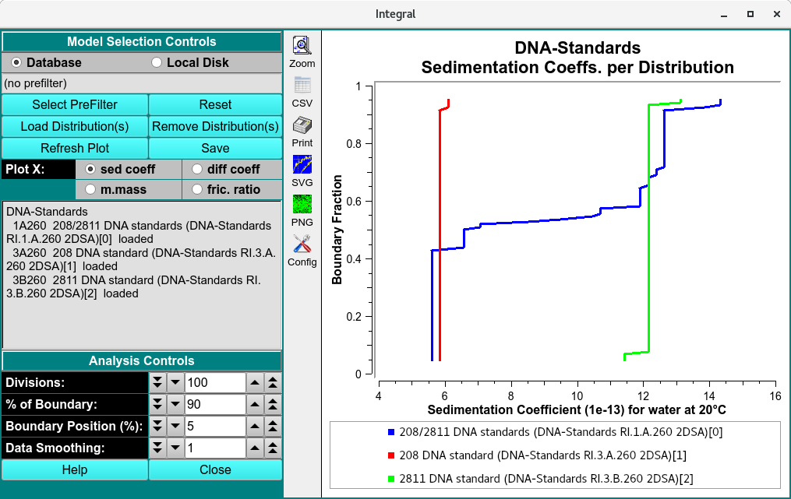

========================================
Integral Distributions Combined Plots
========================================

.. toctree:: 
  :maxdepth: 3

.. contents:: Index
  :local: 

To combine integral model distributions from multiple datasets (either from different cells of the same run or from different runs), use **Combine Integral Distributions** from the *Velocity* menu. This will allow you to compare distributions from different cells to each other.

.. note::
    Distribution plots present relative concentration (Y) for X points where the "X" type may be sedimentation coefficient, molecular weight, diffusion coefficient, frictional ratio or vbar (specific density). 
    
    All distributions will be plotted relative to the boundary fraction used in analysis. The default analysis is set to 90%, indicating the distribution will range from 5 % to 95 %  of the total boundary, 5% from the top and bottom are excluded and the data is smoothed by 1%. 
    

Functions:
===========

.. list-table::
  :widths: 20 50  

  * - **Database** 
    - Check this radio button to indicate that distribution data to be selected is in the database.
  * - **Local Disk** 
    - Check this radio button to indicate that distribution data to be selected is on local disk file systems.
  * - **Select PreFilter(s)**
    - `Select Run(s) as Models Pre-Filter <common_dialogs.html#data-loader>`_ dialog to select Run IDs.This can significantly reduce model loading time, particularly with large model counts in the database. The text box to the right of this button will display a summary of runs selected as pre-filters.
  * - **Load Distribution(s)**
    - Load model distribution data as specified through a `Model Loader dialog <common_dialogs.html#load-distribution-model>`_. Multiple distribution files may be selected.
  * - **Remove Distribution(s)**
    - Open a `Remove Model Distributions <common_dialogs.html#remove-model-distributions>`_ dialog to remove selected model distributions from the loaded set.
  * - **Refresh Plot**
    - Resets the plot to the default and automatic plot ranges. 
  * - **Save**
    - Saves the integral distributions of sedimentation coefficient, Molar mass, Frictional ratio and diffusion coefficient distributions for every model loaded to *ultrascan/reports/experimentname* file directory in csv format. 

**Plot X:** Select the "X" axis variable from 
  * **sed. coefff** (sedimentation coefficient),
  * **diff coeff** (diffusion coefficient), 
  * **m.mass** (Molar mass), 
  * **fric. ratio** (Frictional ratio).

**Analysis Controls**

.. list-table::
  :widths: 20 50
  :header-rows: 0 

  * - **Divisions:**
    - Choose the number of divisions to use in integral distribution analysis. 
  * - **% of Boundary:**
    - Choose the percentage of the range from concentration baseline to plateau that is to be used for analysis. 
  * - **Boundary Position (%):**
    - Choose the percent of the plateau-baseline range that is to be added to the baseline to form the beginning of analysis span. For typical analysis 5% is recommended. 
  * - **Data Smoothing:**
    - Choose the number of points to use for any smoothing of raw input data. 
  
**Window Controls**

.. list-table::
  :widths: 20 50
  :header-rows: 0 

  * - **Reset** 
    - Indicate that parameters are to be reset and the plots re-displayed based on original parameters. Data is still saved, so a new set of plots can be created by simply selecting runs and distributions (models).
  * - **Help** 
    - Display this detailed Discrete Distribution Plots help.
  * - **Close** 
    - Close all windows and exit.

Related
====================

`Discrete Distributions Combined Plots <ddist_combine.html>`_

`Finite Element Model Viewer <fe_match/fe_match.html>`_

`2-Dimensional Spectrum Analysis <2dsa.html>`_