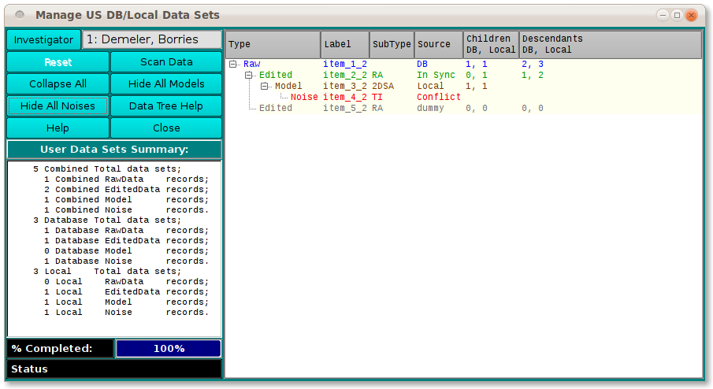
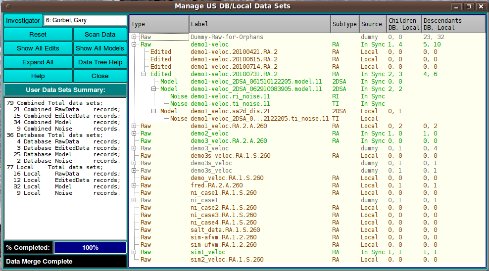

==========================================
Manage Data in Database and on Local Disk
==========================================

.. toctree:: 
  :maxdepth: 3

.. contents:: Index
  :local: 

This module is used to display the four main types of data that may exist for the user in the database and/or on local disk. They are: (1) Raw experiment data; (2) Edited experiment data; (3) Model; and (4) Noise. Besides presenting a tree view of the user's data and their relationships, this module provides a simple means of performing processing on data: (1) upload to DB; (2) download to local disk; (3) remove from DB or local. 

The primary end of any processing of the data is to achieve a synchronizing of data in the database and on local disk. Particularly when preparing for off-network work or when returning to the network after such work, it is desirable to insure that any new data produced has a presence on local disk for off-network work and in the database for normal day-to-day processing. Instances of any data need to be in sync on the two media. This module provides a means to accomplish that.   

Process:
========

    * **Database Password:** Upon opening, US_ManageData requires you to sign on to the database with your DB password. 
    * **Investigator:** For database work, you must specify your investigator name so you are limited to data that you have permission to access and modify. 
    * **Scan Data:** Initiate a scan of all your data on the database and local disk. You will then be presented a full tree view of that data. 
    * **Navigate and Process:** Once you have a tree view of your data, you may navigate it using expand/collapse buttons or the normal **+** and **-** mechanism for specific branch expand and collapse. Context menus at each row allow upload/download/remove/details. 

Initially you are presented with a small window to enter your database password. Then you will see the main window with a sample data tree that shows the kinds of states that data may be in (see tree help below).

.. rst-class:: 
    :align: center

    **Data Main Window**

 After clicking on the **Scan Data** button, the tree will be populated with your actual data. 

.. rst-class:: 
    :align: center

    **Populated Data Manager**

The tree menu will expand and collapse with buttons like these.

.. subfigure:: AB     
  :class-grid: outline 
  :gap: 8px
  :align: center

  .. image:: _static/images/manage_data_bshow.png
    :align: left
    :width: 100%

  .. image:: _static/images/manage_data_bhide.png
    :width: 100%
    :align: right

.. rst-class:: center

    **Tree Menu Buttons**

Functions:
==========

.. list-table::
  :widths: 20 50
  :header-rows: 0

  * - **Investigator:**
    - Often the investigator text field will already be correctly filled out if your home directory name is the same as the first or last of your investigator name. If not, you may enter all or a portion of the first or last name and hit the **Enter** key to have the investigator found. If that, too, fails, you may click the button to enter a full `Investigator dialog <us_investigator.html>`_.
  * - **Reset**
    - Reset the tree to the default sample data.
  * - **Scan Data**
    - Click this button to initiate a full scan of all your data in the database and on local disk. You should re-initiate a scan after any series of processes (upload|download|remove) on the data.
  * - **Show All Edits**
    - Expand the tree view to insure all rows at the level of Edited data are revealed. The button will then be relabelled **Collapse All** so you can hide edits and their descendants.
  * - **Show All Models**
    - Expand the tree view to insure all rows at the level of Model data are revealed. The button will then be relabelled **Hide All Models** so you can hide models and their descendants.
  * - **Expand All**  
    - Expand the tree view to insure all rows at the level of Noise data and their ancestors are revealed. The button will then be relabelled **Hide All Noises** so you can hide noise record rows.
  * - **Data Tree Help**
    - This button lets you pop up a `Tree Help Text <manage_data_thelp.html>`_ Window with some helpful notes on use of the tree view and on the color legend for its rows.
  * - **Tree Navigation and Context Menus**
    - Individual rows in the tree view may be expanded ("+") to show children and other descendants or may be collapsed ("-"). A right-mouse-button click on any row brings up a `Manage Data Context Menu <manage_data_cmenu.html>`_ that allows you to perform processes on the data record or show details about it.
  * - **Help**
    - Display this and other documentation.
  * - **Close**
    - Close all windows and exit.

