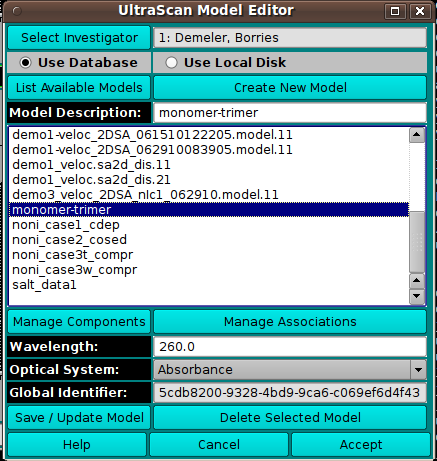

========================================
UltraScan Model Editor
========================================

.. toctree:: 
  :maxdepth: 3

.. contents:: Index
  :local: 

Using this window, you choose a model to load and can create or edit a model.

.. rst-class:: 
    :align: center

    **Model Editor**

Functions:
===========

.. list-table::
  :widths: 20 50
  :header-rows: 0

  * - **Select Investigator** 
    - This button brings up an `Investigator Dialog <us_investigator.html>`_ that allows selecting the current investigator for whom to list models.
  * - **Use Database** 
    - Check to select loading or editing the model from the database.
  * - **Use Local Disk** 
    - Check to select loading or editing the model from the hard disk.
  * - **List Available Models** 
    - This button initiates population of the list of models from the designated source (DB or disk).
  * - **Create New Model** 
    - This button designates that the model to be specified and used by the caller is new. An entry with the name **New Model** will be added to the list. It should be changed in the Model Description text box to an appropriate name.
  * - **Model Description:** 
    - The text box here echoes the name of the model currently selected in the list. The text box entry can be edited to change the model name; of use, particularly, when a new model is being created.
  * - **Manage Components** 
    - This button brings up a `Model Components Dialog <components.html>`_ in which the model components and their properties can be specified.
  * - **Manage Associations** 
    - This button brings up a `Model Associations Dialog <associations.html>`_ in which reversible association chemical equations can be defined.
  * - **Wavelength:** 
    - Specify the model wavelength value in this text box.
  * - **Optical System:** 
    - Select the model optical system: Absorbance, Interference, or Fluorescence.
  * - **Global Identifier:** 
    - Read-only global identifier of the model.
  * - **Save / Update Model** 
    - Save the new or edited model to the database or local disk.
  * - **Delete Selected Model** 
    - Delete the selected model from the database or local disk.
  * - **Accept** 
    - Close the dialog and return the model selection to the caller.
  * - **Help** 
    - Show this documentation.
  * - **Cancel** 
    - Close the dialog and do not return the model selection to the caller.
