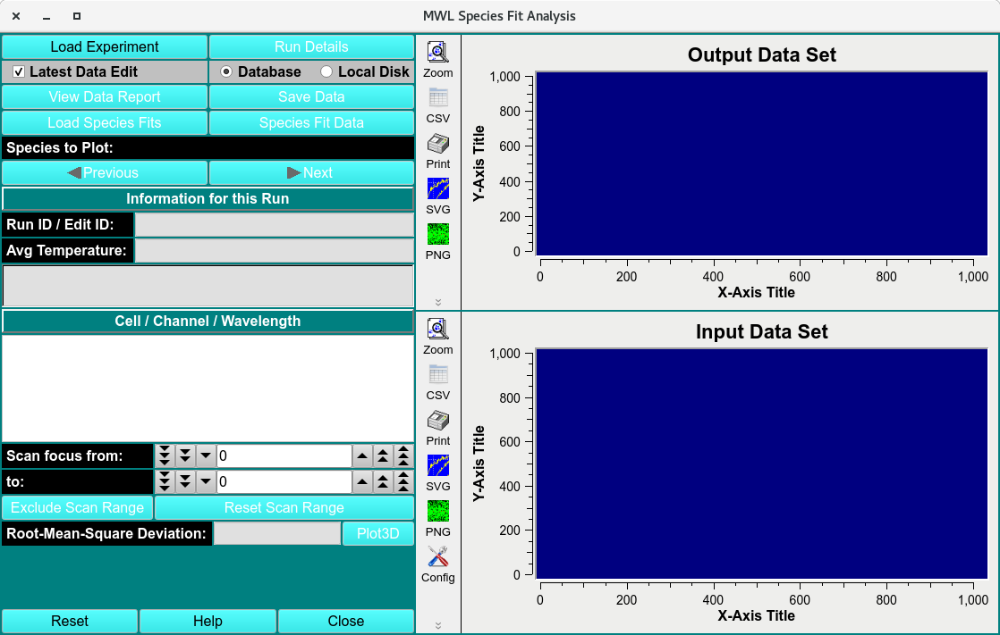
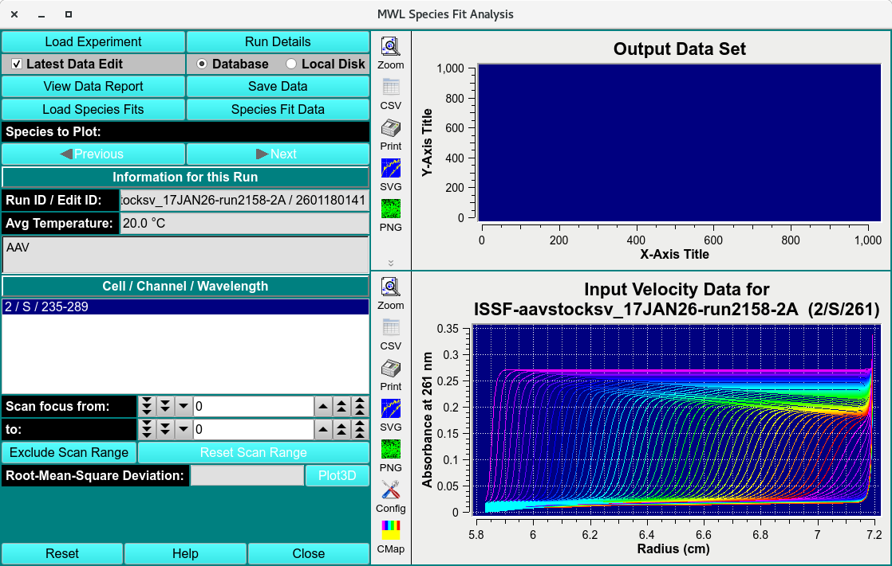
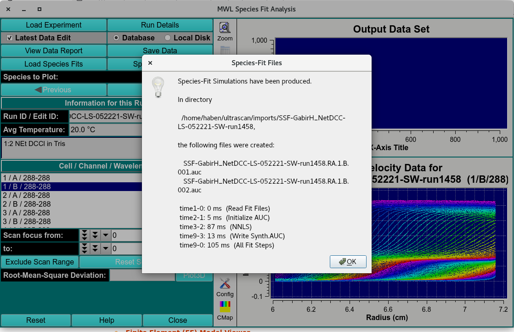
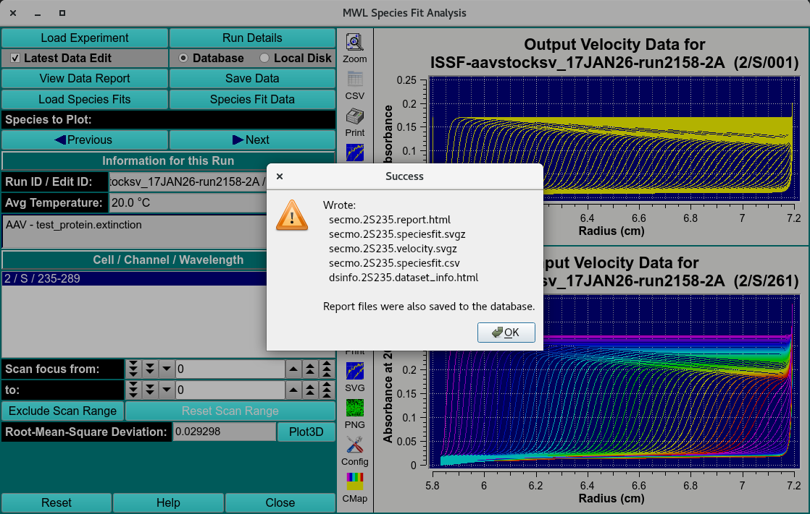
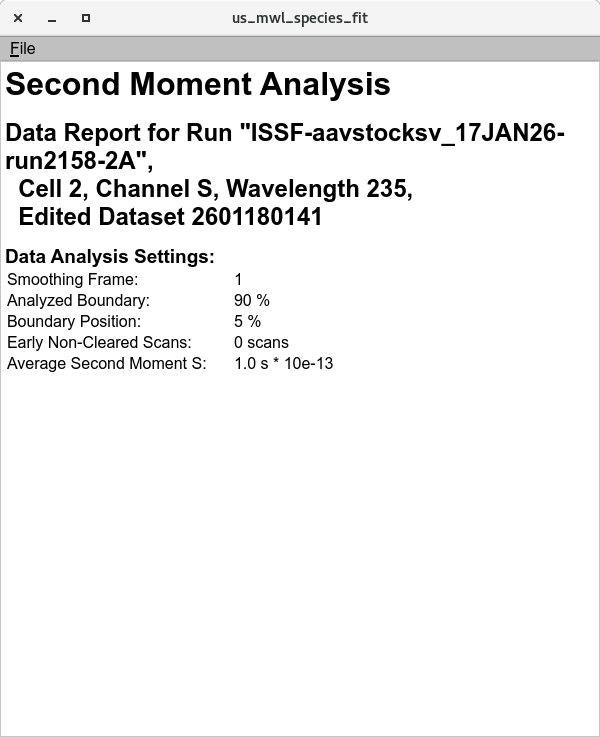
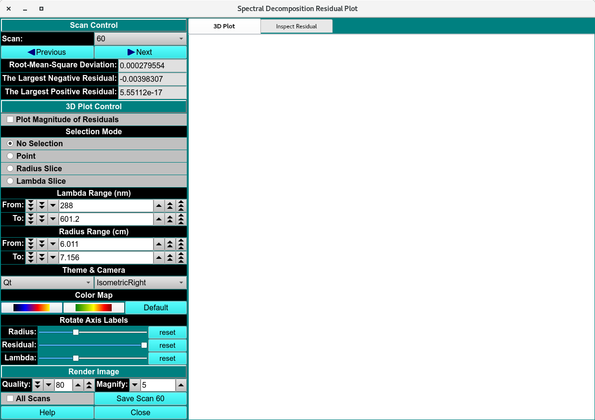
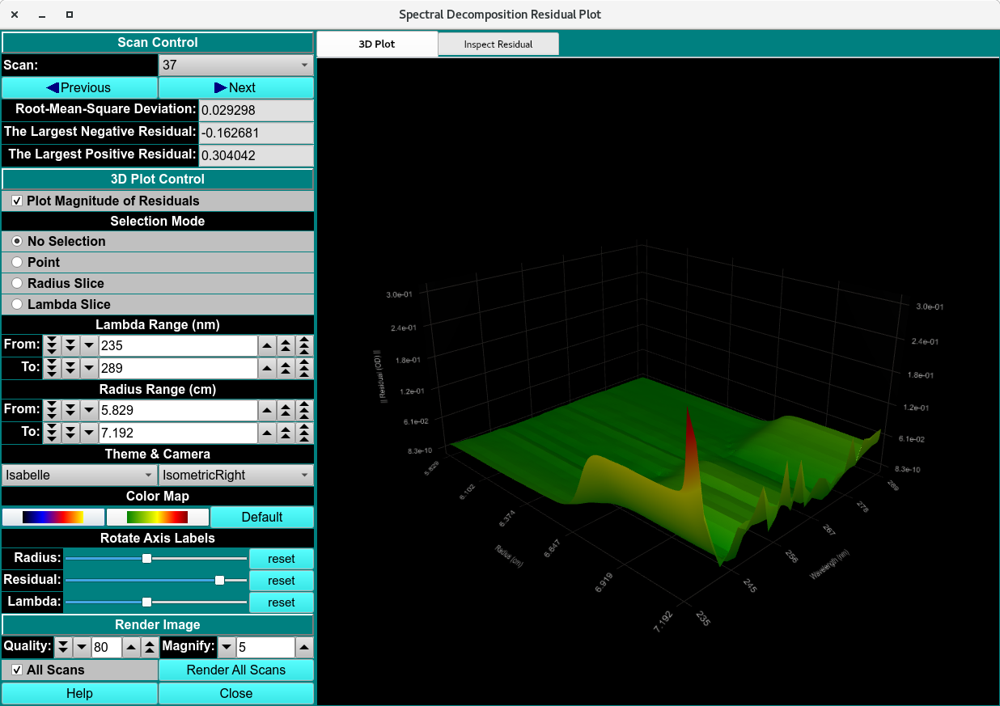
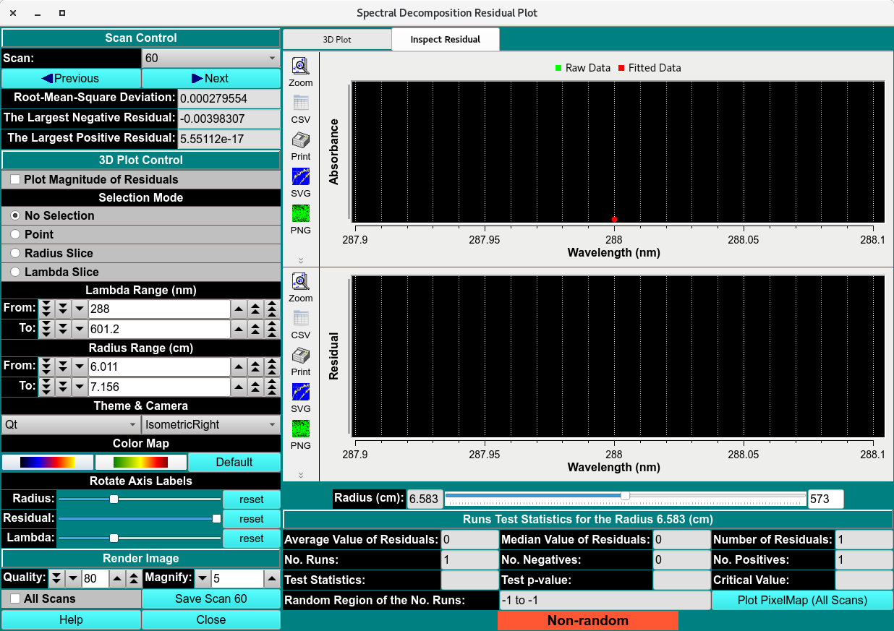
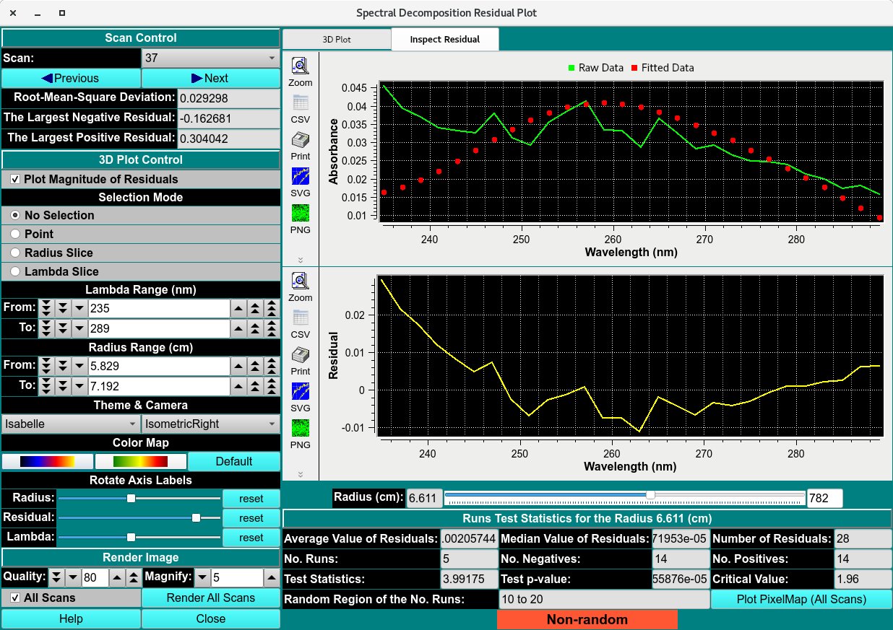

==================================
MWL Species Fit Analysis
==================================

.. toctree:: 
  :maxdepth: 3

.. contents:: Index
  :local: 

This module inputs the time-synchronized 2DSA-IT–based **ISSF** simulations and performs spectral deconvolution. For each spectral interval the measured absorbance is separated by the analytes’ extinction-coefficient spectra into **SSF-ISSF-** datasets. The **SSF-ISSF-** outputs are solute-resolved, spectrum-separated datasets generated for every solute

.. rst-class::
    :align: center

    **Multi-Wavelength Species Fit Analysis Main Window**

MWL Species Fit Process:
==========================

  1. Load the experiment **ISSF-** file using a :ref:`Load Run Data Dialog <fe-data-loader>`.  

.. rst-class::
  :align: center
  
  **Loaded ISSF- Data**
  

  2. Load the extinction-coefficient spectra file as a csv. This file can be generated by measuring serial dilution spectra of analyte and fitting using :doc:`Spectrum Fitter <../us_extinction>`.  
  
  3. Click **Species Fit Data** and a simulation **SSF-ISSF-** dataset for every analyte extinction-coefficient spectra inputted will be generated and saved in the $HOME/ultrascan/imports folder. 

.. rst-class::
  :align: center
  
  **Saved Deconvoluted Data**

  4. Click **Save Data** and the datasets and deconvolution quality report will be saved in the database. 

.. rst-class::
  :align: center
  
  **Saved Deconvoluted Data and Report**
  

MWL Species Fit Functions: 
============================

.. list-table::
  :widths: 20 50
  :header-rows: 0 

  * - **Load Experiment** 
    - Load the time-synchronized **ISSF-** simulations generated in :doc:`MWL Pre-Fit Species Simulation module <mwl_species_sim>`. 
  * - **Run Details** 
    - Bring up a :doc:`Run Details Dialog <../run_details>` with a summary of data and run details.
  * - **Latest Data Editor** 
    - Select latest edit of all data displayed.   
  * - **Database** 
    - Load or save data from the database.   
  * - **Local Disk**
    - Load or save data from the local disk.
  * - **View Data Report** 
    - View the :ref:`data report <mwl-spec-fit-report>` file.   
  * - **Save Data** 
    - Save the simulated data in $HOME/ultrascan/imports  
  * - **Load Species Fits**
    - Load the extinction-coefficient spectra files of 2 or more species from local file. Files will be saved in csv format from :doc:`Spectrum Fitter <../us_extinction>`  
  * - **Species Fit Data**
    - Generate and save **SSF-ISSF-** simulation files.  
  * - **Species to Plot:** 
    - Plot one of the at least 2 species deconvoluted from the original dataset.    
  * - **Previous** 
    - Navigate to the previous datasets.
  * - **Next** 
    - Navigate to the next datasets.
  * - **Run ID/ Edit ID:** 
    - The run and edit identification labels.   
  * - **Avg Temperature:** 
    - Average temperature of experiment.  
  * - **Solution name:** 
    - Name of the original solution.   
  * - **Cell / Channel / Wavelength**
    - Triple identifier.    
  * - **Scans focus**
    - Select a scan range.   
  * - **Exclude Scan range**
    - Exclude selected scan range.   
  * - **Reset Scan range**
    - Reset all excluded scans.   
  * - **Root-Mean-Square Deviation:** 
    - The Root-Mean-Square Deviation of the deconvolution.  
  * - **Plot3D**
    - RMSD, residuals and fitting plots of the :ref:`Deconvolution <mwl-decon-rmsd>`.  
  * - **Reset**
    - Reset window.   
  * - **Help**
    - Open the MWL Species Fit Analysis help documentation.   
  * - **Close**
    - Close window. 

.. _mwl-spec-fit-report:

.. rst-class::
  :align: center
  
  **Data Report**

Spectral Decomposition Residual Plot
 
================================

Assess the deconvolution RMSD and Residuals

.. _mwl-decon-rmsd:

.. rst-class::
  :align: center
  
  **Empty Spectral Decomposition Residual Plot**
  
  

.. rst-class::
  :align: center
  
  **Spectral Decomposition Residual Plot**

|

.. rst-class::
  :align: center
  
  **Empty Spectral Decomposition Residuals**

.. rst-class::
  :align: center
  
  **Spectral Decomposition Residuals**
  
